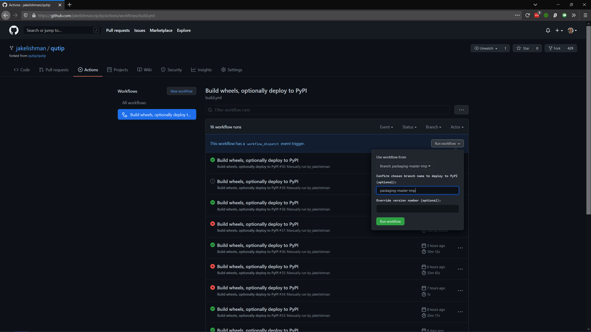
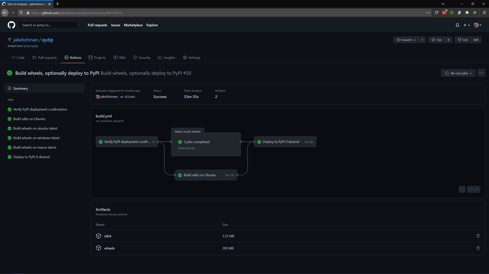

.. This file was created using retext 6.1 https://github.com/retext-project/retext

.. _release_distribution:

************************
Release and Distribution
************************

Preamble
++++++++

This document covers the process for managing updates to the current minor release and making new releases.
Within this document, the git remote ``upstream`` refers to the main QuTiP organsiation repository, and ``origin`` refers to your personal fork.

In short, the steps you need to take are:

1. Prepare the release branch (see git_).
2. Run the "Build wheels, optionally deploy to PyPI" GitHub action to build binary and source packages and upload them to PyPI (see deploy_).
3. Create a GitHub release and uploaded the built files to it (see github_).
4. Update `qutip.org <https://qutip.org/>`_ with the new links and documentation (web_).
5. Update the conda feedstock, deploying the package to ``conda`` (cforge_).

.. _git:

Setting Up The Release Branch
+++++++++++++++++++++++++++++

In this step you will prepare a git branch on the main QuTiP repository that has the state of the code that is going to be released.
This procedure is quite different if you are releasing a new minor or major version compared to if you are making a bugfix patch release.
For a new minor or major version, do update-changelog_ and then jump to release_.
For a bug fix to an existing release, do update-changelog_ and then jump to bugfix_.

Changes that are not backwards-compatible may only be made in a major release.
New features that do not affect backwards-compatibility can be made in a minor release.
Bug fix releases should be small, only fix bugs, and not introduce any new features.

There are a few steps that *should* have been kept up-to-date during day-to-day development, but might not be quite accurate.
For every change that is going to be part of your release, make sure that:

- The user guide in the documentation is updated with any new features, or changes to existing features.
- Any new API classes or functions have entries in a suitable RST file in ``doc/apidoc``.
- Any new or changed docstrings are up-to-date and render correctly in the API documentation.

Please make a normal PR to ``master`` correcting anything missing from these points and have it merged before you begin the release, if necessary.

.. _update-requirement:

Updating the Requirements
-------------------------

Ensure that QuTiP's tests pass on the oldest version supported in the requirements.
On major and minor version, requirements can be adjusted upwards, but patch release must not change minimum requirements.
We follow `NEP29`_ for minimum supported versions ::

    - All minor versions of Python released 42 months prior to the project, and at minimum the two latest minor versions.
    - All minor versions of numpy and scipy released in the 24 months prior to the project, and at minimum the last three minor versions.

If dependency versions need to be updated, update them in the master branch. The following files may need to be updated: `.github/workflows/tests.yml`, `setup.cfg` and `roadmap.rst`. Finally, ensure that PyPI wheels and conda builds cover at least these versions.

.. _NEP29: https://numpy.org/neps/nep-0029-deprecation_policy.html

.. _update-changelog:

Updating the Changelog
----------------------

This needs to be done no matter what type of release is being made.

#. Create a new branch to use to make a pull request.
#. Update the changelog using ``towncrier``:

   towncrier build --version=<version-number>

Where ``<version-number>`` is the expected version number of the release

#. Make a pull request on the main ``qutip/qutip`` repository with this changelog, and get other members of the admin team to approve it.
#. Merge this into ``master``.

Now jump to release_ if you are making a major or minor release, or bugfix_ if you are only fixing bugs in a previous release.

.. _release:

Create a New Minor or Major Release
-----------------------------------

This involves making a new branch to hold the release and adding some commits to set the code into "release" mode.
This release should be done by branching directly off the ``master`` branch at its current head.

#. On your machine, make sure your copy of ``master`` is up-to-date (``git checkout master; git pull upstream master``).
   This should at least involve fetching the changelog PR that you just made.
   Now create a new branch off a commit in ``master`` that has the state of the code you want to release.
   The command is ``git checkout -b qutip-<major>.<minor>.X``, for example ``qutip-4.7.X``.
   This branch name will be public, and must follow this format.
#. Push the new branch (with no commits in it relative to ``master``) to the main ``qutip/qutip`` repository (``git push upstream qutip-4.7.X``).
   Creating a branch is one of the only situations in which it is ok to push to ``qutip/qutip`` without making a pull request.
#. Create a second new branch, which will be pushed to your fork and used to make a pull request against the ``qutip-<major>.<minor>.X`` branch on ``qutip/qutip`` you just created.
   You can call this branch whatever you like because it is not going to the main repository, for example ``git checkout -b prepare-qutip-4.7.0``.
#. - Change the ``VERSION`` file to contain the new version number exactly, removing the ``.dev`` suffix.
     For example, if you are releasing the first release of the minor 4.7 track, set ``VERSION`` to contain the string ``4.7.0``.
     (*Special circumstances*: if you are making an alpha, beta or release candidate release, append a ``.a<n>``, ``.b<n>`` or ``.rc<n>`` to the version string, where ``<n>`` is an integer starting from 0 that counts how many of that pre-release track there have been.)
   - Edit ``setup.cfg`` by changing the "Development Status" line in the ``classifiers`` section to ::

        Development Status :: 5 - Production/Stable

   Commit both changes (``git add VERSION setup.cfg; git commit -m "Set release mode for 4.7.0"``), and then push them to your fork (``git push -u origin prepare-qutip-4.7.0``)
#. Using GitHub, make a pull request to the release branch (e.g. ``qutip-4.7.X``) using this branch that you just created.
   You will need to change the "base branch" in the pull request, because GitHub will always try to make the PR against ``master`` at first.
   When the tests have passed, merge this in.
#. Finally, back on ``master``, make a new pull request that changes the ``VERSION`` file to be ``<next-expected-version>.dev``, for example ``4.8.0.dev``.
   The "Development Status" in ``setup.cfg`` on ``master`` should not have changed, and should be ::

       Development Status :: 2 - Pre-Alpha

   because ``master`` is never directly released.

You should now have a branch that you can see on the GitHub website that is called ``qutip-4.7.X`` (or whatever minor version), and the state of the code in it should be exactly what you want to release as the new minor release.
If you notice you have made a mistake, you can make additional pull requests to the release branch to fix it.
``master`` should look pretty similar, except the ``VERSION`` will be higher and have a ``.dev`` suffix, and the "Development Status" in ``setup.cfg`` will be different.

* Activate the readthedocs build for the newly created version branch and set it as the latest.

You are now ready to actually perform the release.
Go to deploy_.

.. _bugfix:

Create a Bug Fix Release
------------------------

In this you will modify an already-released branch by "cherry-picking" one or more pull requests that have been merged to ``master`` (including your new changelog), and bump the "patch" part of the version number.

#. On your machine, make sure your copy of ``master`` is up-to-date (``git checkout master; git pull upstream master``).
   In particular, make sure the changelog you wrote in the first step is visible.
#. Find the branch of the release that you will be modifying.
   This should already exist on the ``qutip/qutip`` repository, and be called ``qutip-<major>.<minor>.X`` (e.g. ``qutip-4.6.X``).
   If you cannot see it, run ``git fetch upstream`` to update all the branch references from the main repository.
   Checkout a new private branch, starting from the head of the release branch (``git checkout -b prepare-qutip-4.6.1 upstream/qutip-4.6.X``).
   You can call this branch whatever you like (in the example it is ``prepare-qutip-4.6.1``), because it will only be used to make a pull request.
#. Cherry-pick all the commits that will be added to this release in order, including your PR that wrote the new changelog entries (this will be the last one you cherry-pick).
   You will want to use ``git log`` to find the relevant commits, going from **oldest to newest** (their "age" is when they were merged into ``master``, not when the PR was first opened).
   The command is slightly different depending on which merge strategy was used for a particular PR:

   - "merge": you only need to find one commit though the log will have included several; there will be an entry in ``git log`` with a title such as "Merge pull request #1000 from <...>".
     Note the first 7 characters of its hash.
     Cherry-pick this by ``git cherry-pick --mainline 1 <hash>``.
   - "squash and merge": there will only be a single commit for the entire PR.
     Its name will be "<Name of the pull request> (#1000)".
     Note the first 7 characters of its hash.
     Cherry-pick this by ``git cherry-pick <hash>``.
   - "rebase and merge": this is the most difficult, because there will be many commits that you will have to find manually, and cherry-pick all of them.
     Go to the GitHub page for this PR, and go to the "Commits" tab.
     Using your local ``git log`` (you may find ``git log --oneline`` useful), find the hash for every single commit that is listed on the GitHub page, in order from **oldest to newest** (top-to-bottom in the GitHub view, which is bottom-to-top in ``git log``).
     You will need to use the commit message to do this; the hashes that GitHub reports will probably not be the same as how they appear locally.
     Find the first 7 characters of each of the hashes.
     Cherry-pick these all in one go by ``git cherry-pick <hash1> <hash2> ... <hash10>``, where ``<hash1>`` is the oldest.

   If any of the cherry-picks have merge conflicts, first verify that you are cherry-picking in order from oldest to newest.
   If you still have merge conflicts, you will either need to manually fix them (if it is a *very* simple fix), or else you will need to find which additional PR this patch depends on, and restart the bug fix process including this additional patch.
   This generally should not happen if you are sticking to very small bug fixes; if the fixes had far-reaching changes, a new minor release may be more appropriate.
#. Change the ``VERSION`` file by bumping the last number up by one (double-digit numbers are fine, so ``4.6.10`` comes after ``4.6.9``), and commit the change.
#. Push this branch to your fork, and make a pull request against the release branch.
   On GitHub in the PR screen, you will need to change the "Base" branch to ``qutip-4.6.X`` (or whatever version), because GitHub will default to making it against ``master``.
   It should be quite clear if you have forgotten to do this, because there will probably be many merge conflicts.
   Once the tests have passed and you have another admin's approval, merge the PR.

You should now see that the ``qutip-4.6.X`` (or whatever) branch on GitHub has been updated, and now includes all the changes you have just made.
If you have made a mistake, feel free to make additonal PRs to rectify the situation.

You are now ready to actually perform the release.
Go to deploy_.

.. _deploy:

Build Release Distribution and Deploy
+++++++++++++++++++++++++++++++++++++

This step builds the source (sdist) and binary (wheel) distributions, and uploads them to PyPI (pip).
You will also be able to download the built files yourself in order to upload them to the QuTiP website.

Build and Deploy
----------------

This is handled entirely by a GitHub Action.
Go to the `"Actions" tab at the top of the QuTiP code repository <https://github.com/qutip/qutip/actions>`_.
Click on the "Build wheels, optionally deploy to PyPI" action in the left-hand sidebar.
Click the "Run workflow" dropdown in the header notification; it should look like the image below.

- Use the drop-down menu to choose the branch or tag you want to release from.
  This should be called ``qutip-4.5.X`` or similar, depending on what you made earlier.
  This must *never* be ``master``.
- To make the release to PyPI, type the branch name (e.g. ``qutip-4.5.X``) into the "Confirm chosen branch name [...]" field.
  You *may* leave this field blank to skip the deployment and only build the package.
- (Special circumstances) If for some reason you need to override the version number (for example if the previous deployment to PyPI only partially succeeded), you can type a valid Python version identifier into the "Override version number" field.
  You probably do not need to do this.
  The mechanism is designed to make alpha-testing major upgrades with nightly releases easier.
  For even a bugfix release, you should commit the change to the ``VERSION`` file.
- Click the lower "Run workflow" to perform the build and deployment.

At this point, the deployment will take care of itself.
It should take between 30 minutes and an hour, after which the new version will be available for install by ``pip install qutip``.
You should see the new version appear on `QuTiP's PyPI page <https://pypi.org/project/qutip>`_.

Download Built Files
--------------------

When the build is complete, click into its summary screen.
This is the main screen used to both monitor the build and see its output, and should look like the below image on a success.

The built binary wheels and the source distribution are the "build artifacts" at the bottom.
You need to download both the wheels and the source distribution.
Save them on your computer, and unzip both files; you should have many wheel ``qutip-*.whl`` files, and two sdist files: ``qutip-*.tar.gz`` and ``qutip-*.zip``.
These are the same files that have just been uploaded to PyPI.

Monitoring Progress (optional)
------------------------------

While the build is in progress, you can monitor its progress by clicking on its entry in the list below the "Run workflow" button.
You should see several subjobs, like the completed screen, except they might not yet be completed.

The "Verify PyPI deployment confirmation" should get ticked, no matter what.
If it fails, you have forgotten to choose the correct branch in the drop-down menu or you made a typo when confirming the correct branch, and you will need to restart this step.
You can check that the deployment instruction has been understood by clicking the "Verify PyPI deployment confirmation" job, and opening the "Compare confirmation to current reference" subjob.
You will see a message saying "Built wheels will be deployed" if you typed in the confirmation, or "Only building wheels" if you did not.
If you see "Only building wheels" but you meant to deploy the release to PyPI, you can cancel the workflow and re-run it after typing the confirmation.

.. _github:

Making a Release on GitHub
++++++++++++++++++++++++++

This is all done through `the "Releases" section <https://github.com/qutip/qutip/releases>`_ of the ``qutip/qutip`` repository on GitHub.

- Click the "Draft a new release" button.
- Choose the correct branch for your release (e.g. ``qutip-4.5.X``) in the drop-down.
- For the tag name, use ``v<your-version>``, where the version matches the contents of the ``VERSION`` file.
  In other words, if you are releasing a micro version 4.5.3, use ``v4.5.3`` as the tag, or if you are releasing major version 5.0.0, use ``v5.0.0``.
- The title is "QuTiP <your-version>", e.g. "QuTiP 4.6.0".
- For the description, write a short (~two-line for a patch release) summary of the reason for this release, and note down any particular user-facing changes that need special attention.
  Underneath, put the changelog you wrote when you did the documentation release.
  Note that there may be some syntax differences between the ``.rst`` file of the changelog and the Markdown of this description field (for example, GitHub's markdown typically maintains hard-wrap linebreaks, which is probably not what you wanted).
- Drag-and-drop all the ``qutip-*.whl``, ``qutip-*.tar.gz`` and ``qutip-*.zip`` files you got after the build step into the assets box.
  You may need to unzip the files ``wheels.zip`` and ``sdist.zip`` to find them if you haven't already; **don't** upload those two zip files.

Click on the "Publish release" button to finalise.

.. _web:

Website
+++++++

This assumes that qutip.github.io has already been forked and familiarity with the website updating workflow.
The documentation need not be updated for every patch release.

HTML File Updates
-----------------

- Edit ``download.html``

    * The 'Latest release' version and date should be updated.
    * The tar.gz and zip links need to have their micro release numbers updated in their filenames, labels and trackEvent javascript.
      These links should point to the "Source code" links that appeared when you made in the GitHub Releases section.
      They should look something like ``https://github.com/qutip/qutip/archive/refs/tags/v4.6.0.tar.gz``.
    * For a minor or major release links to the last micro release of the previous version will need to be moved (copied) to the 'Previous releases' section.

- Edit ``_includes/sidebar.html``

    * Add the new version and release date. Only actively developed version should be listed. Micro replace the previous entry but the last major can be kept.
    * Link to the installation instruction, documentation, source code and changelog should be updated.

- Edit ``documentation.html``

    * For major and minor release, the previous release tags should be moved (copied) to the 'Previous releases' section and the links to the readthedocs of the new version added the to 'Latest releases' section.

.. _cforge:

Conda Forge
+++++++++++

If not done previously then fork the `qutip-feedstock <https://github.com/conda-forge/qutip-feedstock>`_.

Checkout a new branch on your fork, e.g. ::

    $ git checkout -b version-4.0.2

Find the sha256 checksum for the tarball that the GitHub web interface generated when you produced the release called "Source code".
This is *not* the sdist that you downloaded earlier, it's a new file that GitHub labels "Source code".
When you download it, though, it will have a name that *looks* like it's the sdist ::

    $ openssl sha256 qutip-4.0.2.tar.gz

Edit the ``recipe/meta.yaml`` file.
Change the version at the top of the file, and update the sha256 checksum.
Check that the recipe package version requirements at least match those in ``setup.cfg``, and that any changes to the build process are reflected in ``meta.yml``.
Also ensure that the build number is reset ::

    build:
        number: 0

Push changes to your fork, e.g. ::

    $ git push --set-upstream origin version-4.0.2

Make a Pull Request.
This will trigger tests of the package build process.

If (when) the tests pass, the PR can be merged, which will trigger the upload of the packages to the conda-forge channel.
To test the packages, add the conda-forge channel with lowest priority ::

    $ conda config --append channels conda-forge

This should mean that the prerequistes come from the default channel, but the qutip packages are found in conda-forge.
