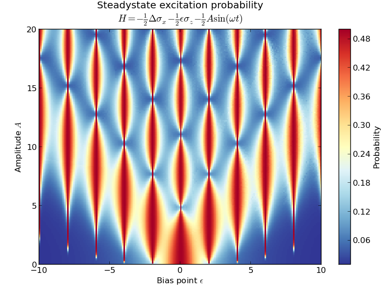

.. QuTiP 
   Copyright (C) 2011-2012, Paul D. Nation & Robert J. Johansson

.. _exadvancedlzs:

Landau-Zener-Stückelberg interferometry
=======================================

This is an other example of how to use the propagator of a driven system to calculate its steadystate. The system is the same as considered in :ref:`exme43`, for which the Hamiltonian is

.. math::

    H(t) = -\frac{1}{2}\Delta\sigma_x - \frac{1}{2}\epsilon\sigma_z - \frac{1}{2}A\cos(\omega t) \sigma_z.

This example also illustrates how to use the :func:`qutip.parfor` to parallelize the loop over the elements of a matrix.

.. note:: 

    This example takes quite long time to run.

.. literalinclude:: ex-lzs.py

.. _lzs-figure: 

