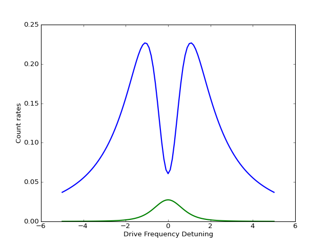
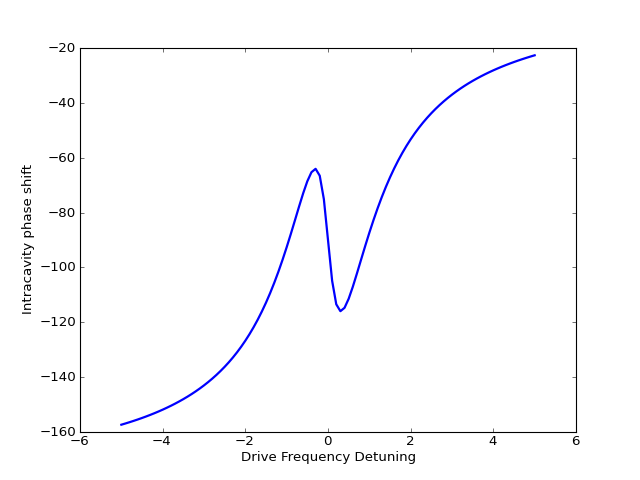

.. QuTiP 
   Copyright (C) 2011-2012, Paul D. Nation & Robert J. Johansson

.. _exbasic17:

Cavity-Qubit Steadystate
=========================

Find the steady state of a cavity-qubit system as a function of the cavity driving frequency.

.. literalinclude:: /../qutip/qutip/examples/ex_17.py

.. _ex17-figure0: 

.. _ex17-figure1: 

