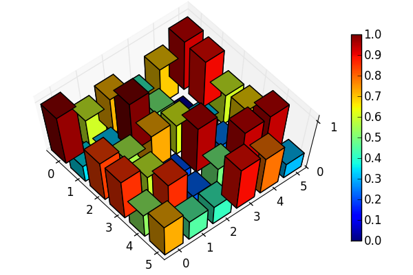

.. QuTiP 
   Copyright (C) 2011, Paul D. Nation & Robert J. Johansson

Visualizing a density matrix as a 3D histogram
==============================================
  
Many people like to plot the density matrix as a 3D histogram.  In this example, we show how to accomplish this task in QuTiP.  Here we have made the color of each bar proportional to its height.

.. include:: examples-3d-histogram.py
    :literal:    

`Download example <http://qutip.googlecode.com/svn/doc/examples/examples-3d-histogram.py>`_
      

