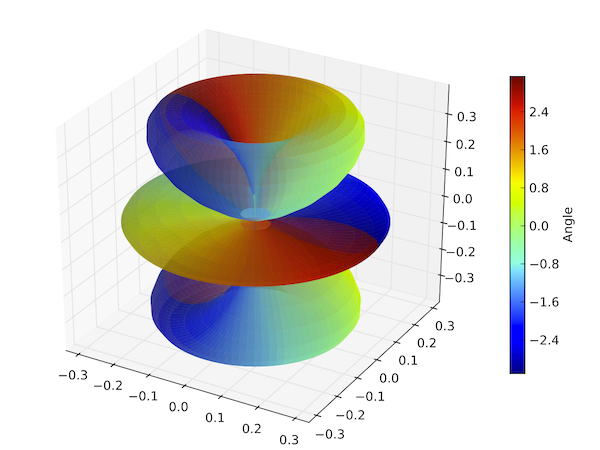
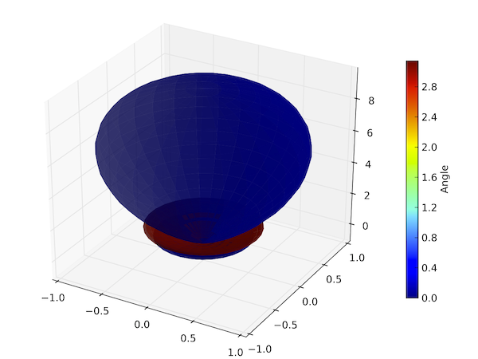

.. QuTiP 
   Copyright (C) 2011-2012, Paul D. Nation & Robert J. Johansson

Plotting an angular wave function and direction eigen-ket
=========================================================
  
Adapted from the quantum optics toolbox by Sze M. Tan

Shows a plot of an angular wave function corresponding to specified state of a l=3 system, and then computes an approximation to a direction eigenket in the direct sum space of angular-momentum spaces.

.. include:: examples-angular.py
    :literal:    

`Download example <http://qutip.googlecode.com/svn/doc/examples/examples-angular.py>`_
      

    

