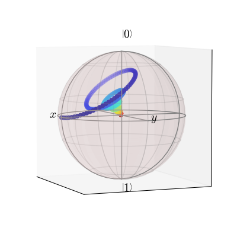

.. QuTiP 
   Copyright (C) 2011-2012, Paul D. Nation & Robert J. Johansson

.. _examples_bloch_qubit_decay:

Decay of a qubit state coupled to a zero-temp. bath shown on a Bloch sphere
===========================================================================

Qubit dynamics shown in a Bloch sphere.

Basic example
-------------

.. include:: examples-bloch-qubit-decay.py
    :literal:    

`Download example <http://qutip.googlecode.com/svn/doc/examples/examples-bloch-qubit-decay.py>`_
      
.. figure:: examples-bloch-qubit-decay.png
    :align: center
    :width: 4in

Slightly More Advanced
----------------------

Suppose we want to vary the color of our points as a function of time.  Here we show you how to do this.  After running the previous example::

    from matplotlib import mpl,cm #need to import colormap (cm)
    sphere.clear() #clear the previous data
    nrm=mpl.colors.Normalize(0,3)#normalize colors to tlist range
    colors=cm.jet(nrm(tlist)) #make list of colors, one for each time in twist
    sphere.point_color=list(colors) #define sphere point colors
    sphere.add_points([sx,sy,sz],'m')#add points as 'multi' colored points
    sphere.point_marker=['o'] #make all markers same 'circle' shape
    sphere.point_size=[25] #same point sizes
    sphere.view=[-23,5] #change viewing angle to see all the colors
    sphere.show()
   
        

