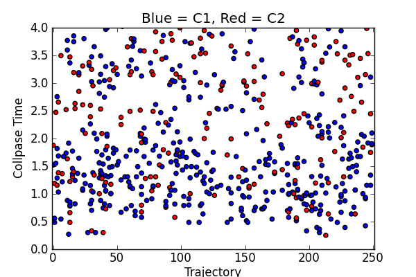

.. QuTiP 
   Copyright (C) 2011, Paul D. Nation & Robert J. Johansson

.. _examples_collapsetimesmonte:

Simple example demonstrating the use of multiple return values from mcsolve
---------------------------------------------------------------------------

Here we show how to get the collapse times and which operator values from the :func:`qutip.mcsolve` function.  In the figure we plot the times at which a collapse occurred for each Monte-Carlo trajectory.  Which operator did the collapse is given by the color of the point.
    
.. include:: examples-collapsetimesmonte.py
    :literal:    

`Download example <http://qutip.googlecode.com/svn/doc/examples/examples-collapsetimesmonte.py>`_

