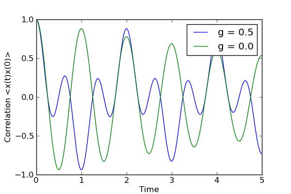

.. QuTiP 
   Copyright (C) 2011, Paul D. Nation & Robert J. Johansson

Example on how to calculate two-time correlation functions in QuTiP.
--------------------------------------------------------------------
  
In the following example we calculate the :math:`\left<x(t)x(0)\right>` correlation function for a cavity, with and without coupling to a two-level atom.

.. include:: examples-corrfunc.py
    :literal:    

`Download example <http://qutip.googlecode.com/svn/doc/examples/examples-corrfunc.py>`_

    

