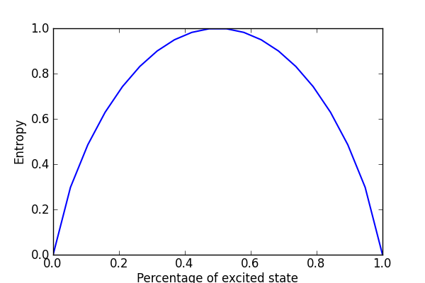

.. QuTiP 
   Copyright (C) 2011-2012, Paul D. Nation & Robert J. Johansson

Von-Neumann entropy of a binary mixture of :math:`\left|\uparrow\right>` and :math:`\left|\downarrow\right>` states
===================================================================================================================
     
Calculates the entropy of a mixture of :math:`a\left|\uparrow\right>\left<\uparrow\right| + (1-a)\left|\downarrow\right>\left<\downarrow\right|` states as the mixing parameter :math:`a` is varied from 0 to 1.
    
.. include:: examples-entropy.py
    :literal:    

`Download example <http://qutip.googlecode.com/svn/doc/examples/examples-entropy.py>`_
      

