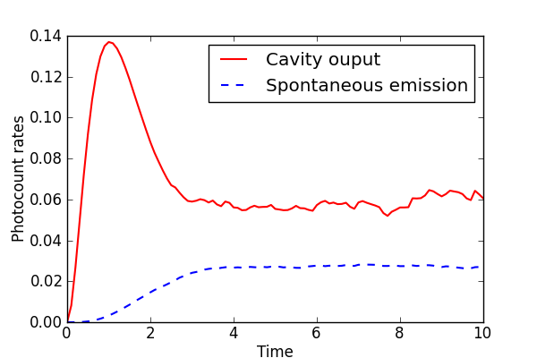

.. QuTiP 
   Copyright (C) 2011-2012, Paul D. Nation & Robert J. Johansson

Calculation of Expectation Values via Monte-Carlo Method
---------------------------------------------------------
  
Monte-Carlo time evolution of an atom+cavity system.  Adapted from a qotoolbox example by Sze M. Tan.
    
.. include:: examples-expectmonte.py
    :literal:    

`Download example <http://qutip.googlecode.com/svn/doc/examples/examples-expectmonte.py>`_

