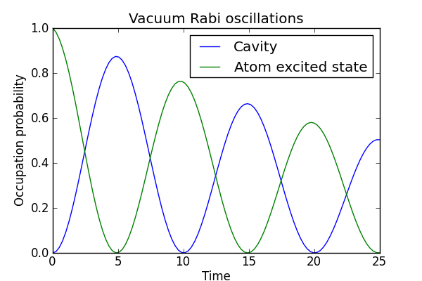

.. QuTiP 
   Copyright (C) 2011, Paul D. Nation & Robert J. Johansson

Vacuum Rabi oscillations in the Jaynes-Cummings model with dissipation
======================================================================
  
This example illustrates the vacuum Rabi oscillations in the Jaynes-Cummings model.

.. include:: examples-jc-model.py
    :literal:    

`Download example <http://qutip.googlecode.com/svn/doc/examples/examples-jc-model.py>`_
      

