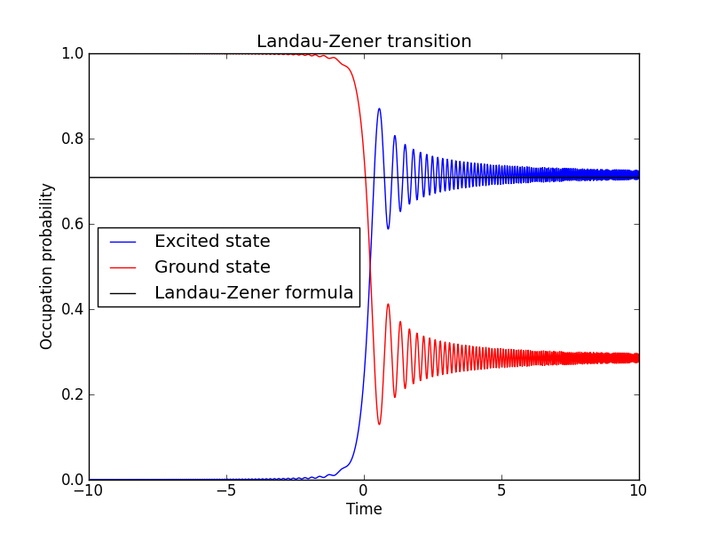
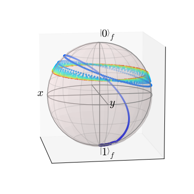
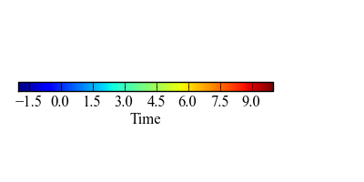

.. QuTiP 
   Copyright (C) 2011-2012, Paul D. Nation & Robert J. Johansson

Landau-Zener transitions in a quantum two-level system
======================================================
  
Master equation with time-dependent Hamiltonian: Landau-Zener transitions. (QuTiP paper Figures 10 and 11)

.. include:: examples-landau-zener.py
    :literal:    

`Download example <http://qutip.googlecode.com/svn/doc/examples/examples-landau-zener.py>`_
      

    

