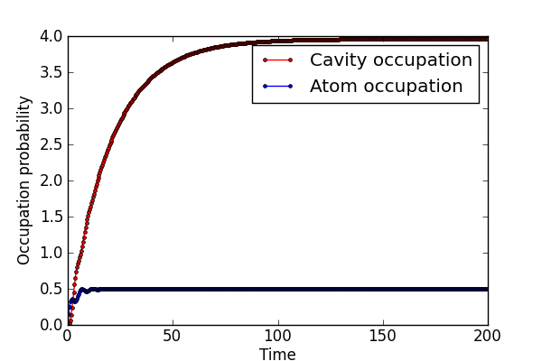
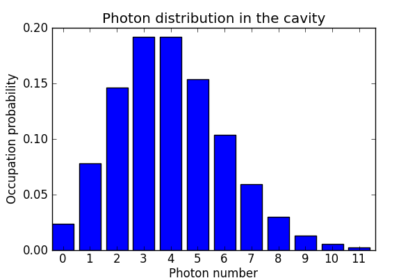
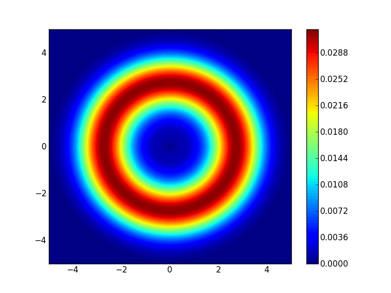

.. QuTiP 
   Copyright (C) 2011-2012, Paul D. Nation & Robert J. Johansson

Single-atom lasing in a Jaynes-Cumming-like system
==================================================
  
This example illustrates a simple model for single-atom lasing in a Jaynes-Cumming-like system, with an additional incoherent pump on the qubit.
  
.. include:: examples-lasing.py
    :literal:    

`Download example <http://qutip.googlecode.com/svn/doc/examples/examples-lasing.py>`_
      

    
    Cavity and atom occupation probabilities.
    

    Cavity photon distribution (final state).
    

    Cavity Winger function (final state).
