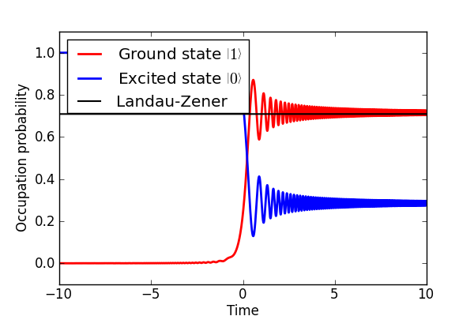

.. QuTiP 
   Copyright (C) 2011, Paul D. Nation & Robert J. Johansson

Figures 10 & 11 from the QuTiP manuscript.
-------------------------------------------------------------------------------

Here we calculate the occupation of a qubit after going through an avoided level crossing and compare to the Landau-Zener formula.
The Bloch sphere representation is also given, where the data point color indicates the amount of elapsed time.
    
.. include:: examples-paperfig2.py
    :literal:    

`Download example <http://qutip.googlecode.com/svn/doc/examples/examples-paperfig2.py>`_

.. figure:: examples-paperfig10_11_2.png 
    :align: center
    
.. figure:: examples-paperfig10_11_3.png 
    :align: center

