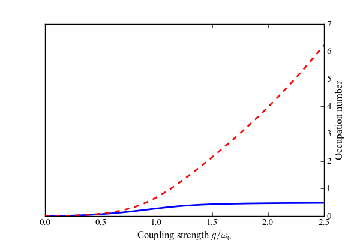
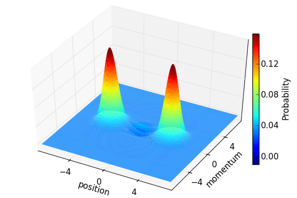

.. QuTiP 
   Copyright (C) 2011-2012, Paul D. Nation & Robert J. Johansson

Figure 2 from the QuTiP manuscript.
-------------------------------------------------------------------------------

Here we calculate the ground state occupation probability for a coupled cavity-qubit system in the ultra-strong coupling regime as a function of the coupling strength g.  In set figure shows the Wigner function for the cavity mode at the largest coupling strength :math:`g=2.5`, which is well approximated by Eq.4 from the paper.
    
.. include:: examples-paperfig2.py
    :literal:    

`Download example <http://qutip.googlecode.com/svn/doc/examples/examples-paperfig2.py>`_

