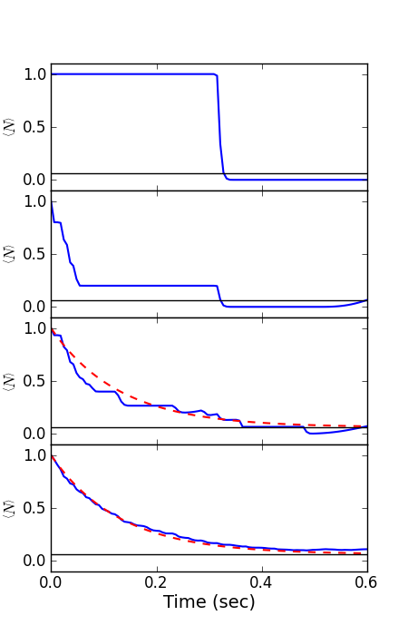

.. QuTiP 
   Copyright (C) 2011, Paul D. Nation & Robert J. Johansson

Figure 4 from the QuTiP manuscript.
-------------------------------------------------------------------------------

This is a Monte-Carlo simulation showing the decay of a cavity Fock state :math:`\left|0\right>` in a thermal environment with an average occupation number of :math:`n=0.063`.  Here, the coupling strength is given by the inverse of the cavity ring-down time :math:`T_{c}=0.129`.

The parameters chosen here correspond to those from S. Gleyzes, et al., Nature 446, 297 (2007).
    
.. include:: examples-paperfig4.py
    :literal:    

`Download example <http://qutip.googlecode.com/svn/doc/examples/examples-paperfig4.py>`_

