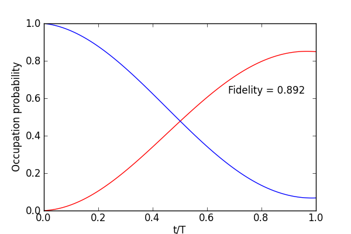

.. QuTiP 
   Copyright (C) 2011, Paul D. Nation & Robert J. Johansson

Figure 6 from the QuTiP manuscript.
-------------------------------------------------------------------------------

Dissipative :math:`i`-SWAP gate.
    
.. include:: examples-paperfig6.py
    :literal:    

`Download example <http://qutip.googlecode.com/svn/doc/examples/examples-paperfig6.py>`_

