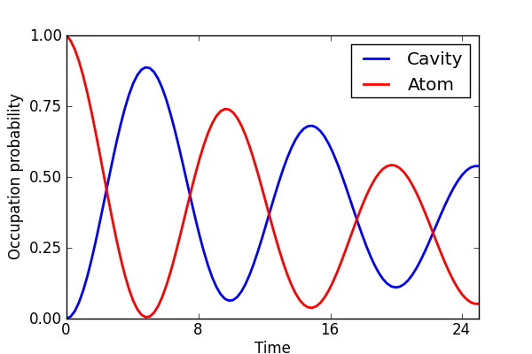

.. QuTiP 
   Copyright (C) 2011-2012, Paul D. Nation & Robert J. Johansson

Figure 7 from the QuTiP manuscript.
-------------------------------------------------------------------------------

Master equation evolution of the Jaynes-Cummings Hamiltonian in a thermal environment characterized by n=0.75.  Here, the initial state is an excited atom coupled to a cavity mode in vacuum.  The coupling strength, atom, and cavity rates are :math:`g=0.05`, :math:`\gamma=0.05`, and :math:`\kappa=0.005`, respectively.
    
.. include:: examples-paperfig7.py
    :literal:    

`Download example <http://qutip.googlecode.com/svn/doc/examples/examples-paperfig7.py>`_

