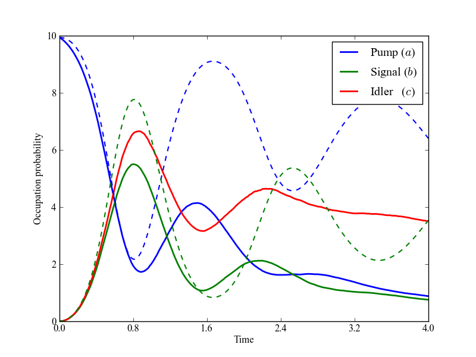

.. QuTiP 
   Copyright (C) 2011, Paul D. Nation & Robert J. Johansson

Figure 8 from the QuTiP manuscript.
-------------------------------------------------------------------------------

Monte-Carlo simulation of a trilinear Hamiltonian with the pump mode in an initial coherent state with :math:`a=\sqrt{10}`.  Both
signal and idler modes start in vacuum states.  Here, the coupling rates to the environment for the pump, signal, and idler modes are g0=0.1, g1=0.4, g2=0.1, respectively.  Also presented is the closed-system evolution, g0=g1=g2=0.
    
.. include:: examples-paperfig8.py
    :literal:    

`Download example <http://qutip.googlecode.com/svn/doc/examples/examples-paperfig8.py>`_

