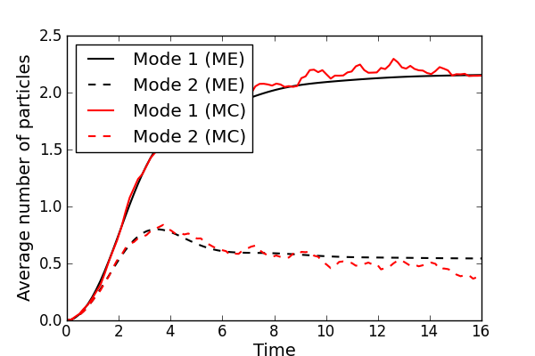

.. QuTiP 
   Copyright (C) 2011-2012, Paul D. Nation & Robert J. Johansson

Master equation vs. Monte-Carlo evolution for a unequally damped parametric amplifier
-----------------------------------------------------------------------------------------
    
.. include:: examples-parampmonte.py
    :literal:    

`Download example <http://qutip.googlecode.com/svn/doc/examples/examples-parampmonte.py>`_

