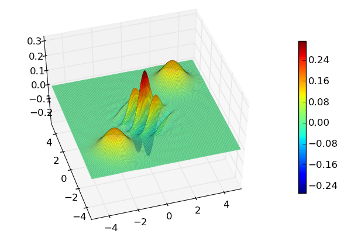
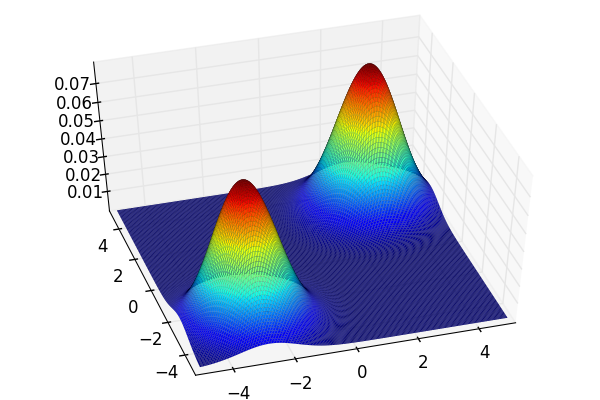

.. QuTiP 
   Copyright (C) 2011-2012, Paul D. Nation & Robert J. Johansson

Wigner and Q-function distributions for a Schrodinger-Cat state
===============================================================
  
   
Calculates the Wigner for a Schrodinger Cat-state composed of two coherent states :math:`\alpha_1=-2-2j`, and :math:`\alpha_2=2+2j`.
    
.. include:: examples-schcatdist.py
    :literal:    

`Download example <http://qutip.googlecode.com/svn/doc/examples/examples-schcatdist.py>`_
      

    
    The Wigner function of the Schrödinger cat state.
    

    The Q-function of the Schrödinger cat state.

