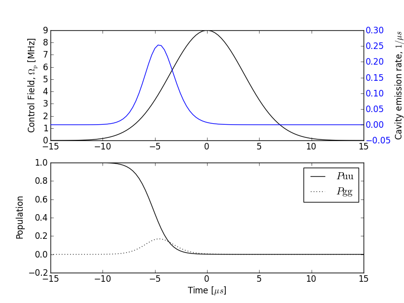

.. QuTiP 
   Copyright (C) 2011-2012, Paul D. Nation & Robert J. Johansson

Single photon source based on a three level atom strongly coupled to a cavity
=============================================================================
  
This example highlights a single photon source based on a three level atom strongly coupled to a cavity.   
    
.. include:: examples-single-photon-source.py
    :literal:    

`Download example <http://qutip.googlecode.com/svn/doc/examples/examples-single-photon-source.py>`_
      

    
    State Population and Emission from Cavity
    

