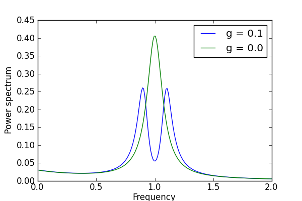

.. QuTiP 
   Copyright (C) 2011-2012, Paul D. Nation & Robert J. Johansson

The spectrum of a cavity coupled to a two-level atom
----------------------------------------------------
Calculate the power spectrum of a cavity, with and without coupling to a two-level atom.
    
.. include:: examples-spectrumsteady.py
    :literal:    

`Download example <http://qutip.googlecode.com/svn/doc/examples/examples-spectrumsteady.py>`_

