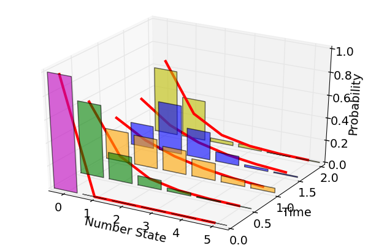

.. QuTiP 
   Copyright (C) 2011-2012, Paul D. Nation & Robert J. Johansson

.. _examples_thermalmonte:

Trilinear Hamiltonian: Deviation from a thermal spectrum
--------------------------------------------------------

Adapted from: P. D. Nation and M. P. Blencowe, "The Trilinear Hamiltonian: a zero-dimensional model of Hawking radiation from a quantized source", NJP *12* 095013 (2010)

The parametric amplifier is a common example of a linear amplifier.  It is well-known that the parametric amplifier produces a thermal state, when starting from vacuum, in both the signal or idler mode, when the other mode is traced over.  The key approximation in the parametric amplifier is the assumption that the pump mode be modeled as a classical system, defined by a c-number amplitude and phase.  Relaxing this condition leads to the trilinear Hamiltonian, where the pump is now a quantized degree of freedom.  As the example below shows, the signal or idler mode begins to deviate from a thermal distribution as the pump mode transfers energy.
    
.. include:: examples-thermalmonte.py
    :literal:

`Download example <http://qutip.googlecode.com/svn/doc/examples/examples-thermalmonte.py>`_

    
