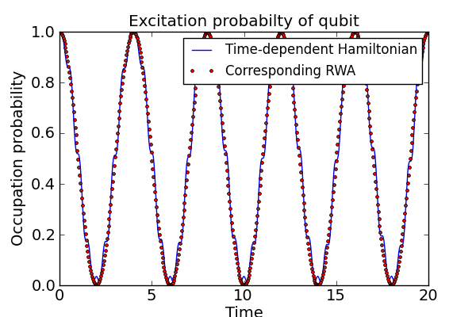

.. QuTiP 
   Copyright (C) 2011-2012, Paul D. Nation & Robert J. Johansson

Rabi oscillations of an atom subject to a time-dependent classical driving field
================================================================================
  
This example illustrates how to evolve the master equation with time-dependent Hamiltonian.

.. include:: examples-time-dependence.py
    :literal:    

`Download example <http://qutip.googlecode.com/svn/doc/examples/examples-time-dependence.py>`_
      

