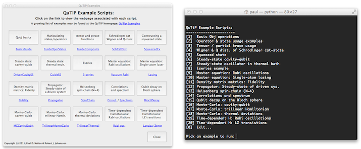

.. QuTiP 
   Copyright (C) 2011-2012, Paul D. Nation & Robert J. Johansson

.. _examples:

***********************
QuTiP Example Scripts
***********************

.. _examples-running:

Running Examples
================

QuTip includes 20 built in demos from the examples below that demonstrate the usage of the built in functions for solving a variety of problems.  To run the demos, load the QuTiP package::

    >>> from qutip import *
    
and run the demos function::

    >>> demos()

This will generate the examples GUI, or a command line list of demos, depending on the availability of the graphics libraries:

If you do not have any graphics libraries installed, or they are disabled, then the demos function *must* be run from the terminal.

.. _examples-list:

List of Built-in Examples
=========================

.. toctree::
   :maxdepth: 2
   
   ex-basic.rst
   ex-master-equation.rst
   ex-monte-carlo.rst
   ex-correlation.rst
   ex-time-dependence.rst   
   ex-advanced.rst 

