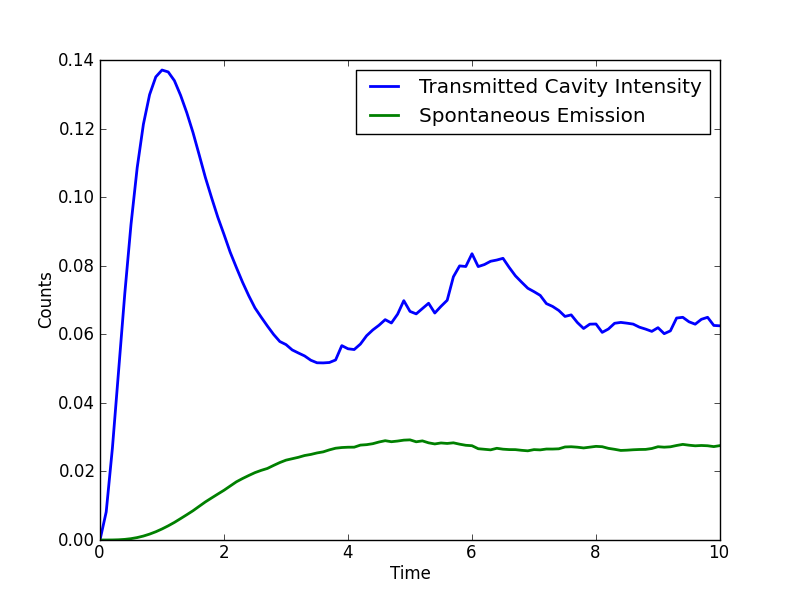

.. QuTiP 
   Copyright (C) 2011-2012, Paul D. Nation & Robert J. Johansson

.. _exmc30:

Driven Cavity+Qubit Monte Carlo
===============================

Monte Carlo evoution of a coherently driven cavity with a two-level atom initially in the ground state and no photons in the cavity.

Adapted from qotoolbox example 'probqmc3' by Sze M. Tan.

.. literalinclude:: ex_30.py

