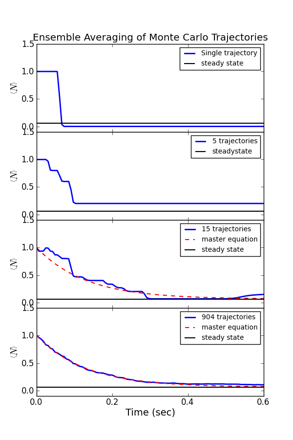

.. QuTiP 
   Copyright (C) 2011-2012, Paul D. Nation & Robert J. Johansson

.. _exmc32:

Averaging of Monte Carlo Trajectories to Master Equation Solution
=================================================================

This is a Monte Carlo simulation showing the decay of a cavity
Fock state :math:`\left|1\rangle\right.` in a thermal environment with an average
occupation number of :math:`n=0.063`.  Here, the coupling strength is given
by the inverse of the cavity ring-down time :math:`T_{c}=0.129`.

The parameters chosen here correspond to those from
S. Gleyzes, et al., Nature **446**, 297 (2007).

.. literalinclude:: ex_32.py

