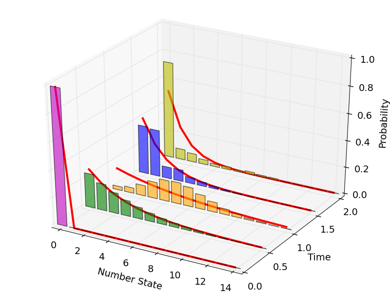

.. QuTiP 
   Copyright (C) 2011-2012, Paul D. Nation & Robert J. Johansson

.. _exmc33:

Trilinear Hamiltonian: Deviation from Thermal State
===================================================

Demonstrates the deviation from a thermal distribution for a single oscillator mode of the trilinear Hamiltonian.

Adapted from Nation & Blencowe, NJP 12 095013 (2010).

.. literalinclude:: ex_33.py

