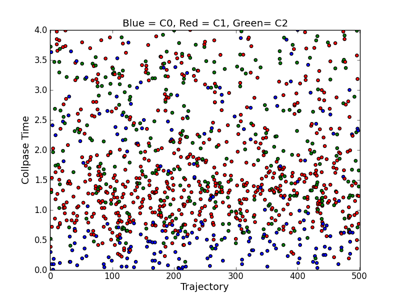

.. QuTiP 
   Copyright (C) 2011-2012, Paul D. Nation & Robert J. Johansson

.. _exmc34:

Visualizing Monte Carlo Collapse Times and Operators
====================================================

Example showing which times and operators were responsible for wave function collapse in a Monte Carlo simulation of a dissipative trilinear Hamiltonian.  Operators are color coded for clarity.

.. literalinclude:: ex_34.py

