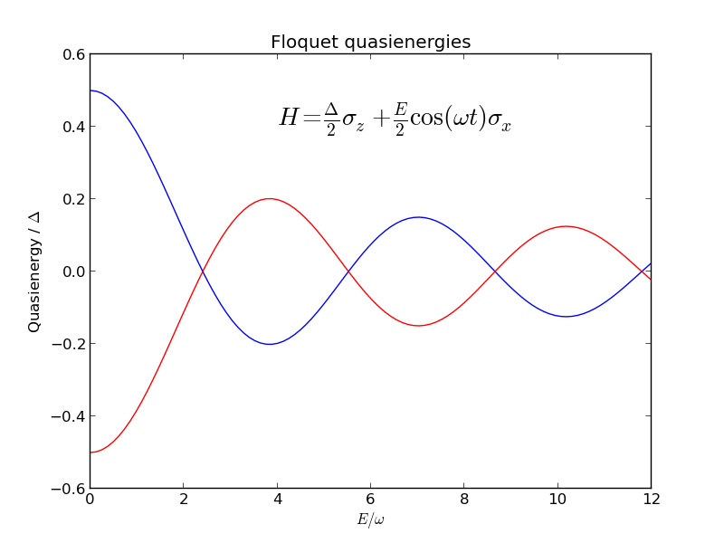

.. QuTiP 
   Copyright (C) 2011-2012, Paul D. Nation & Robert J. Johansson

.. _exme44:

Floquet quasienergy levels for a driven two-level system
========================================================

This example demonstrates how to calculate the Floquet quasienergies for a driven system. The example is taken from Creffield et al., Phys. Rev. B 67, 165301 (2003), see Fig. 1(a) in that paper. The Hamiltonian is

.. math::

    H(t) = \frac{\Delta}{2}\sigma_z + \frac{E}{2}\cos(\omega t)\sigma_z,

and we use the QuTiP function :func:`qutip.floquet.floquet_modes` to obtain the Floquet modes and the quasienergies.

.. plot:: ../qutip/qutip/examples/ex_44.py
	:include-source:

