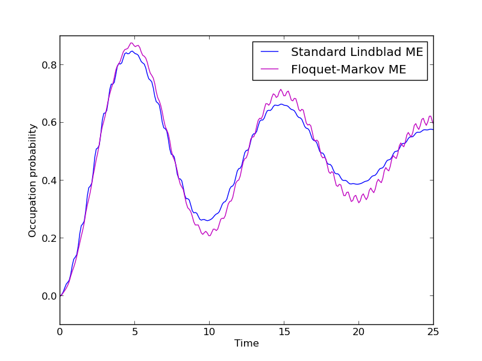

.. QuTiP 
   Copyright (C) 2011-2012, Paul D. Nation & Robert J. Johansson

.. _exme44:

Floquet-Markov master equation
==============================

In this example we demonstrate how to use the Floquet-Markov master equation solver in QuTiP by revisting the vacuum Rabi oscillation problem: i.e., a simple two level system subject to a driving field (classical in this example) and dissipation due to its interaction with the environment. We use the QuTiP function :func:`qutip.floquet.fmmesolve` to obtain the system dynamics. For comparison we also calculate the dynamics using the standard Lindblad master eqaution. For weak driving and dissipation the two solvers should give similar results, but not necessarily when the driving amplitude or dissipation rates are large compared to the two-level energy splitting.

.. plot:: ../qutip/qutip/examples/ex_45.py
	:include-source:

