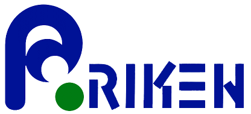

.. QuTiP 
   Copyright (C) 2011-2012, Paul D. Nation & Robert J. Johansson

.. _frontmatter:

Frontmatter
============

These pages contains automatically generated API documentation for QuTiP. A PDF version of this text may be found on the `downloads page <http://code.google.com/p/qutip/downloads/list>`_. 

**For more information see the** `QuTiP project web page`_.

.. _QuTiP project web page: http://code.google.com/p/qutip

Citing This Project
********************
    
If you find this project useful, then please cite:

.. centered:: J. R. Johansson, P.D. Nation, and F. Nori, "QuTiP: An open-source Python framework for the dynamics of open quantum systems", Comp. Phys. Comm. (2012)

which may also be download from http://arxiv.org/abs/1110.0573.

Funding
********************

The development of QuTiP has been partially supported by the Japanese Society for the Promotion of Science Foreign Postdoctoral Fellowship Program under grants P11202 (PDN) and P11501 (JRJ).  Additional funding comes from RIKEN and Kakenhi grant Nos. 2301202 (PDN) and 2302501 (JRJ). 

.. figure:: figures/jsps.jpg
   :align: center
   :width: 4in

   
   
