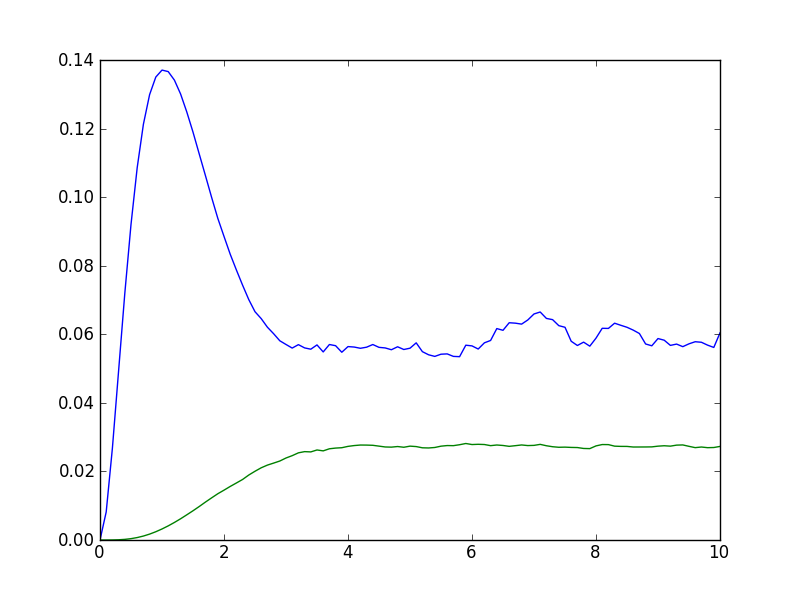

.. QuTiP 
   Copyright (C) 2011-2012, Paul D. Nation & Robert J. Johansson

.. _odedata:

**************************************************
The Odedata Class and Dynamical Simulation Results
**************************************************

.. important::  In QuTiP 2, the results from all of the dynamics solvers are returned as Odedata objects.  This significantly simplifies the storage and saving of simulation data.  However, this change also results in the loss of backward compatibility with QuTiP version 1.x.  Therefore, please read this section to avoid running into any issues.

.. _odedata-class:

The Odedata Class
=================
Before embarking on simulating the dynamics of quantum systems, we will first look at the data structure used for returning the simulation results to the user.  This object is a :func:`qutip.Odedata` class that stores all the crucial data needed for analyzing and plotting the results of a simulation.  Like the :func:`qutip.Qobj` class, the ``Odedata`` class has a collection of properties for storing information.  However, in contrast to the Qobj class, this structure contains no methods, and is therefore nothing but a container object.  A generic Odedata object ``odedata`` contains the following properties for storing simulation data:

.. tabularcolumns:: | p{2cm} | p{3cm} |

+------------------------+-----------------------------------------------------------------------+
| Property               | Description                                                           |
+========================+=======================================================================+
| odedata.solver         | String indicating which solver was used to generate the data.         |
+------------------------+-----------------------------------------------------------------------+
| odedata.times          | List/array of times at which simulation data is calculated.           |
+------------------------+-----------------------------------------------------------------------+
| odedata.expect         | List/array of expectation values, if requested.                       |
+------------------------+-----------------------------------------------------------------------+
| odedata.states         | List/array of state vectors /density matrices calcuated at ``times``  |
|                        | , if requested.                                                       |
+------------------------+-----------------------------------------------------------------------+
| odedata.num_expect     | The number of expectation value operators in the simulation.          |
+------------------------+-----------------------------------------------------------------------+
| odedata.num_collapse   | The number of collapse operators in the simulation.                   |
+------------------------+-----------------------------------------------------------------------+
| odedata.ntraj          | Number of monte-carlo trajectories run (if using mcsolve).            |
+------------------------+-----------------------------------------------------------------------+

.. _odedata-access:

Accessing Odedata Data
======================
To understand how to access the data in a Odedata object we will use the :ref:`exmc30` example as a guide, although we do not worry about the simulation details at this stage.  Like all solvers, the monte-carlo solver used in this example returns an Odedata object, here called simply ``data``.  To see what is contained inside ``data`` we can use the print command:

>>> print data
    Odedata object with mcsolve data.
    ---------------------------------
    expect = True
    num_expect = 2, num_collapse = 2, ntraj = 500

The first line tells us that this data object was generated from the Monte-Carlo solver ``mcsolve`` (discussed in :ref:`monte`).  The next line (not the ``---`` line of course) indicates that this object contains expectation value data.  Finally, the last line gives the number of expectation value and collapse operators used in the simulation, along with the number of Monte-Carlo trajectories run.  Note that the number of trjaectories ``ntraj`` is only displayed when using the Monte-Carlo solver.

Now we have all the information needed to reproduce the simulation results.  To access the data for the two expectation values one can do:

>>> expt0 = data.expect[0]
>>> expt1 = data.expect[1]

Recall that Python uses C-style indexing that begins with zero ( i.e. [0] => 1st collapse operator data).  Together with the array of times at which these expectation values are calculated:

>>> times = data.times

we can plot the resulting expectation values:

>>> plot(times,expt0,times,expt1)
>>> show()

.. image-odedata1:

.. figure:: guide-dynamics-odedata1.png
   :align: center
   :width: 4in
   
   Data for expectation values extracted from the ``data`` Odedata object.

State vectors, or density matrices, are accessed in a similar manner, although typically one does not need an index (i.e [0]) since there is only one list of state vectors.  The one exception to this rule is if you choose to ouput states from the Monte-Carlo solver, where there are ``ntraj`` number of state vectors arrays.

.. _odedata-saving:

Saving and Loading Odedata Objects
==================================

The main advantage in using the Odedata class as a data storage object comes from the simplicity in which simulation data can be stored and later retrieved. The :func:`qutip.fileio.qsave` and :func:`qutip.fileio.qload` functions are designed for this task.  To begin, let us save the ``data`` object from the previous section into a file called "cavity+qubit-data" in the current working directory by calling:

>>> qsave(data,'cavity+qubit-data')

All of the data results are then stored in a single file of the same name with a ".qu" extension.  Therefore, everything needed to later this data is stored in a single file.  Loading the file is just as easy as saving:

>>> chicken=qload('cavity+qubit-data')
    Loaded Odedata object:
    Odedata object with mcsolve data.
    ---------------------------------
    expect = True
    num_expect = 2, num_collapse = 2, ntraj = 500

where ``chicken`` is the new name of the Odedata object.  We can then extract the data and plot in the same manner as before::

	expt0 = chicken.expect[0]
	expt1 = chicken.expect[1]
	times = chicken.times
	plot(times,expt0,times,expt1)
	show()

.. image-odedata2:

   
   Data for expectation values from the ``chicken`` object loaded from the ``data`` object stored with :func:`qutip.fileio.qsave`

