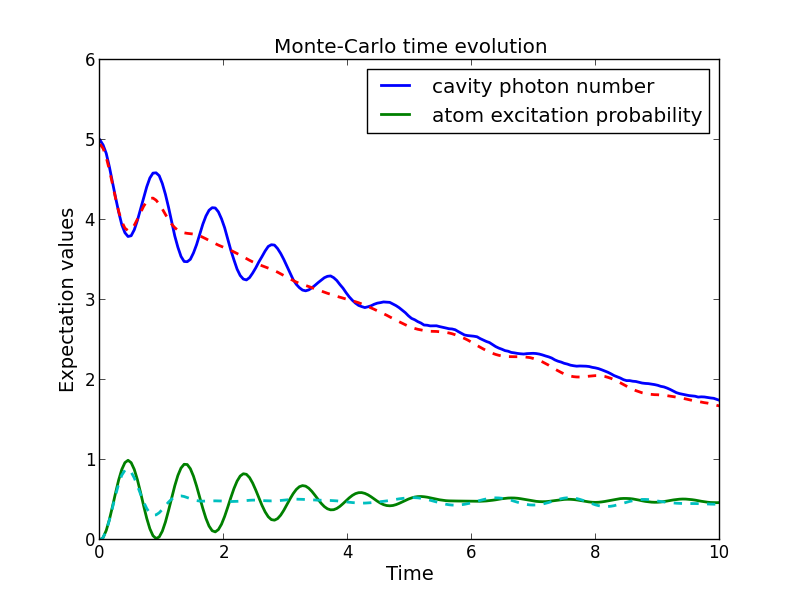

.. QuTiP 
   Copyright (C) 2011-2012, Paul D. Nation & Robert J. Johansson

.. _monte:

*******************************************
Quantum Dynamics via the Monte-Carlo Solver
*******************************************

.. _monte-intro:

Introduction
=============

Where as the density matrix formalism describes the ensemble average over many identical realizations of a quantum system, the Monte-Carlo (MC), or quantum-jump approach to wave function evolution, allows for simulating an individual realization of the system dynamics.  Here, the environment is continuously monitored, resulting in a series of quantum jumps in the system wave function, conditioned on the increase in information gained about the state of the system via the environmental measurements.  In general, this evolution is governed by the Schrödinger equation with a **non-Hermitian** effective Hamiltonian  

.. math::
	:label: heff
	
	H_{\rm eff}=H_{\rm sys}-\frac{i\hbar}{2}\sum_{i}C^{+}_{n}C_{n},

where again, the :math:`C_{n}` are collapse operators, each corresponding to a separate irreversible process with rate :math:`\gamma_{n}`.  Here, the strictly negative non-Hermitian portion of Eq.(:eq:`heff`) gives rise to a reduction in the norm of the wave function, that to first-order in a small time :math:`\delta t`, is given by :math:`\left<\psi(t+\delta t)|\psi(t+\delta t)\right>=1-\delta p` where

.. math::
	:label: jump

	\delta p =\delta t \sum_{n}\left<\psi(t)|C^{+}_{n}C_{n}|\psi(t)\right>,

and :math:`\delta t` is such that :math:`\delta p \ll 1`.  With a probability of remaining in the state :math:`\left|\psi(t+\delta t)\right>` given by :math:`1-\delta p`, the corresponding quantum jump probability is thus Eq.(:eq:`jump`).  If the environmental measurements register a quantum jump, say via the emission of a photon into the environment, or a change in the spin of a quantum dot, the wave function undergoes a jump into a state defined by projecting :math:`\left|\psi(t)\right>` using the collapse operator :math:`C_{n}` corresponding to the measurement

.. math::
	:label: project

	\left|\psi(t+\delta t)\right>=C_{n}\left|\psi(t)\right>/\left<\psi(t)|C_{n}^{+}C_{n}|\psi(t)\right>^{1/2}.

If more than a single collapse operator is present in Eq~(:eq:`heff`), the probability of collapse due to the :math:`i\mathrm{th}`-operator :math:`C_{i}` is given by 

.. math::
	:label: pcn

	P_{i}(t)=\left<\psi(t)|C_{i}^{+}C_{i}|\psi(t)\right>/\delta p.

Evaluating the MC evolution to first-order in time is quite tedious.  Instead, QuTiP uses the following algorithm to simulate a single realization of a quantum system.  Starting from a pure state :math:`\left|\psi(0)\right>`:

- **I:** Choose a random number :math:`r` between zero and one, representing the probability that a quantum jump occurs.  

- **II:** Integrate the Schrödinger equation (:eq:`schrodinger`), using the effective Hamiltonian (:eq:`heff`) until a time :math:`\tau` such that the norm of the wave function satisfies :math:`\left<\psi(\tau)\right.\left|\psi(\tau)\right>=r`, at which point a jump occurs.

- **III:** The resultant jump projects the system at time :math:`\tau` into one of the renormalized states given by Eq.(:eq:`project`).  The corresponding collapse operator :math:`C_{n}` is chosen such that :math:`n` is the smallest integer satisfying:

.. math::
	:label: mc3

	\sum_{i=1}^{n} P_{n}(\tau) \ge r

where the individual :math:`P_{n}` are given by Eq.(:eq:`pcn`).  Note that the left hand side of Eq.(:eq:`mc3`) is, by definition, normalized to unity.

- **IV:** Using the renormalized state from step III as the new initial condition at time :math:`\tau`, draw a new random number, and repeat the above procedure until the final simulation time is reached.

.. _monte-qutip:

Monte-Carlo in QuTiP:
=====================

In QuTiP, Monte-Carlo evolution is implemented with the :func:`qutip.mcsolve` function. It takes nearly the same arguments as the :func:`qutip.mesolve`
function for master-equation evolution, except that the initial state must be a ket vector, as oppose to a density matrix, and there is an optional keyword parameter ``ntraj`` that defines the number of stochastic trajectories to be simulated.  By default, ``ntraj=500`` indicating that 500 Monte-Carlo trajectories will be performed. 

To illustrate the use of the Monte-Carlo evolution of quantum systems in QuTiP, let's again consider the case of a two-level atom coupled to a leaky cavity. The only differences to the master-equation treatment is that in this case we invoke the :func:`qutip.mcsolve` function instead of :func:`qutip.mesolve`::

	from qutip import *
	from pylab import *

	tlist = linspace(0.0, 10.0, 200)
	psi0 = tensor(fock(2,0), fock(10, 5))
	a  = tensor(qeye(2), destroy(10))
	sm = tensor(destroy(2), qeye(10))
	H = 2*pi * a.dag() * a + 2 * pi * sm.dag() * sm + 2*pi * 0.25 * (sm*a.dag() + sm.dag() * a)
	#run monte-carlo solver
	data = mcsolve(H, psi0, tlist, [sqrt(0.1)*a], [a.dag()*a, sm.dag()*sm])
	plot(tlist, data.expect[0],tlist, data.expect[1])
	title('Monte-Carlo time evolution')
	xlabel('Time')
	ylabel('Expectation values')
	legend(("cavity photon number", "atom excitation probability"))
	show()

.. guide-dynamics-mc1:

.. figure:: guide-dynamics-mc.png
   :align: center
   :width: 4in

The advantage of the Monte-Carlo method over the master equation approach is that only the state vector is required to be kept in the computers memory, as opposed to the entire density matrix. For large quantum system this becomes a significant advantage, and the Monte-Carlo solver is therefore generally recommended for such systems. For example, simulating a Heisenberg spin-chain consisting of 10 spins with random parameters and initial states takes almost 7 times longer using the master equation rather than Monte-Carlo approach with the default number of trajectories running on a quad-CPU machine.  Furthermore, it takes about 7 times the memory as well. However, for small systems, the added overhead of averaging a large number of stochastic trajectories to obtain the open system dynamics, as well as starting the multiprocessing functionality, outweighs the benefit of the minor (in this case) memory saving. Master equation methods are therefore generally more efficient when Hilbert space sizes are on the order of a couple of hundred states or smaller.

Like the master equation solver :func:`qutip.mesolve`, the Monte-Carlo solver returns a Odedata object consisting of expectation values, if the user has defined expectation value operators in the 5th-arguement to ``mcsolve``, or state vectors if no expectation value operators are given.  If state vectors are returned, then the :func:`qutip.Odedata` returned by :func:`qutip.mcsolve` will be an array of length ``ntraj``, with each element containing an array of ket-type qobjs with the same number of elements as ``tlist``.  Furthermore, the output Odedata object will also contain a list of times at which collapse occurred, and which collapse operators did the collapse, in the ``col_times`` and ``col_which`` properties, respectively. See example :ref:`exmc34` for an example using these properties.

.. _monte-ntraj:

Changing the Number of Trajectories
-----------------------------------

As mentioned earlier, by default, the ``mcsolve`` function runs 500 trajectories.  This value was chosen because it gives good accuracy, monte-carlo errors scale as :math:`1/n` where :math:`n` is the number of trajectories, and simultaneously does not take an excessive amount of time to run.  However, like many other options in QuTiP you are free to change the number of trajectories to fit your needs.  If we want to run 1000 trajectories in the above example, we can simply modify the call to ``mcsolve`` like:

>>> data = mcsolve(H, psi0, tlist, [sqrt(0.1)*a], [a.dag()*a, sm.dag()*sm],ntraj=1000)

where we have added the keyword argument ``ntraj=1000`` at the end of the inputs.  Now, the Monte-Carlo solver will calculate expectation values for both operators, ``a.dag()*a, sm.dag()*sm`` averaging over 1000 trajectories.  Sometimes one is also interested in seeing how the Monte-Carlo trajectories converge to the master equation solution by calculating expectation values over a range of trajectory numbers.  If, for example, we want to average over 1, 10, 100, and 1000 trajectories, then we can input this into the solver using:

>>> ntraj = [1,10,100,1000]

Keep in mind that the input list must be in ascending order since the total number of trajectories run by ``mcsolve`` will be calculated using the last element of ``ntraj``.  In this case, we need to use an extra index when getting the expectation values from the Odedata object returned by ``mcsolve``.  In the above example using:

>>> data = mcsolve(H, psi0, tlist, [sqrt(0.1)*a], [a.dag()*a, sm.dag()*sm],ntraj=[1,10,100,1000])

we can extract the relevant expectation values using::

	expt1=data.expect[0] # <- expectation values for 1 trajectory
	expt10=data.expect[1] # <- expectation values avg. over 10 trajectories
	expt100=data.expect[2] # <- expectation values avg. over 100 trajectories
	expt1000=data.expect[3] # <- expectation values avg. over 1000 trajectories

An example is given in :ref:`exmc32`.

The Monte-Carlo solver also has many available options that can be set using the :func:`qutip.Odeoptions` class as discussed in :ref:`odeoptions`.

.. _monte-reuse:

Reusing Hamiltonian Data
------------------------

.. note:: This section covers a specialized topic and may be skipped if you are new to QuTiP.

In order to solve a given simulation as fast as possible, the solvers in QuTiP take the given input operators and break them down into simpler components before passing them on to the ODE solvers.  Although these operations are reasonably fast, the time spent organizing data can become appreciable when repeatedly solving a system over, for example, many different initial conditions. In cases such as this, the Hamiltonian and other operators may be reused after the initial configuration, thus speeding up calculations.  Note that, unless you are planning to reuse the data many times, this functionality will not be very useful.

To turn on the "reuse" functionality we must set the ``rhs_reuse=True`` flag in the :func:`qutip.Odeoptions`:  

>>> options=Odeoptions(rhs_reuse=True)

A full account of this feature is given in :ref:`odeoptions`.  Using the previous example, we will calculate the dynamics for two different initial states, with the Hamiltonian data being reused on the second call::  

	from qutip import *
	from pylab import *
	#construct operators
	tlist = linspace(0.0, 10.0, 200)
	psi0 = tensor(fock(2,0), fock(10, 5))
	a  = tensor(qeye(2), destroy(10))
	sm = tensor(destroy(2), qeye(10))
	H = 2*pi * a.dag() * a + 2 * pi * sm.dag() * sm + 2*pi * 0.25 * (sm*a.dag() + sm.dag() * a)
	
	#first run
	data1 = mcsolve(H, psi0, tlist, [sqrt(0.1)*a], [a.dag()*a, sm.dag()*sm])
	
	#change initial state
	psi1 = tensor(fock(2,0), coherent(10, 2-1j))
	
	#run again, reusing data
	opts=Odeoptions(rhs_reuse=True)
	data2 = mcsolve(H, psi1, tlist, [sqrt(0.1)*a], [a.dag()*a, sm.dag()*sm],options=opts)
	
	#plot both results
	plot(tlist,data1.expect[0],tlist,data1.expect[1],lw=2)
	plot(tlist,data2.expect[0],'--',tlist,data2.expect[1],'--',lw=2)
	title('Monte-Carlo time evolution')
	xlabel('Time',fontsize=14)
	ylabel('Expectation values',fontsize=14)
	legend(("cavity photon number", "atom excitation probability"))
	show()

.. guide-dynamics-mc2:

In addition to the initial state, one may reuse the Hamiltonian data when changing the number of trajectories ``ntraj`` or simulation times ``tlist``.  The reusing of Hamiltonian data is also supported for time-dependent Hamiltonians.  See :ref:`time` for further details.

