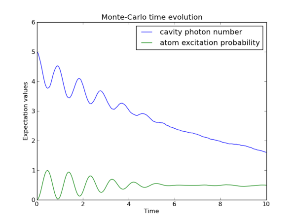

.. QuTiP 
   Copyright (C) 2011-2012, Paul D. Nation & Robert J. Johansson

.. _monte:

*******************************************
Quantum Dynamics via the Monte-Carlo Solver
*******************************************

.. _monte-intro:

Introduction
=============

Where as the density matrix formalism describes the ensemble average over many identical realizations of a quantum system, the Monte-Carlo (MC), or quantum-jump approach to wave function evolution, allows for simulating an individual realization of the system dynamics.  Here, the environment is continuously monitored, resulting in a series of quantum jumps in the system wave function, conditioned on the increase in information gained about the state of the system via the environmental measurements.  In general, this evolution is governed by the Schrödinger equation (:eq:`schrodinger`) with a **non-Hermitian** effective Hamiltonian  

.. math::
	:label: heff
	
	H_{\rm eff}=H_{\rm sys}-\frac{i\hbar}{2}\sum_{i}C^{+}_{n}C_{n},

where again, the :math:`C_{n}` are collapse operators, each corresponding to a separate irreversible process with rate :math:`\gamma_{n}`.  Here, the strictly negative non-Hermitian portion of Eq.~(:eq:`heff`) gives rise to a reduction in the norm of the wave function, that to first-order in a small time :math:`\delta t`, is given by :math:`\left<\psi(t+\delta t)|\psi(t+\delta t)\right>=1-\delta p` where

.. math::
	:label: jump

	\delta p =\delta t \sum_{n}\left<\psi(t)|C^{+}_{n}C_{n}|\psi(t)\right>,

and :math:`\delta t` is such that :math:`\delta p \ll 1`.  With a probability of remaining in the state :math:`\left|\psi(t+\delta t)\right>` given by :math:`1-\delta p`, the corresponding quantum jump probability is thus Eq.~(:eq:`jump`).  If the environmental measurements register a quantum jump, say via the emission of a photon into the environment, or a change in the spin of a quantum dot, the wave function undergoes a jump into a state defined by projecting :math:`\left|\psi(t)\right>` using the collapse operator :math:`C_{n}` corresponding to the measurement

.. math::
	:label: project

	\left|\psi(t+\delta t)\right>=C_{n}\left|\psi(t)\right>/\left<\psi(t)|C_{n}^{+}C_{n}|\psi(t)\right>^{1/2}.

If more than a single collapse operator is present in Eq~(:eq:`heff`), the probability of collapse due to the :math:`i\mathrm{th}$-operator $C_{i}` is given by 

.. math::
	:label: pcn

	P_{i}(t)=\left<\psi(t)|C_{i}^{+}C_{i}|\psi(t)\right>/\delta p.

Evaluating the MC evolution to first-order in time is quite tedious.  Instead, QuTiP uses the following algorithm to simulate a single realization of a quantum system.  Starting from a pure state :math:`\left|\psi(0)\right>`:

- **I:** Choose a random number :math:`r` between zero and one, representing the probability that a quantum jump occurs.  

- **II:** Integrate the Schrödinger equation (:eq:`schrodinger`), using the effective Hamiltonian (:eq:`heff`) until a time :math:`\tau` such that the norm of the wave function satisfies :math:`\left<\psi(\tau)\right.\left|\psi(\tau)\right>=r`, at which point a jump occurs.

- **III:** The resultant jump projects the system at time :math:`\tau` into one of the renormalized states given by Eq.~(:eq:`project`).  The corresponding collapse operator :math:`C_{n}` is chosen such that :math:`n` is the smallest integer satisfying:

.. math::
	:label: mc3

	\sum_{i=1}^{n} P_{n}(\tau) \ge r

where the individual :math:`P_{n}` are given by Eq.~(:eq:`pcn`).  Note that the left hand side of Eq.~(:eq:`mc3`) is, by definition, normalized to unity.

- **IV:** Using the renormalized state from step III as the new initial condition at time :math:`\tau`, draw a new random number, and repeat the above procedure until the final simulation time is reached.

.. _monte-qutip:

Monte-Carlo in QuTiP:
=====================

In QuTiP, Monto-Carlo evolution is implemented with the
:func:`qutip.mcsolve` function. It takes nearly the same arguments as the :func:`qutip.mesolve`
function for master-equation evolution, expect for one additional parameter
``ntraj`` (fourth parameter), which define the number of stochastic trajectories
that should be averaged. This number should usually be in the range 100 - 500 to
give a smooth results (although the optimal number for ``ntraj`` can vary from
case to case).

To illustrate the use of the Monte-Carlo evolution of quantum systems in QuTiP,
let's again consider the case of a two-level atom coupled to a leaky cavity. The 
only differences to the master-equation treatment is that in this case we 
invoke the :func:`qutip.mcsolve` function instead of :func:`qutip.mesolve`, and a new parameter 
``ntraj = 250`` has been defined::

    >>> tlist = linspace(0.0, 10.0, 200)
    >>> psi0 = tensor(fock(2,0), fock(10, 5))
    >>> a  = tensor(qeye(2), destroy(10))
    >>> sm = tensor(destroy(2), qeye(10))
    >>> H = 2*pi * a.dag() * a + 2 * pi * sm.dag() * sm + 2*pi * 0.25 * (sm*a.dag() + sm.dag() * a)
    >>> ntraj = 250
    >>> expt_list = mcsolve(H, psi0, tlist, ntraj, [sqrt(0.1)*a], [a.dag()*a, sm.dag()*sm])
    >>> 
    >>> from pylab import *
    >>> plot(tlist, real(expt_list[0]))
    >>> plot(tlist, real(expt_list[1]))
    >>> title('Monte-Carlo time evolution')
    >>> xlabel('Time')
    >>> ylabel('Expectation values')
    >>> legend(("cavity photon number", "atom excitation probability"))
    >>> show()

The advantage of the Monte-Carlo method over the master equation approach is that only the state vector is required to be kept in the computer memory (as opposed to the entire density matrix). For large quantum system this becomes a significant advantage and the Monte-Carlo is therefore generally recommended for such systems. But for small systems, on the other hand, the added overhead of averaging a large number of stochastic trajectories to obtain the open system dynamics outweigh the benefits of the (small) memory saving, and master equations are therefore generally more efficient.

The return value(s) from the Monte-Carlo solver depend on the presence of collapse and expectation operators in the :func:`qutip.mcsolve` function, as well as how many outputs are requested by the user.  The last example had both collapse and expectation value operators::

    >>> out=mcsolve(H, psi0, tlist, ntraj, [sqrt(0.1)*a], [a.dag()*a, sm.dag()*sm])

and the user requested a single output ``out``.  In this case, the monte-carlo solver returns the average over all trajectories for the expectation values generated by the requested operators.  If we remove the collapse operators::

    >>> out=mcsolve(H, psi0, tlist, ntraj, [], [a.dag()*a, sm.dag()*sm])

then we will also get expectation values for the output.  Now, if we add back in the collapse operators, but remove the expectation value operators::

    >>> out=mcsolve(H, psi0, tlist, ntraj, [sqrt(0.1)*a], [])

then the output of :func:`qutip.mcsolve` *is not* a list of expectation values but rather a list of state vector Qobjs calculated for each time, and trajectory.  This a huge output and should be avoided unless you want to see the jumps associated with the collapse operators for individual trajectories.  For example::
    
    >>> out[0]
    
will be a list of state vector Qobjs evaluated at the times in ``tlist``.

In addition, when collapse operators are specified, the monte-carlo solver will also keep track of when a collapse occurs, and which operator did the collapse.  To obtain this information, the user must specify multiple return values from the :func:`qutip.mcsolve` function.  For example, to get the times at which collapses occurred for the trajectories we can do::

    >>> expt,times=mcsolve(H, psi0, tlist, ntraj, [sqrt(0.1)*a], [a.dag()*a, sm.dag()*sm])
    
where we have requested a second output `times`.  Again the first operator corresponds to the expectation values.  To get the information on which operator did the collapse we add a third return value::

    >>> expt,times,which=mcsolve(H, psi0, tlist, ntraj, [sqrt(0.1)*a], [a.dag()*a, sm.dag()*sm])

If no expectation values are specified then the first output will be a list of state vectors.  A example demonstrating the use of multiple return values may be found at .  To summarize, the table below gives the output of the monte-carlo solver for a given set of input and output conditions:

+--------------------+-----------------------+-----------------------------+------------------------------------+
| Collapse operators | Expectation operators | Number of requested outputs | Return value(s)                    |
+====================+=======================+=============================+====================================+
| NO                 | NO                    | 1                           | List of state vectors              |
+--------------------+-----------------------+-----------------------------+------------------------------------+
| NO                 | YES                   | 1                           | List of expectation values         |
+--------------------+-----------------------+-----------------------------+------------------------------------+
| YES                | NO                    | 1                           | List of state vectors for each     |
|                    |                       |                             | trajectory.                        |
+--------------------+-----------------------+-----------------------------+------------------------------------+
| YES                | NO                    | 2                           | List of state vectors for each     |
|                    |                       |                             | trajectory + List of collapse times|
|                    |                       |                             | for each trajectory.               |
+--------------------+-----------------------+-----------------------------+------------------------------------+
| YES                | NO                    | 3                           | List of state vectors for each     |
|                    |                       |                             | trajectory + List of collapse times|
|                    |                       |                             | for each trajectory + List of which|
|                    |                       |                             | operator did collapse for each     |
|                    |                       |                             | trajectory.                        |
+--------------------+-----------------------+-----------------------------+------------------------------------+
| YES                | YES                   | 1                           | List of expectation values for each|
|                    |                       |                             | trajectory.                        |
+--------------------+-----------------------+-----------------------------+------------------------------------+
| YES                | YES                   | 2                           | List of expectation values for each|
|                    |                       |                             | trajectory + List of collapse times|
|                    |                       |                             | for each trajectory.               |
+--------------------+-----------------------+-----------------------------+------------------------------------+
| YES                | YES                   | 3                           | List of expectation values for each|
|                    |                       |                             | trajectory + List of collapse times|
|                    |                       |                             | for each trajectory + List of which|
|                    |                       |                             | operator did collapse for each     |
|                    |                       |                             | trajectory.                        |
+--------------------+-----------------------+-----------------------------+------------------------------------+

