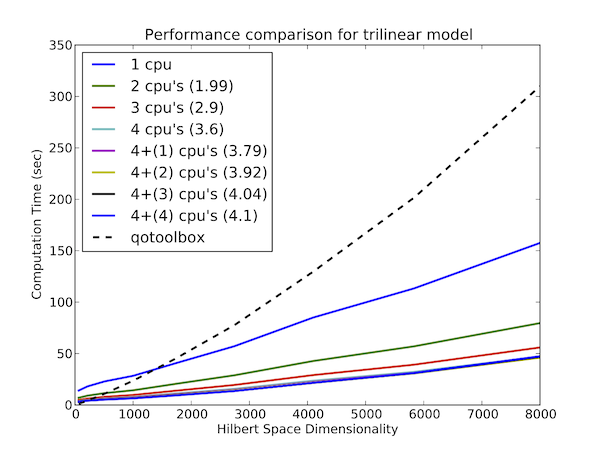

.. QuTiP 
   Copyright (C) 2011-2012, Paul D. Nation & Robert J. Johansson

.. _performance:

**********************************
Performance (QuTiP vs. qotoolbox)
**********************************

Here we compare the performance of the master-equation and monte-Carlo solvers to their quantum optics toolbox counterparts.

In this example, we calculate the time-evolution of the density matrix for a coupled oscillator system using the `mesolve` function, and compare it to the quantum optics toolbox (qotoolbox).  Here, we see that the QuTiP solver out performs it's qotoolbox counterpart by a substantial margin as the system size increases.

.. figure:: guide-dynamics-odesolve-performance.png
   :align: center
   :width: 4in

To test the Monte-Carlo solvers, here we simulate a trilinear Hamiltonian over a range of Hilbert space sizes.  Since QuTiP uses multiprocessing, we can measure the performance gain when using several CPU's.  In contrast, the qotoolbox is limited to a single-processor only.  In the legend, we show the speed-up factor in the parenthesis, which should ideally be equal to the number of processors.  Finally, we have included the results using hyperthreading, written here as 4+(x) where x is the number of hyperthreads, found in some newer Intel processors.  We see however that the performance benefits from hyperthreading are marginal at best.

