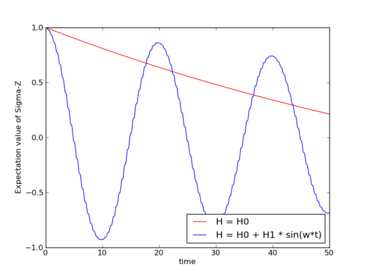

.. QuTiP 
   Copyright (C) 2011-2012, Paul D. Nation & Robert J. Johansson

.. _time:

**************************************************************
Solving Time-dependent Hamiltonians (unitary and non-unitary)
**************************************************************

In the previous examples of quantum system evolution, we assumed that the systems under consideration were described by a time-independent Hamiltonian. The two main evolution solvers in QuTiP, :func:`qutip.mesolve` and :func:`qutip.mcsolve`, can also handle time-dependent Hamiltonians. If a callback function is passed as first parameter to the solver function (instead of :class:`qutip.Qobj` Hamiltonian), then this function is called at each time step and is expected to return the :class:`qutip.Qobj` Hamiltonian for that point in time. The callback function takes two arguments: the time `t` and list additional Hamiltonian arguments ``H_args``. This list of additional arguments is the same object as is passed as the sixth parameter to the solver function (only used for time-dependent Hamiltonians).

For example, let's consider a two-level system with energy splitting 1.0, and subject to a time-dependent field that couples to the :math:`\sigma_x` operator with amplitude 0.1. Furthermore, to make the example a little bit more interesting, let's also assume that the two-level system is subject to relaxation, with relaxation rate 0.01. The following code calculates the dynamics of the system in the absence and in the presence of the time-dependent driving signal::

    >>> def hamiltonian_t(t, args):
    >>>     H0 = args[0]
    >>>     H1 = args[1]
    >>>     w  = args[2]
    >>>     return H0 + H1 * sin(w * t)
    >>> 
    >>> H0 = - 2*pi * 0.5  * sigmaz()
    >>> H1 = - 2*pi * 0.05 * sigmax() 
    >>> H_args = (H0, H1, 2*pi*1.0)
    >>> psi0 = fock(2, 0)                   # intial state |0>
    >>> c_op_list = [sqrt(0.01) * sigmam()] # relaxation
    >>> tlist = arange(0.0, 50.0, 0.01)
    >>>
    >>> expt_sz    = odesolve(H0, psi0, tlist, c_op_list, [sigmaz()])
    >>> expt_sz_td = odesolve(hamiltonian_t, psi0, tlist, c_op_list, [sigmaz()], H_args)
    >>>
    >>> #expt_sz_td = mcsolve(hamiltonian_t, psi0, tlist,250, c_op_list, [sigmaz()], H_args) #monte-carlo
    >>>
    >>> from pylab import *
    >>> plot(tlist, expt_sz[0],    'r')
    >>> plot(tlist, expt_sz_td[0], 'b')
    >>> ylabel("Expectation value of Sigma-Z")
    >>> xlabel("time")
    >>> legend(("H = H0", "H = H0 + H1 * sin(w*t)"), loc=4)
    >>> show()

