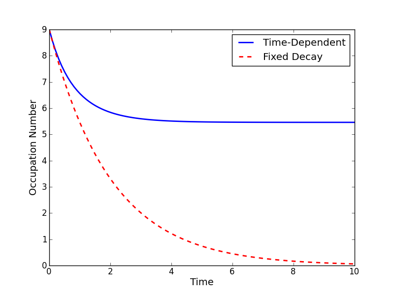

.. QuTiP 
   Copyright (C) 2011-2012, Paul D. Nation & Robert J. Johansson

.. _time:

*************************************************
Solving Problems with Time-dependent Hamiltonians
*************************************************

Methods for Writing Time-Dependent Operators
============================================

In the previous examples of quantum evolution, we assumed that the systems under consideration were described by time-independent Hamiltonians.  However, many systems have explicit time dependence in either the Hamiltonian, or the collapse operators describing coupling to the environment, and sometimes both components might depend on time.  The two main evolution solvers in QuTiP, :func:`qutip.mesolve` and :func:`qutip.mcsolve`, discussed in :ref:`master` and :ref:`monte` respectively, are capable of handling time-dependent Hamiltonians and collapse terms.  There are, in general, three different ways to implement time-dependent problems in QuTiP 2:

1. **Function based**: Hamiltonian / collapse operators expressed using [qobj, func] pairs, where the time-dependent coefficients of the Hamiltonian (or collapse operators) are expressed in the Python functions.

2. **String (Cython) based**: The Hamiltonian and/or collapse operators are expressed as a list of [qobj, string] pairs, where the time-dependent coefficients are represented as strings.  The resulting Hamiltonian is then compiled into C code using Cython and executed.

3. **Hamiltonian function (outdated)**: The Hamiltonian is itself a Python function with time-dependence.  Collapse operators must be time independent using this input format. 

Give the multiple choices of input style, the first question that arrises is which option to choose?  In short, the function based method (option #1) is the most general, allowing for essentially arbitrary coefficients expressed via user defined functions.  However, by automatically compiling your system into C code, the second option (string based) tends to be more efficient and will run faster.  Of course, for small system sizes and evolution times, the difference will be minor.  Although this method does not support all time-dependent coefficients that one can think of, it does support essentially all problems that one would typically encounter.  If you can write you time-dependent coefficients using any of the following functions, or combinations thereof (including constants) then you may use this method::

   'acos', 'acosh', 'asin', 'asinh', 'atan', 'atan2', 'atanh', 'ceil',
   'copysign', 'cos', 'cosh', 'degrees', 'erf', 'erfc', 'exp', 'expm1',
   'fabs', 'factorial', 'floor', 'fmod', 'frexp', 'fsum', 'gamma',
   'hypot', 'isinf', 'isnan', 'ldexp', 'lgamma', 'log', 'log10', 'log1p',
   'modf', 'pow', 'radians', 'sin', 'sinh', 'sqrt', 'tan', 'tanh', 'trunc'

Finally option #3, expressing the Hamiltonian as a Python function, is the original method for time dependence in QuTiP 1.x.  However, this method is somewhat less efficient then the previously mentioned methods, and does not allow for time-dependent collapse operators. However, in contrast to options #1 and #2, this method can be used in implementing time-dependent Hamiltonians that cannot be expressed as a function of constant operators with time-dependent coefficients.

A collection of examples demonstrating the simulation of time-dependent problems can be found here: :ref:`extd`.

.. _time-function:

Function Based Time Dependence
==============================

A very general way to write a time-dependent Hamiltonian or collapse operator is by using Python functions as the time-dependent coefficients.  To accomplish this, we need to write a Python function that returns the time-dependent coefficient.  Additionally, we need to tell QuTiP that a given Hamiltonian or collapse operator should be associated with a given Python function.  To do this, one needs to specify operator-function pairs in list format: ``[Op, py_coeff]``, where ``Op`` is a given Hamiltonian or collapse operator and ``py_coeff`` is the name of the Python function representing the coefficient.  With this format, the form of the Hamiltonian for both ``mesolve`` and ``mcsolve`` is:

>>> H = [H0, [H1, py_coeff1], [H2, py_coeff2], ...]

where ``H0`` is a time-independent Hamiltonian, while ``H1``,``H2``, are time dependent. The same format can be used for collapse operators:

>>> c_op_list = [[C0, py_coeff0], C1, [C2, py_coeff2], ...]

Here we have demonstrated that the ordering of time-dependent and time-independent terms does not matter.  In addition, any or all of the collapse operators may be time dependent.  

.. note:: While, in general, you can arrange time-dependent and time-independent terms in any order you like, it is best to place all time-independent terms first.

As an example, we will look at :ref:`exme41` that has a time-dependent Hamiltonian of the form :math:`H=H_{0}-f(t)H_{1}` where :math:`f(t)` is the time-dependent driving strength given as :math:`f(t)=A\exp\left[-\left( t/\sigma \right)^{2}\right]`.  The follow code sets up the problem::

    from qutip import *
    # Define atomic states. Use ordering from paper
    ustate = basis(3, 0)
    excited = basis(3, 1)
    ground = basis(3, 2)
    
    # Set where to truncate Fock state for cavity
    N = 2
    
    # Create the atomic operators needed for the Hamiltonian
    sigma_ge = tensor(qeye(N), ground * excited.dag())  # |g><e|
    sigma_ue = tensor(qeye(N), ustate * excited.dag())  # |u><e|
    
    # Create the photon operator
    a = tensor(destroy(N), qeye(3))
    ada = tensor(num(N), qeye(3))
    
    # Define collapse operators
    c_op_list = []
    # Cavity decay rate
    kappa = 1.5
    c_op_list.append(sqrt(kappa) * a)
    
    # Atomic decay rate
    gamma = 6  # decay rate
    # Use Rb branching ratio of 5/9 e->u, 4/9 e->g
    c_op_list.append(sqrt(5*gamma/9) * sigma_ue)
    c_op_list.append(sqrt(4*gamma/9) * sigma_ge)
    
    # Define time vector
    t = linspace(-15, 15, 100)
	
    # Define initial state
    psi0 = tensor(basis(N, 0), ustate)
    
    # Define states onto which to project
    state_GG = tensor(basis(N, 1), ground)
    sigma_GG = state_GG * state_GG.dag()
    state_UU = tensor(basis(N, 0), ustate)
    sigma_UU = state_UU * state_UU.dag()
    
    # Set up the time varying Hamiltonian
    g = 5  # coupling strength
    H0 = -g * (sigma_ge.dag() * a + a.dag() * sigma_ge)  # time-independent term
    H1 = (sigma_ue.dag() + sigma_ue)  # time-dependent term

Given that we have a single time-dependent Hamiltonian term, and constant collapse terms, we need to specify a single Python function for the coefficient :math:`f(t)`.  In this case, one can simply do::

	def H1_coeff(t, args):
	        return 9 * exp(-(t / 5.) ** 2)

In this case, the return value dependents only on time.  However, when specifying Python functions for coefficients, **the function must have (t,args) as the input variables, in that order**.  Having specified our coefficient function, we can now specify the Hamiltonian in list format and call the solver (in this case :func:`qutip.mesolve`)::

    H=[H0,[H1,H1_coeff]]
    output = mesolve(H, psi0, t, c_op_list,[ada, sigma_UU, sigma_GG])

We can call the Monte Carlo solver in the exact same way (if using the default ``ntraj=500``):

>>> output = mcsolve(H, psi0, t, c_op_list,[ada, sigma_UU, sigma_GG])

The output from the master equation solver is identical to that shown in the examples, the Monte Carlo however will be noticeably off, suggesting we should increase the number of trajectories for this example.  In addition, we can also consider the decay of a simple Harmonic oscillator with time-varying decay rate::

    from qutip import *
    kappa = 0.5
    def col_coeff(t, args):  # coefficient function
        return sqrt(kappa * exp(-t))
    N = 10  # number of basis states
    a = destroy(N)
    H = a.dag() * a  # simple HO
    psi0 = basis(N, 9)  # initial state
    c_op_list = [[a, col_coeff]]  # time-dependent collapse term
    tlist = linspace(0, 10, 100)
    output = mesolve(H, psi0, tlist, c_op_list, [a.dag() * a])

A comparison of this time-dependent damping, with that of a constant decay term is presented below.

Using the args variable
------------------------
In the previous example we hardcoded all of the variables, driving amplitude :math:`A` and width :math:`\sigma`, with their numerical values.  This is fine for problems that are specialized, or that we only want to run once.  However, in many cases, we would like to change the parameters of the problem in only one location (usually at the top of the script), and not have to worry about manually changing the values on each run.  QuTiP allows you to accomplish this using the keyword ``args`` as an input to the solvers.  For instance, instead of explicitly writing 9 for the amplitude and 5 for the width of the gaussian driving term, we can make us of the args variable::

    def H1_coeff(t, args):
        return args['A'] * exp(-(t/args['sigma'])**2)

or equivalently::

    def H1_coeff(t, args):
        A = args['A']
        sig = args['sigma']
        return A * exp(-(t / sig) ** 2)

where args is a Python dictionary of ``key: value`` pairs ``args = {'A': a, 'sigma': b}`` where ``a`` and ``b`` are the two parameters for the amplitude and width, respectively.  Of course, we can always hardcode the values in the dictionary as well ``args = {'A': 9, 'sigma': 5}``, but there is much more flexibility by using variables in ``args``.  To let the solvers know that we have a set of args to pass we append the ``args`` to the end of the solver input:

>>> output = mesolve(H, psi0, tlist, c_op_list, [a.dag() * a], args={'A': 9, 'sigma': 5})

or to keep things looking pretty::

    args = {'A': 9, 'sigma': 5}
    output = mesolve(H, psi0, tlist, c_op_list, [a.dag() * a], args=args)

Once again, the Monte Carlo solver :func:`qutip.mcsolve` works in an identical manner.

.. _time-string:

String Format Method
=====================

.. note:: You must have Cython installed on your computer to use this format.  See :ref:`install` for instructions on installing Cython.

The string-based time-dependent format works in a similar manner as the previously discussed Python function method.  That being said, the underlying code does something completely different.  When using this format, the strings used to represent the time-dependent coefficients, as well as Hamiltonian and collapse operators, are rewritten as Cython code using a code generator class and then compiled into C code.  The details of this meta-programming will be published in due course.  however, in short, this can lead to a substantial reduction in time for complex time-dependent problems, or when simulating over long intervals.  We remind the reader that the types of functions that can be used with this method is limited to::

   ['acos', 'acosh', 'asin', 'asinh', 'atan', 'atan2', 'atanh', 'ceil'
   , 'copysign', 'cos', 'cosh', 'degrees', 'erf', 'erfc', 'exp', 'expm1'
   , 'fabs', 'factorial', 'floor', 'fmod', 'frexp', 'fsum', 'gamma'
   , 'hypot', 'isinf', 'isnan', 'ldexp', 'lgamma', 'log', 'log10', 'log1p'
   , 'modf', 'pow', 'radians', 'sin', 'sinh', 'sqrt', 'tan', 'tanh', 'trunc']

Like the previous method, the string-based format uses a list pair format ``[Op, str]`` where ``str`` is now a string representing the time-dependent coefficient.  For our first example, this string would be ``'9 * exp(-(t / 5.) ** 2)'``.  The Hamiltonian in this format would take the form:

>>> H = [H0, [H1, '9 * exp(-(t / 5.) ** 2)']]

Notice that this is a valid Hamiltonian for the string-based format as ``exp`` is included in the above list of suitable functions. Calling the solvers is the same as before:

>>> output = mesolve(H, psi0, tlist, c_op_list, [a.dag() * a])

We can also use the ``args`` variable in the same manner as before, however we must rewrite our string term to read: ``'A * exp(-(t / sig) ** 2)'``::

    H = [H0, [H1, 'A * exp(-(t / sig) ** 2)']]
    args = {'A': 9, 'sig': 5}
    output = mesolve(H, psi0, tlist, c_op_list, [a.dag()*a], args=args)

.. important:: Naming your ``args`` variables ``e`` or ``pi`` will mess things up when using the string-based format.

Collapse operators are handled in the exact same way.

.. _time-hfunc:

Function Based Hamiltonian
==========================

In the previous version of QuTiP, the simulation of time-dependent problems required writing the Hamiltonian itself as a Python function.  This is in fact the method used in our example :ref:`exme41`.  However, this method does not allow for time-dependent collapse operators, and is therefore more restrictive.  Furthermore, it is less efficient than the other methods for all but the most basic of Hamiltonians (see the next section for a comparison of times.).  In this format, the entire Hamiltonian is written as a Python function::

    def Hfunc(t, args):
        H0 = args[0]
        H1 = args[1]
        w = 9 * exp(-(t/5.)**2)
        return H0 - w * H1

where the ``args`` variable **must always be given**, and is now a ``list`` of Hamiltonian terms: ``args=[H0, H1]``.  In this format, our call to the master equation is now:

>>> output = mesolve(Hfunc, psi0, tlist, c_op_list, [a.dag() * a], args=[H0, H1])

We cannot evaluate time-dependent collapse operators in this format, so we can not simulate the previous harmonic oscillator decay example.

.. _time-bench:

A Quick Comparison of Simulation Times
=======================================

Here we give a table of simulation times for the single-photon example using the different time-dependent formats and both the master equation and Monte Carlo solver.

.. tabularcolumns:: | p{4cm} | p{4cm} | p{4cm} |

+------------------------+-----------------+-------------+
| Format                 | Master Equation | Monte Carlo |       
+========================+=================+=============+
| Python Function        | 2.1 sec         | 27 sec      |
+------------------------+-----------------+-------------+
| Cython String          | 1.4 sec         | 9 sec       |
+------------------------+-----------------+-------------+
| Hamiltonian Function   | 1.0 sec         | 238 sec     |
+------------------------+-----------------+-------------+

For the current example, the table indicates that the Hamiltonian function method is in fact the fastest when using the master equation solver.  This is because the simulation is quite small.  In contrast, the Hamiltonian function is over 26x slower than the compiled string version when using the Monte Carlo solver.  In this case, the 500 trajectories needed in the simulation highlights the inefficient nature of the Python function calls.

.. _time-reuse:

Reusing Time-Dependent Hamiltonian Data
=======================================

.. note:: This section covers a specialized topic and may be skipped if you are new to QuTiP.

When repeatedly simulating a system where only the time-dependent variables, or initial state change, it is possible to reuse the Hamiltonian data stored in QuTiP and there by avoid spending time needlessly preparing the Hamiltonian and collapse terms for simulation.  To turn on the the reuse features, we must pass a :class:`qutip.Odeoptions` object with the ``rhs_reuse`` flag turned on.  Instructions on setting flags are found in :ref:`odeoptions`.  For example, we can do::

    H = [H0, [H1, 'A * exp(-(t / sig) ** 2)']]
    args = {'A': 9, 'sig': 5}
    output = mcsolve(H, psi0, tlist, c_op_list, [a.dag()*a], args=args)
    opts = Odeoptions(rhs_reuse=True)
    args = {'A': 10, 'sig': 3}
    output = mcsolve(H, psi0, tlist, c_op_list, [a.dag()*a], args=args, options=opts)
	

In this case, the second call to :func:`qutip.mcsolve` takes 3 seconds less than the first.  Of course our parameters are different, but this also shows how much time one can save by not reorganizing the data, and in the case of the string format, not recompiling the code.  If you need to call the solvers many times for different parameters, this savings will obviously start to add up.

.. _time-parallel:

Running String-Based Time-Dependent Problems using Parfor
==========================================================

.. note:: This section covers a specialized topic and may be skipped if you are new to QuTiP.

In this section we discuss running string-based time-dependent problems using the :func:`qutip.parfor` function.  As the :func:`qutip.mcsolve` function is already parallelized, running string-based time dependent problems inside of parfor loops should be restricted to the :func:`qutip.mesolve` function only. When using the string-based format, the system Hamiltonian and collapse operators are converted into C code with a specific file name that is automatically genrated, or supplied by the user via the ``rhs_filename`` property of the :class:`qutip.Odeoptions` class. Because the :func:`qutip.parfor` function uses the built-in Python multiprocessing functionality, in calling the solver inside a parfor loop, each thread will try to generate compiled code with the same file name, leading to a crash.  To get around this problem you can call the :func:`qutip.rhs_generate` function to compile simulation into C code before calling parfor.  You **must** then set the :class:`qutip.Odedata` object ``rhs_reuse=True`` for all solver calls inside the parfor loop that indicates that a valid C code file already exists and a new one should not be generated.  As an example, we will look at the Landau-Zener-Stuckelberg interferometry example that can be found in the :ref:`exadvanced` section.

To set up the problem, we run the following code::

	from qutip import *
	
	# set up the parameters and start calculation
	delta    = 0.1  * 2 * pi  # qubit sigma_x coefficient
	w        = 2.0  * 2 * pi  # driving frequency
	T        = 2 * pi / w     # driving period 
	gamma1   = 0.00001        # relaxation rate
	gamma2   = 0.005          # dephasing  rate
	eps_list = linspace(-10.0, 10.0, 501) * 2 * pi  # epsilon
	A_list   = linspace(0.0, 20.0, 501) * 2 * pi	# Amplitude

	# pre-calculate the necessary operators
	sx = sigmax(); sz = sigmaz(); sm = destroy(2); sn = num(2)
	# collapse operators
	c_op_list = [sqrt(gamma1) * sm, sqrt(gamma2) * sz]  # relaxation and dephasing

	# setup time-dependent Hamiltonian (list-string format)
	H0 = -delta / 2.0 * sx
	H1 = [sz, '-eps / 2.0 + A / 2.0 * sin(w * t)']
	H_td = [H0, H1]
	Hargs = {'w': w, 'eps': eps_list[0], 'A': A_list[0]}
	

where the last code block sets up the problem using a string-based Hamiltonian, and ``Hargs`` is a dictionary of arguments to be passed into the Hamiltonian.  In this example, we are going to use the :func:`qutip.propagator` and :func:`qutip.propagator.propagator_steadystate` to find expectation
values for different values of :math:`\epsilon` and :math:`A` in the 
Hamiltonian :math:`H = -\frac{1}{2}\Delta\sigma_x -\frac{1}{2}\epsilon\sigma_z- \frac{1}{2}A\sin(\omega t)`.

We must now tell the :func:`qutip.mesolve` function, that is called by :func:`qutip.propagator` to reuse a
pre-generated Hamiltonian constructed using the :func:`qutip.rhs_generate` command::

	# ODE settings (for reusing list-str format Hamiltonian)
	opts = Odeoptions(rhs_reuse=True)
	# pre-generate RHS so we can use parfor
	rhs_generate(H_td, c_op_list, Hargs, name='lz_func')

Here, we have given the generated file a custom name ``lz_func``, however this is not necessary as a generic name will automatically be given.  Now we define the function ``task`` that is called by parfor::

	# a task function for the for-loop parallelization: 
	# the m-index is parallelized in loop over the elements of p_mat[m,n]
	def task(args):
	    m, eps = args
	    p_mat_m = zeros(len(A_list))
	    for n, A in enumerate(A_list):
	        # change args sent to solver, w is really a constant though.
	        Hargs = {'w': w, 'eps': eps,'A': A} 
	        U = propagator(H_td, T, c_op_list, Hargs, opts) #<- IMPORTANT LINE
	        rho_ss = propagator_steadystate(U)
	        p_mat_m[n] = expect(sn, rho_ss)
	    return [m, p_mat_m]

Notice the Odeoptions ``opts`` in the call to the :func:`qutip.propagator` function.  This is tells the :func:`qutip.mesolve` function used in the propagator to call the pre-generated file ``lz_func``. If this were missing then the routine would fail.

