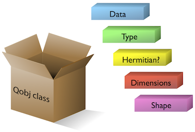

.. _basics:

***********************************
Basic Operations on Quantum Objects
***********************************

.. _basics-first:

First things first
==================

.. warning:: Do not run QuTiP from the installation directory.

To load the qutip modules, first call the import statement:

.. code-block:: Python

   from qutip import *

This will load all of the user available functions. Often, we also need to import the NumPy and Matplotlib libraries with:

.. code-block:: Python

   import numpy as np

   import matplotlib.pyplot as plt

In the rest of the documentation, functions are written using `qutip.module.function()` notation which links to the corresponding function in the QuTiP API: :ref:`apidoc`. However, in calling `import *`, we have already loaded all of the QuTiP modules. Therefore, we will only need the function name and not the complete path when calling the function from the interpreter prompt, Python script, or Jupyter notebook.

.. _basics-qobj:

The quantum object class
========================

.. _basics-qobj-intro:

Introduction
---------------

The key difference between classical and quantum mechanics is the use of operators instead of numbers as variables. Moreover, we need to specify state vectors and their properties. Therefore, in computing the dynamics of quantum systems, we need a data structure that encapsulates the properties of a quantum operator and ket/bra vectors. The quantum object class, :func:`qutip.Qobj`, accomplishes this using matrix representation.

To begin, let us create a blank ``Qobj``:

.. testcode:: [basics]

    print(Qobj())

**Output**:

.. testoutput:: [basics]
    :options: +NORMALIZE_WHITESPACE

    Quantum object: dims = [[1], [1]], shape = (1, 1), type = bra
    Qobj data =
    [[0.]]

where we see the blank ``Qobj`` object with dimensions, shape, and data. Here the data corresponds to a 1x1-dimensional matrix consisting of a single zero entry.

.. Hint:: By convention, the names of Python classes, such as ``Qobj()``, are capitalized whereas the names of functions are not.

We can create a ``Qobj`` with a user defined data set by passing a list or array of data into the ``Qobj``:

.. testcode:: [basics]

    print(Qobj([[1],[2],[3],[4],[5]]))

**Output**:

.. testoutput:: [basics]
    :options: +NORMALIZE_WHITESPACE

    Quantum object: dims = [[5], [1]], shape = (5, 1), type = ket
    Qobj data =
    [[1.]
    [2.]
    [3.]
    [4.]
    [5.]]

.. testcode:: [basics]

    x = np.array([[1, 2, 3, 4, 5]])
    print(Qobj(x))

**Output**:

.. testoutput:: [basics]
    :options: +NORMALIZE_WHITESPACE

    Quantum object: dims = [[1], [5]], shape = (1, 5), type = bra
    Qobj data =
    [[1. 2. 3. 4. 5.]]

.. testcode:: [basics]
    :hide:

    np.random.seed(42)

.. testcode:: [basics]

    r = np.random.rand(4, 4)
    print(Qobj(r))

**Output**:

.. testoutput:: [basics]
    :options: +NORMALIZE_WHITESPACE

    Quantum object: dims = [[4], [4]], shape = (4, 4), type = oper, isherm = False
    Qobj data =
    [[0.37454012 0.95071431 0.73199394 0.59865848]
     [0.15601864 0.15599452 0.05808361 0.86617615]
     [0.60111501 0.70807258 0.02058449 0.96990985]
     [0.83244264 0.21233911 0.18182497 0.18340451]]

Notice how both the dims and shape change according to the input data.  Although dims and shape appear to be the same,
dims keep track of the shapes for individual components of a multipartite system, while shape does not. We refer the reader to the section
:ref:`tensor products and partial traces <tensor>` for more information.

.. note:: If you are running QuTiP from a python script you must use the :func:`print` function to view the Qobj attributes.

.. _basics-qobj-states:

States and operators
---------------------

Manually specifying the data for each quantum object is inefficient. Even more so when most objects correspond to commonly used
types such as the
ladder operators of a harmonic oscillator, the Pauli spin operators for a two-level system, or state vectors such as Fock states.
Therefore, QuTiP includes predefined objects for a variety of states and operators:

.. cssclass:: table-striped

+--------------------------+----------------------------------+----------------------------------------+
| States                   | Command (# means optional)       | Inputs                                 |
+==========================+==================================+========================================+
| Fock state ket vector    | ``basis(N,#m)``/``fock(N,#m)``   | N = number of levels in Hilbert space, |
|                          |                                  | m = level containing excitation        |
|                          |                                  | (0 if no m given)                      |
+--------------------------+----------------------------------+----------------------------------------+
| Empty ket vector         | ``zero_ket(N)``                  | N = number of levels in Hilbert space, |
+--------------------------+----------------------------------+----------------------------------------+
| Fock density matrix      | ``fock_dm(N,#p)``                | same as basis(N,m) / fock(N,m)         |
| (outer product of basis) |                                  |                                        |
+--------------------------+----------------------------------+----------------------------------------+
| Coherent state           | ``coherent(N,alpha)``            | alpha = complex number (eigenvalue)    |
|                          |                                  | for requested coherent state           |
+--------------------------+----------------------------------+----------------------------------------+
| Coherent density matrix  | ``coherent_dm(N,alpha)``         | same as coherent(N,alpha)              |
| (outer product)          |                                  |                                        |
+--------------------------+----------------------------------+----------------------------------------+
| Thermal density matrix   | ``thermal_dm(N,n)``              | n = particle number expectation value  |
| (for n particles)        |                                  |                                        |
+--------------------------+----------------------------------+----------------------------------------+
| Maximally mixed density  | ``maximally_mixed_dm(N)``        | N = number of levels in Hilbert space  |
| matrix                   |                                  |                                        |
+--------------------------+----------------------------------+----------------------------------------+

.. cssclass:: table-striped

+--------------------------+----------------------------+----------------------------------------+
| Operators                | Command (# means optional) | Inputs                                 |
+==========================+============================+========================================+
| Charge operator          | ``charge(N,M=-N)``         | Diagonal operator with entries         |
|                          |                            | from M..0..N.                          |
+--------------------------+----------------------------+----------------------------------------+
| Commutator               | ``commutator(A, B, kind)`` | Kind = 'normal' or 'anti'.             |
+--------------------------+----------------------------+----------------------------------------+
| Diagonals operator       | ``qdiags(N)``              | Quantum object created from arrays of  |
|                          |                            | diagonals at given offsets.            |
+--------------------------+----------------------------+----------------------------------------+
| Displacement operator    | ``displace(N,alpha)``      | N=number of levels in Hilbert space,   |
| (Single-mode)            |                            | alpha = complex displacement amplitude.|
+--------------------------+----------------------------+----------------------------------------+
| Higher spin operators    | ``jmat(j,#s)``             | j = integer or half-integer            |
|                          |                            | representing spin, s = 'x', 'y', 'z',  |
|                          |                            | '+', or '-'                            |
+--------------------------+----------------------------+----------------------------------------+
| Identity                 | ``qeye(N)``                | N = number of levels in Hilbert space. |
+--------------------------+----------------------------+----------------------------------------+
| Identity-like            | ``qeye_like(qobj)``        | qobj = Object to copy dimensions from. |
+--------------------------+----------------------------+----------------------------------------+
| Lowering (destruction)   | ``destroy(N)``             | same as above                          |
| operator                 |                            |                                        |
+--------------------------+----------------------------+----------------------------------------+
| Momentum operator        | ``momentum(N)``            | same as above                          |
+--------------------------+----------------------------+----------------------------------------+
| Number operator          | ``num(N)``                 | same as above                          |
+--------------------------+----------------------------+----------------------------------------+
| Phase operator           | ``phase(N, phi0)``         | Single-mode Pegg-Barnett phase         |
| (Single-mode)            |                            | operator with ref phase phi0.          |
+--------------------------+----------------------------+----------------------------------------+
| Position operator        | ``position(N)``            | same as above                          |
+--------------------------+----------------------------+----------------------------------------+
| Raising (creation)       | ``create(N)``              | same as above                          |
| operator                 |                            |                                        |
+--------------------------+----------------------------+----------------------------------------+
| Squeezing operator       | ``squeeze(N, sp)``         | N=number of levels in Hilbert space,   |
| (Single-mode)            |                            | sp = squeezing parameter.              |
+--------------------------+----------------------------+----------------------------------------+
| Squeezing operator       | ``squeezing(q1, q2, sp)``  | q1,q2 = Quantum operators (Qobj)       |
| (Generalized)            |                            | sp = squeezing parameter.              |
+--------------------------+----------------------------+----------------------------------------+
| Sigma-X                  | ``sigmax()``               |                                        |
+--------------------------+----------------------------+----------------------------------------+
| Sigma-Y                  | ``sigmay()``               |                                        |
+--------------------------+----------------------------+----------------------------------------+
| Sigma-Z                  | ``sigmaz()``               |                                        |
+--------------------------+----------------------------+----------------------------------------+
| Sigma plus               | ``sigmap()``               |                                        |
+--------------------------+----------------------------+----------------------------------------+
| Sigma minus              | ``sigmam()``               |                                        |
+--------------------------+----------------------------+----------------------------------------+
| Tunneling operator       | ``tunneling(N,m)``         | Tunneling operator with elements of the|
|                          |                            | form :math:`|N><N+m| + |N+m><N|`.      |
+--------------------------+----------------------------+----------------------------------------+

As an example, we give the output for a few of these functions:

.. doctest:: [basics]
  :options: +NORMALIZE_WHITESPACE

   >>> basis(5,3)
   Quantum object: dims = [[5], [1]], shape = (5, 1), type = ket
   Qobj data =
   [[0.]
    [0.]
    [0.]
    [1.]
    [0.]]

   >>> coherent(5,0.5-0.5j)
   Quantum object: dims = [[5], [1]], shape = (5, 1), type = ket
   Qobj data =
   [[ 0.7788017 +0.j        ]
    [ 0.38939142-0.38939142j]
    [ 0.        -0.27545895j]
    [-0.07898617-0.07898617j]
    [-0.04314271+0.j        ]]

   >>> destroy(4)
   Quantum object: dims = [[4], [4]], shape = (4, 4), type = oper, isherm = False
   Qobj data =
   [[0.         1.         0.         0.        ]
    [0.         0.         1.41421356 0.        ]
    [0.         0.         0.         1.73205081]
    [0.         0.         0.         0.        ]]

   >>> sigmaz()
   Quantum object: dims = [[2], [2]], shape = (2, 2), type = oper, isherm = True
   Qobj data =
   [[ 1.  0.]
    [ 0. -1.]]

   >>> jmat(5/2.0,'+')
   Quantum object: dims = [[6], [6]], shape = (6, 6), type = oper, isherm = False
   Qobj data =
   [[0.         2.23606798 0.         0.         0.         0.        ]
    [0.         0.         2.82842712 0.         0.         0.        ]
    [0.         0.         0.         3.         0.         0.        ]
    [0.         0.         0.         0.         2.82842712 0.        ]
    [0.         0.         0.         0.         0.         2.23606798]
    [0.         0.         0.         0.         0.         0.        ]]

.. _basics-qobj-props:

Qobj attributes
---------------

We have seen that a quantum object has several internal attributes, such as data, dims, and shape.  These can be accessed in the following way:

.. doctest:: [basics]
  :options: +NORMALIZE_WHITESPACE

   >>> q = destroy(4)

   >>> q.dims
   [[4], [4]]

   >>> q.shape
   (4, 4)

In general, the attributes (properties) of a ``Qobj`` object (or any Python object) can be retrieved using the `Q.attribute` notation.
In addition to the those shown with the ``print`` function, an instance of the ``Qobj`` class also has the following attributes:

.. cssclass:: table-striped

+---------------+---------------+----------------------------------------+
| Property      | Attribute     | Description                            |
+===============+===============+========================================+
| Data          | ``Q.data``    | Matrix representing state or operator  |
+---------------+---------------+----------------------------------------+
| Dimensions    | ``Q.dims``    | List keeping track of shapes for       |
|               |               | individual components of a             |
|               |               | multipartite system (for tensor        |
|               |               | products and partial traces).          |
+---------------+---------------+----------------------------------------+
| Shape         | ``Q.shape``   | Dimensions of underlying data matrix.  |
+---------------+---------------+----------------------------------------+
| is Hermitian? | ``Q.isherm``  | Is the operator Hermitian or not?      |
+---------------+---------------+----------------------------------------+
| Type          | ``Q.type``    | Is object of type 'ket, 'bra',         |
|               |               | 'oper', or 'super'?                    |
+---------------+---------------+----------------------------------------+

   The ``Qobj`` Class viewed as a container for the properties needed to characterize a quantum operator or state vector.

For the destruction operator above:

.. doctest:: [basics]
  :options: +NORMALIZE_WHITESPACE

    >>> q.type
    'oper'

    >>> q.isherm
    False

    >>> q.data
    Dia(shape=(4, 4), num_diag=1)

The ``data`` attribute returns a Qutip diagonal matrix.
``Qobj`` instances store their data in Qutip matrix format.
In the core qutip module, the ``Dense``, ``CSR`` and ``Dia`` formats are available, but other packages can add other formats.
For example, the ``qutip-jax`` module adds the ``Jax`` and ``JaxDia`` formats.
One can always access the underlying matrix as a numpy array using :meth:`.Qobj.full`.
It is also possible to access the underlying data in a common format using :meth:`.Qobj.data_as`.

.. doctest:: [basics]
  :options: +NORMALIZE_WHITESPACE

    >>> q.data_as("dia_matrix")
    <4x4 sparse matrix of type '<class 'numpy.complex128'>'
        with 3 stored elements (1 diagonals) in DIAgonal format>

Conversion between storage type is done using the :meth:`.Qobj.to` method.

.. doctest:: [basics]
  :options: +NORMALIZE_WHITESPACE

    >>> q.to("CSR").data
    CSR(shape=(4, 4), nnz=3)

    >>> q.to("CSR").data_as("csr_matrix")
    <4x4 sparse matrix of type '<class 'numpy.complex128'>'
        with 3 stored elements in Compressed Sparse Row format>

Note that :meth:`.Qobj.data_as` does not do the conversion.

QuTiP will do conversion when needed to keep everything working in any format.
However these conversions could slow down computation and it is recommended to keep to one format family where possible.
For example, core QuTiP  ``Dense`` and ``CSR`` work well together and binary operations between these formats is efficient.
However binary operations between ``Dense`` and ``Jax`` should be avoided since it is not always clear whether the operation will be executed by Jax (possibly on a GPU if present) or numpy.

.. _basics-qobj-math:

Qobj Math
----------

The rules for mathematical operations on ``Qobj`` instances are similar to standard matrix arithmetic:

.. doctest:: [basics]
  :options: +NORMALIZE_WHITESPACE

    >>> q = destroy(4)

    >>> x = sigmax()

    >>> q + 5
    Quantum object: dims = [[4], [4]], shape = (4, 4), type = oper, isherm = False
    Qobj data =
    [[5.         1.         0.         0.        ]
     [0.         5.         1.41421356 0.        ]
     [0.         0.         5.         1.73205081]
     [0.         0.         0.         5.        ]]

    >>> x * x
    Quantum object: dims = [[2], [2]], shape = (2, 2), type = oper, isherm = True
    Qobj data =
    [[1. 0.]
     [0. 1.]]

    >>> q ** 3
    Quantum object: dims = [[4], [4]], shape = (4, 4), type = oper, isherm = False
    Qobj data =
    [[0.         0.         0.         2.44948974]
     [0.         0.         0.         0.        ]
     [0.         0.         0.         0.        ]
     [0.         0.         0.         0.        ]]

    >>> x / np.sqrt(2)
    Quantum object: dims = [[2], [2]], shape = (2, 2), type = oper, isherm = True
    Qobj data =
    [[0.         0.70710678]
     [0.70710678 0.        ]]

Of course, like matrices, multiplying two objects of incompatible shape throws an error:

.. doctest:: [basics]
  :options: +SKIP

    >>> print(q * x)
    ------------------------------------------------------------------
    TypeError                        Traceback (most recent call last)
    <ipython-input-33-0b599f41213e> in <module>
    ----> 1 print(q * x)

    ~/Documents/qutip_dev/qutip/qutip/qobj.py in __mul__(self, other)
        553
        554             else:
    --> 555                 raise TypeError("Incompatible Qobj shapes")
        556
        557         elif isinstance(other, np.ndarray):

    TypeError: Incompatible Qobj shapes

In addition, the logic operators "is equal" `==` and "is not equal" `!=` are also supported.

.. _basics-functions:

Functions operating on Qobj class
=================================

Like attributes, the quantum object class has defined functions (methods) that operate on ``Qobj`` class instances. For a general quantum object ``Q``:

.. cssclass:: table-striped

+-----------------+-------------------------------+----------------------------------------+
| Function        | Command                       | Description                            |
+=================+===============================+========================================+
| Check Hermicity | ``Q.check_herm()``            | Check if quantum object is Hermitian   |
+-----------------+-------------------------------+----------------------------------------+
| Conjugate       | ``Q.conj()``                  | Conjugate of quantum object.           |
+-----------------+-------------------------------+----------------------------------------+
| Cosine          | ``Q.cosm()``                  | Cosine of quantum object.              |
+-----------------+-------------------------------+----------------------------------------+
| Dagger (adjoint)| ``Q.dag()``                   | Returns adjoint (dagger) of object.    |
+-----------------+-------------------------------+----------------------------------------+
| Diagonal        | ``Q.diag()``                  | Returns the diagonal elements.         |
+-----------------+-------------------------------+----------------------------------------+
| Diamond Norm    | ``Q.dnorm()``                 | Returns the diamond norm.              |
+-----------------+-------------------------------+----------------------------------------+
| Eigenenergies   | ``Q.eigenenergies()``         | Eigenenergies (values) of operator.    |
+-----------------+-------------------------------+----------------------------------------+
| Eigenstates     | ``Q.eigenstates()``           | Returns eigenvalues and eigenvectors.  |
+-----------------+-------------------------------+----------------------------------------+
| Exponential     | ``Q.expm()``                  | Matrix exponential of operator.        |
+-----------------+-------------------------------+----------------------------------------+
| Full            | ``Q.full()``                  | Returns full (not sparse) array of     |
|                 |                               | Q's data.                              |
+-----------------+-------------------------------+----------------------------------------+
| Groundstate     | ``Q.groundstate()``           | Eigenval & eigket of Qobj groundstate. |
+-----------------+-------------------------------+----------------------------------------+
| Matrix inverse  | ``Q.inv()``                   | Matrix inverse of the Qobj.            |
+-----------------+-------------------------------+----------------------------------------+
| Matrix Element  | ``Q.matrix_element(bra,ket)`` | Matrix element <bra|Q|ket>             |
+-----------------+-------------------------------+----------------------------------------+
| Norm            | ``Q.norm()``                  | Returns L2 norm for states,            |
|                 |                               | trace norm for operators.              |
+-----------------+-------------------------------+----------------------------------------+
| Overlap         | ``Q.overlap(state)``          | Overlap between current Qobj and a     |
|                 |                               | given state.                           |
+-----------------+-------------------------------+----------------------------------------+
| Partial Trace   | ``Q.ptrace(sel)``             | Partial trace returning components     |
|                 |                               | selected using 'sel' parameter.        |
+-----------------+-------------------------------+----------------------------------------+
| Permute         | ``Q.permute(order)``          | Permutes the tensor structure of a     |
|                 |                               | composite object in the given order.   |
+-----------------+-------------------------------+----------------------------------------+
| Projector       | ``Q.proj()``                  | Form projector operator from given     |
|                 |                               | ket or bra vector.                     |
+-----------------+-------------------------------+----------------------------------------+
| Sine            | ``Q.sinm()``                  | Sine of quantum operator.              |
+-----------------+-------------------------------+----------------------------------------+
| Sqrt            | ``Q.sqrtm()``                 | Matrix sqrt of operator.               |
+-----------------+-------------------------------+----------------------------------------+
| Tidyup          | ``Q.tidyup()``                | Removes small elements from Qobj.      |
+-----------------+-------------------------------+----------------------------------------+
| Trace           | ``Q.tr()``                    | Returns trace of quantum object.       |
+-----------------+-------------------------------+----------------------------------------+
| Conversion      | ``Q.to(dtype)``               | Convert the matrix format CSR / Dense. |
+-----------------+-------------------------------+----------------------------------------+
| Transform       | ``Q.transform(inpt)``         | A basis transformation defined by      |
|                 |                               | matrix or list of kets 'inpt' .        |
+-----------------+-------------------------------+----------------------------------------+
| Transpose       | ``Q.trans()``                 | Transpose of quantum object.           |
+-----------------+-------------------------------+----------------------------------------+
| Truncate Neg    | ``Q.trunc_neg()``             | Truncates negative eigenvalues         |
+-----------------+-------------------------------+----------------------------------------+
| Unit            | ``Q.unit()``                  | Returns normalized (unit)              |
|                 |                               | vector Q/Q.norm().                     |
+-----------------+-------------------------------+----------------------------------------+

.. doctest:: [basics]
  :options: +NORMALIZE_WHITESPACE

    >>> basis(5, 3)
    Quantum object: dims = [[5], [1]], shape = (5, 1), type = ket
    Qobj data =
    [[0.]
     [0.]
     [0.]
     [1.]
     [0.]]

    >>> basis(5, 3).dag()
    Quantum object: dims = [[1], [5]], shape = (1, 5), type = bra
    Qobj data =
    [[0. 0. 0. 1. 0.]]

    >>> coherent_dm(5, 1)
    Quantum object: dims = [[5], [5]], shape = (5, 5), type = oper, isherm = True
    Qobj data =
    [[0.36791117 0.36774407 0.26105441 0.14620658 0.08826704]
     [0.36774407 0.36757705 0.26093584 0.14614018 0.08822695]
     [0.26105441 0.26093584 0.18523331 0.10374209 0.06263061]
     [0.14620658 0.14614018 0.10374209 0.05810197 0.035077  ]
     [0.08826704 0.08822695 0.06263061 0.035077   0.0211765 ]]

    >>> coherent_dm(5, 1).diag()
    array([0.36791117, 0.36757705, 0.18523331, 0.05810197, 0.0211765 ])

    >>> coherent_dm(5, 1).full()
    array([[0.36791117+0.j, 0.36774407+0.j, 0.26105441+0.j, 0.14620658+0.j,
            0.08826704+0.j],
           [0.36774407+0.j, 0.36757705+0.j, 0.26093584+0.j, 0.14614018+0.j,
            0.08822695+0.j],
           [0.26105441+0.j, 0.26093584+0.j, 0.18523331+0.j, 0.10374209+0.j,
            0.06263061+0.j],
           [0.14620658+0.j, 0.14614018+0.j, 0.10374209+0.j, 0.05810197+0.j,
            0.035077  +0.j],
           [0.08826704+0.j, 0.08822695+0.j, 0.06263061+0.j, 0.035077  +0.j,
            0.0211765 +0.j]])

    >>> coherent_dm(5, 1).norm()
    1.0000000175063126

    >>> coherent_dm(5, 1).sqrtm()
    Quantum object: dims = [[5], [5]], shape = (5, 5), type = oper, isherm = False
    Qobj data =
    [[0.36791117+3.66778589e-09j 0.36774407-2.13388761e-09j
      0.26105441-1.51480558e-09j 0.14620658-8.48384618e-10j
      0.08826704-5.12182118e-10j]
     [0.36774407-2.13388761e-09j 0.36757705+2.41479965e-09j
      0.26093584-1.11446422e-09j 0.14614018+8.98971115e-10j
      0.08822695+6.40705133e-10j]
     [0.26105441-1.51480558e-09j 0.26093584-1.11446422e-09j
      0.18523331+4.02032413e-09j 0.10374209-3.39161017e-10j
      0.06263061-3.71421368e-10j]
     [0.14620658-8.48384618e-10j 0.14614018+8.98971115e-10j
      0.10374209-3.39161017e-10j 0.05810197+3.36300708e-10j
      0.035077  +2.36883273e-10j]
     [0.08826704-5.12182118e-10j 0.08822695+6.40705133e-10j
      0.06263061-3.71421368e-10j 0.035077  +2.36883273e-10j
      0.0211765 +1.71630348e-10j]]

    >>> coherent_dm(5, 1).tr()
    1.0

    >>> (basis(4, 2) + basis(4, 1)).unit()
    Quantum object: dims = [[4], [1]], shape = (4, 1), type = ket
    Qobj data =
    [[0.        ]
     [0.70710678]
     [0.70710678]
     [0.        ]]
