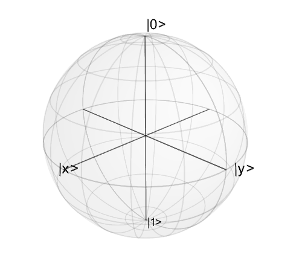
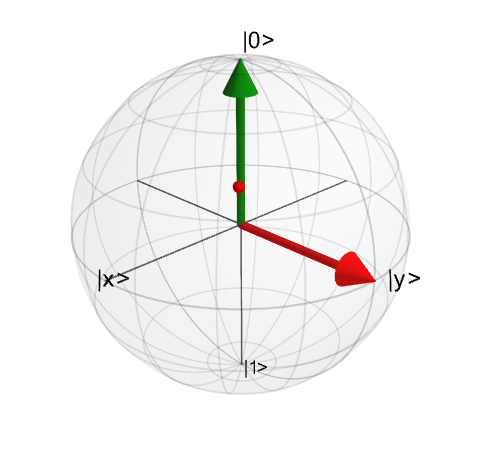
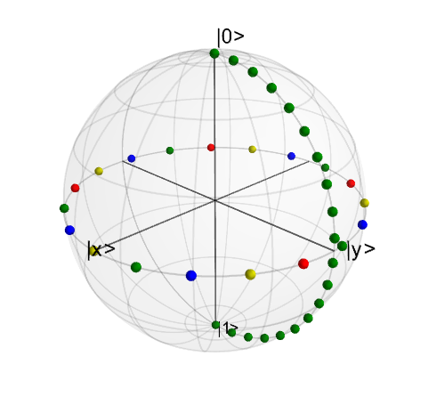

.. QuTiP 
   Copyright (C) 2011-2012, Paul D. Nation & Robert J. Johansson

.. _bloch:

******************************
Plotting on the Bloch Sphere
******************************

.. ipython::
   :suppress:

   In [1]: from qutip import *

.. _bloch-intro:

.. important:: 
	Updated in QuTiP version 2.2.

Introduction
============

When studying the dynamics of a two-level system, it is often convent to visualize the state of the system by plotting the state-vector or density matrix on the Bloch sphere.  In QuTiP, we have created two different classes to allow for easy creation and manipulation of data sets, both vectors and data points, on the Bloch sphere.  The :class:`qutip.Bloch` class, uses Matplotlib to render the Bloch sphere, where as :class:`qutip.Bloch3d` uses the Mayavi rendering engine to generate a more faithful 3D reconstruction of the Bloch sphere.

.. _bloch-class:

The Bloch and Bloch3d Classes
=============================

In QuTiP, creating a Bloch sphere is accomplished by calling either:

.. ipython::
 
    In [1]: b=Bloch()

which will load an instance of the :class:`qutip.Bloch` class, or using:

.. ipython::
 
    In [1]: b3d=Bloch3d()

that loads the :class:`qutip.Bloch3d` version.  Before getting into the details of these objects, we can simply plot the blank Bloch sphere associated with these instances via:

.. ipython::
 	
	@savefig bloch-empty.png width=3.5in align=center
	In [1]: b.show()

or

.. _image-blank3d:

In addition to the show() command, the Bloch class has the following functions:

.. tabularcolumns:: | p{3.5cm} | p{7cm} | p{6cm} |

+--------------------------+--------------------------------------+------------------------------------------+
| Name                     | Input Parameters (#=optional)        | Description                              |
+==========================+======================================+==========================================+
| add_points(pnts,#meth)   | pnts list/array of (x,y,z) points,   | Adds a single or set of data points      |  
|                          | meth='m' (default meth='s') will     | to be plotted on the sphere.             |
|                          | plot a collection of points as       |                                          |
|                          | multi-colored data points.           |                                          |
+--------------------------+--------------------------------------+------------------------------------------+
|add_states(state,#kind)   | `state` Qobj or list/array of Qobj's | Input multiple states as a list or array |
|                          | representing state or density matrix |                                          |
|                          | of a two-level system,               |                                          |
|                          | `kind` (optional) string specifying  |                                          |
|                          | if state should be plotted as point  |                                          |
|                          | ('point') or vector (default).       |                                          |
+--------------------------+--------------------------------------+------------------------------------------+
| add_vectors(vec)         | `vec` list/array of (x,y,z) points   | adds single or multiple vectors to plot. |
|                          | giving direction and length of       |                                          |
|                          | state vectors.                       |                                          | 
+--------------------------+--------------------------------------+------------------------------------------+
| clear()                  |                                      | Removes all data from Bloch sphere.      |
|                          |                                      | Keeps customized figure properties.      |
+--------------------------+--------------------------------------+------------------------------------------+
| save(#format,#dirc)      | *format* format (default='png') of   | Saves Bloch sphere to a file.            |
|                          | output file, *dirc* (default=cwd)    |                                          |
|                          | output directory                     |                                          |
|                          |                                      |                                          |
+--------------------------+--------------------------------------+------------------------------------------+
| show()                   |                                      | Generates Bloch sphere with given data.  |
+--------------------------+--------------------------------------+------------------------------------------+

As an example, we can add a single data point:

.. ipython::
	
	In [1]: pnt=[1/sqrt(3),1/sqrt(3),1/sqrt(3)]
	
	In [2]: b.add_points(pnt)
	
	@savefig bloch-1pnt.png width=3.5in align=center
	In [3]: b.show()

and then a single vector:

.. ipython::
	
	In [1]: vec=[0,1,0]
	
	In [2]: b.add_vectors(vec)
	
	@savefig bloch-1pnt+1vec.png width=3.5in align=center
	In [3]: b.show()

and then add another vector corresponding to the :math:`\left|\rm up \right>` state:

.. ipython::
	
	In [1]: up=basis(2,0)
	
	In [2]: b.add_states(up)
	
	@savefig bloch-1pnt+1vec+1state.png width=3.5in align=center
	In [3]: b.show()

Notice that when we add more than a single vector (or data point), a different color will automatically be applied to the later data set (mod 4).  In total, the code for constructing our Bloch sphere with one vector, one state, and a single data point is:

>>> b=Bloch()
>>> pnt=[1/sqrt(3),1/sqrt(3),1/sqrt(3)]
>>> b.add_points(pnt)
>>> #b.show()
>>> vec=[0,1,0]
>>> b.add_vectors(vec)
>>> #b.show()
>>> up=basis(2,0)
>>> b.add_states(up)
>>> b.show()

where we have commented out the extra `show()` commands.  Replacing ``b=Bloch()`` with ``b=Bloch3d()`` in the above code generates the following 3D Bloch sphere.   

.. _image-bloch3ddata:

We can also plot multiple points, vectors, and states at the same time by passing list or arrays instead of individual elements.  Before giving an example, we can use the `clear()` command to remove the current data from our Bloch sphere instead of creating a new instance:

.. ipython::
	
	In [1]: b.clear()
	
	@savefig bloch-clear.png width=3.5in align=center
	In [2]: b.show()

Now on the same Bloch sphere, we can plot the three states associated with the x, y, and z directions:

.. ipython::
	
	In [1]: x=(basis(2,0)+(1+0j)*basis(2,1)).unit()
	
	In [2]: y=(basis(2,0)+(0+1j)*basis(2,1)).unit()
	
	In [3]: z=(basis(2,0)+(0+0j)*basis(2,1)).unit()
	
	In [4]: b.add_states([x,y,z])
	
	@savefig bloch-xyz-states.png width=3.5in align=center
	In [5]: b.show()

a similar method works for adding vectors:

.. ipython::
	
	In [1]: b.clear()
	
	In [2]: vec=[[1,0,0],[0,1,0],[0,0,1]]
	
	In [3]: b.add_vectors(vec)
	
	@savefig bloch-xyz-vecs.png width=3.5in align=center
	In [4]: b.show()

Adding multiple points to the Bloch sphere works slightly differently than adding multiple states or vectors.  For example, lets add a set of 20 points around the equator (after calling `clear()`):

.. ipython::
	:suppress:
	
	In [1]: b.clear()

.. ipython::
	
	In [1]: xp=[cos(th) for th in linspace(0,2*pi,20)]
	
	In [2]: yp=[sin(th) for th in linspace(0,2*pi,20)]
	
	In [3]: zp=zeros(20)
	
	In [4]: pnts=[xp,yp,zp]
	
	In [5]: b.add_points(pnts)
	
	@savefig bloch-20pnts.png width=3.5in align=center
	In [6]: b.show()

Notice that, in contrast to states or vectors, each point remains the same color as the initial point.  This is because adding multiple data points using the add_points function is interpreted, by default, to correspond to a single data point (single qubit state) plotted at different times.  This is very useful when visualizing the dynamics of a qubit.  An example of this is given in the example .  If we want to plot additional qubit states we can call additional `add_points` functions:

.. ipython::
	
	In [1]: xz=zeros(20)
	
	In [2]: yz=[sin(th) for th in linspace(0,pi,20)]
	
	In [3]: zz=[cos(th) for th in linspace(0,pi,20)]
	
	In [4]: b.add_points([xz,yz,zz])
	
	@savefig bloch-40pnts.png width=3.5in align=center
	In [5]: b.show()

The color and shape of the data points is varied automatically by the Bloch class.  Notice how the color and point markers change for each set of data.  Again, we have had to call ``add_points`` twice because adding more than one set of multiple data points is *not* supported by the ``add_points`` function.

What if we want to vary the color of our points.  We can tell the :class:`qutip.Bloch` class to vary the color of each point according to the colors listed in the ``b.point_color`` list (see :ref:`bloch-config` below).  Again after ``clear()``:

.. ipython::
	:suppress:
	
	In [1]: b.clear()

.. ipython::
	
	In [1]: xp=[cos(th) for th in linspace(0,2*pi,20)]
	
	In [2]: yp=[sin(th) for th in linspace(0,2*pi,20)]
	
	In [3]: zp=zeros(20)
	
	In [4]: pnts=[xp,yp,zp]
	
	In [5]: b.add_points(pnts,'m') # <-- add a 'm' string to signify 'multi' colored points
	
	@savefig bloch-multipnts.png width=3.5in align=center
	In [6]: b.show()

Now, the data points cycle through a variety of predefined colors.  Now lets add another set of points, but this time we want the set to be a single color, representing say a qubit going from the :math:`\left|\rm up\right>` state to the :math:`\left|\rm down\right>` state in the y-z plane:

.. ipython::
	
	In [1]: xz=zeros(20)
	
	In [2]: yz=[sin(th) for th in linspace(0,pi,20)]
	
	In [3]: zz=[cos(th) for th in linspace(0,pi,20)]
	
	In [4]: b.add_points([xz,yz,zz]) # no 'm'
	
	@savefig bloch-mpnts+pts.png width=3.5in align=center
	In [5]: b.show()

Again, the same plot can be generated using the :class:`qutip.Bloch3d` class by replacing ``Bloch`` with ``Bloch3d``:

   
A more slick way of using this 'multi' color feature is also given in the example, where we set the color of the markers as a function of time.

Differences Between Bloch and Bloch3d
-------------------------------------
While in general the ``Bloch`` and ``Bloch3d`` classes are interchangeable, there are some important differences to consider when choosing between them.

- The ``Bloch`` class uses Matplotlib to generate figures.  As such, the data plotted on the sphere is in reality just a 2D object.  In contrast the ``Bloch3d`` class uses the 3D rendering engine from VTK via mayavi to generate the sphere and the included data.  In this sense the ``Bloch3d`` class is much more advanced, as objects are rendered in 3D leading to a higher quality figure.

- Only the ``Bloch`` class can be embedded in a Matplotlib figure window.  Thus if you want to combine a Bloch sphere with another figure generated in QuTiP, you can not use ``Bloch3d``.  Of course you can always post-process your figures using other software to get the desired result.

- Due to limitations in the rendering engine, the ``Bloch3d`` class does not support LaTex for text.  Again, you can get around this by post-processing.

- The user customizable attributes for the ``Bloch`` and ``Bloch3d`` classes are not identical.  Therefore, if you change the properties of one of the classes, these changes will cause an exception if the class is switched.

.. _bloch-config:

Configuring the Bloch sphere
============================

Bloch Class Options
--------------------

At the end of the last section we saw that the colors and marker shapes of the data plotted on the Bloch sphere are automatically varied according to the number of points and vectors added.  But what if you want a different choice of color, or you want your sphere to be purple with different axes labels? Well then you are in luck as the Bloch class has 22 attributes which one can control.  Assuming ``b=Bloch()``:
   
.. tabularcolumns:: | p{3cm} | p{7cm} |  p{7cm} |

+---------------+---------------------------------------------------------+---------------------------------------------+
| Attribute     | Function                                                | Default Setting                             | 
+===============+=========================================================+=============================================+
| b.axes        | Matplotlib axes instance for animations. Set by ``axes``| ``None``                                    |
|               | keyword arg.                                            |                                             | 
+---------------+---------------------------------------------------------+---------------------------------------------+
| b.fig         | User supplied Matplotlib Figure instance. Set by ``fig``| ``None``                                    | 
|               | keyword arg.                                            |                                             |
+---------------+---------------------------------------------------------+---------------------------------------------+
| b.font_color  | Color of fonts                                          | `'black'`                                   | 
+---------------+---------------------------------------------------------+---------------------------------------------+
| b.font_size   | Size of fonts                                           | 20                                          | 
+---------------+---------------------------------------------------------+---------------------------------------------+
| b.frame_alpha | Transparency of wireframe                               | 0.1                                         | 
+---------------+---------------------------------------------------------+---------------------------------------------+
| b.frame_color | Color of wireframe                                      | `'gray'`                                    | 
+---------------+---------------------------------------------------------+---------------------------------------------+
| b.frame_width | Width of wireframe                                      | 1                                           | 
+---------------+---------------------------------------------------------+---------------------------------------------+
| b.point_color | List of colors for Bloch point markers to cycle through | `['b','r','g','#CC6600']`                   | 
+---------------+---------------------------------------------------------+---------------------------------------------+
| b.point_marker| List of point marker shapes to cycle through            | `['o','s','d','^']`                         | 
+---------------+---------------------------------------------------------+---------------------------------------------+
| b.point_size  | List of point marker sizes (not all markers look the    | `[55,62,65,75]`                             | 
|               | same size when plotted)                                 |                                             | 
+---------------+---------------------------------------------------------+---------------------------------------------+
| b.sphere_alpha| Transparency of Bloch sphere                            |  0.2                                        | 
+---------------+---------------------------------------------------------+---------------------------------------------+
| b.sphere_color| Color of Bloch sphere                                   |  `'#FFDDDD'`                                | 
+---------------+---------------------------------------------------------+---------------------------------------------+
| b.size        | Sets size of figure window                              | `[7,7]` (700x700 pixels)                    | 
+---------------+---------------------------------------------------------+---------------------------------------------+
| b.vector_color| List of colors for Bloch vectors to cycle through       |  `['g','#CC6600','b','r']`                  | 
+---------------+---------------------------------------------------------+---------------------------------------------+
| b.vector_width| Width of Bloch vectors                                  | 4                                           | 
+---------------+---------------------------------------------------------+---------------------------------------------+
| b.view        | Azimuthal and Elevation viewing angles                  |  `[-60,30]`                                 | 
+---------------+---------------------------------------------------------+---------------------------------------------+
| b.xlabel      | Labels for x-axis                                       | `['$x$','']` +x and -x (labels use LaTeX)   | 
+---------------+---------------------------------------------------------+---------------------------------------------+
| b.xlpos       | Position of x-axis labels                               | `[1.1,-1.1]`                                | 
+---------------+---------------------------------------------------------+---------------------------------------------+
| b.ylabel      | Labels for y-axis                                       | `['$y$','']` +y and -y (labels use LaTeX)   | 
+---------------+---------------------------------------------------------+---------------------------------------------+
| b.ylpos       | Position of y-axis labels                               | `[1.2,-1.2]`                                | 
+---------------+---------------------------------------------------------+---------------------------------------------+
| b.zlabel      | Labels for z-axis                                       | `['$\left|0\\right>$','$\left|1\\right>$']` | 
|               |                                                         | +z and -z (labels use LaTeX)                | 
+---------------+---------------------------------------------------------+---------------------------------------------+
| b.zlpos       | Position of z-axis labels                               | `[1.2,-1.2]`                                | 
+---------------+---------------------------------------------------------+---------------------------------------------+

Bloch3d Class Options
---------------------

The Bloch3d sphere is also customizable.  Note however that the attributes for the ``Bloch3d`` class are not in one-to-one
correspondence to those of the ``Bloch`` class due to the different underlying rendering engines. Assuming ``b=Bloch3d()``:

.. tabularcolumns:: | p{3cm} | p{7cm} |  p{7cm} |

+---------------+---------------------------------------------------------+---------------------------------------------+
| Attribute     | Function                                                | Default Setting                             | 
+===============+=========================================================+=============================================+
| b.fig         | User supplied Mayavi Figure instance. Set by ``fig``    | ``None``                                    | 
|               | keyword arg.                                            |                                             |
+---------------+---------------------------------------------------------+---------------------------------------------+
| b.font_color  | Color of fonts                                          | `'black'`                                   | 
+---------------+---------------------------------------------------------+---------------------------------------------+
| b.font_scale  | Scale of fonts                                          | 0.08                                        | 
+---------------+---------------------------------------------------------+---------------------------------------------+
| b.frame       | Draw wireframe for sphere?                              | True                                        |
+---------------+---------------------------------------------------------+---------------------------------------------+
| b.frame_alpha | Transparency of wireframe                               | 0.05                                        | 
+---------------+---------------------------------------------------------+---------------------------------------------+
| b.frame_color | Color of wireframe                                      | `'gray'`                                    | 
+---------------+---------------------------------------------------------+---------------------------------------------+
| b.frame_num   | Number of wireframe elements to draw                    | 8                                           |
+---------------+---------------------------------------------------------+---------------------------------------------+
| b.frame_radius| Radius of wireframe lines                               | 0.005                                       | 
+---------------+---------------------------------------------------------+---------------------------------------------+
| b.point_color | List of colors for Bloch point markers to cycle through | `['r', 'g', 'b', 'y']`                      | 
+---------------+---------------------------------------------------------+---------------------------------------------+
| b.point_mode  | Type of point markers to draw                           | `sphere`                                    | 
+---------------+---------------------------------------------------------+---------------------------------------------+
| b.point_size  | Size of points                                          | 0.075                                       | 
+---------------+---------------------------------------------------------+---------------------------------------------+
| b.sphere_alpha| Transparency of Bloch sphere                            |  0.1                                        | 
+---------------+---------------------------------------------------------+---------------------------------------------+
| b.sphere_color| Color of Bloch sphere                                   |  `'#808080'`                                | 
+---------------+---------------------------------------------------------+---------------------------------------------+
| b.size        | Sets size of figure window                              | `[500,500]` (500x500 pixels)                | 
+---------------+---------------------------------------------------------+---------------------------------------------+
| b.vector_color| List of colors for Bloch vectors to cycle through       |  `['r', 'g', 'b', 'y']`                     | 
+---------------+---------------------------------------------------------+---------------------------------------------+
| b.vector_width| Width of Bloch vectors                                  | 3                                           | 
+---------------+---------------------------------------------------------+---------------------------------------------+
| b.view        | Azimuthal and Elevation viewing angles                  |  `[45,65 ]`                                 | 
+---------------+---------------------------------------------------------+---------------------------------------------+
| b.xlabel      | Labels for x-axis                                       | ['|x>', '']  +x and -x                      | 
+---------------+---------------------------------------------------------+---------------------------------------------+
| b.xlpos       | Position of x-axis labels                               | `[1.07,-1.07]`                              | 
+---------------+---------------------------------------------------------+---------------------------------------------+
| b.ylabel      | Labels for y-axis                                       | `['$y$','']` +y and -y                      | 
+---------------+---------------------------------------------------------+---------------------------------------------+
| b.ylpos       | Position of y-axis labels                               | `[1.07,-1.07]`                              | 
+---------------+---------------------------------------------------------+---------------------------------------------+
| b.zlabel      | Labels for z-axis                                       | `['|0>', '|1>']` +z and -z                  | 
+---------------+---------------------------------------------------------+---------------------------------------------+
| b.zlpos       | Position of z-axis labels                               | `[1.07,-1.07]`                              | 
+---------------+---------------------------------------------------------+---------------------------------------------+

These properties can also be accessed via the print command:

.. ipython::
	
	In [1]: b=Bloch()
	
	In [2]: print(b)

.. _bloch-animate:

Animating with the Bloch sphere
===============================

The Bloch class was designed from the outset to generate animations.  To animate a set of vectors or data points the basic idea is: plot the data at time t1, save the sphere, clear the sphere, plot data at t2,... The Bloch sphere will automatically number the output file based on how many times the object has been saved (this is stored in b.savenum).  The easiest way to animate data on the Bloch sphere is to use the ``save()`` method and generate a series of images to convert into an animation.  However, as of Matplotlib version 1.1, creating animations is built-in.  We will demonstrate both methods by looking at the decay of a qubit on the bloch sphere.   

.. _bloch-animate-decay:

Example: Qubit Decay
--------------------

The code for calculating the expectation values for the Pauli spin operators of a qubit decay is given below.  This code is common to both animation examples.

.. literalinclude:: scripts/ex_bloch_animation.py

.. _bloch-animate-decay-images:

Generating Images for Animation
++++++++++++++++++++++++++++++++

An example of generating images for generating an animation outside of Python is given below::

	b=Bloch()
	b.vector_color = ['r']
	b.view=[-40,30]
	for i in xrange(len(sx)):
	    b.clear()
	    b.add_vectors([sin(theta),0,cos(theta)])
	    b.add_points([sx[:i+1],sy[:i+1],sz[:i+1]])
	    b.save(dirc='temp') #saving images to temp directory in current working directory

Generating an animation using ffmpeg (for example) is fairly simple::

	ffmpeg -r 20 -b 1800 -i bloch_%01d.png bloch.mp4

.. _bloch-animate-decay-direct:

Directly Generating an Animation
++++++++++++++++++++++++++++++++

.. important:: Generating animations directly from Matplotlib requires installing either mencoder or ffmpeg.  While either choice works on linux, it is best to choose ffmpeg when running on the Mac.  If using macports just do: ``sudo port install ffmpeg``.

The code to directly generate an mp4 movie of the Qubit decay is as follows::

	from pylab import *
	import matplotlib.animation as animation
	from mpl_toolkits.mplot3d import Axes3D
	
	fig = figure()
	ax = Axes3D(fig,azim=-40,elev=30)
	sphere=Bloch(axes=ax)
	
	def animate(i):
	    sphere.clear()
	    sphere.add_vectors([sin(theta),0,cos(theta)])
	    sphere.add_points([sx[:i+1],sy[:i+1],sz[:i+1]])
	    sphere.make_sphere()
	    return ax
		
	def init():
	    sphere.vector_color = ['r']
	    return ax
		
	ani = animation.FuncAnimation(fig, animate, np.arange(len(sx)),
	                            init_func=init, blit=True, repeat=False)
	ani.save('bloch_sphere.mp4', fps=20, clear_temp=True)

The resulting movie may be viewed here: `Bloch_Decay.mp4 <http://qutip.googlecode.com/svn/doc/figures/bloch_decay.mp4>`_

