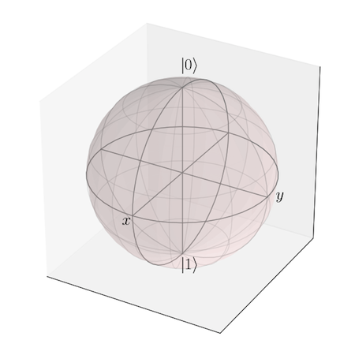
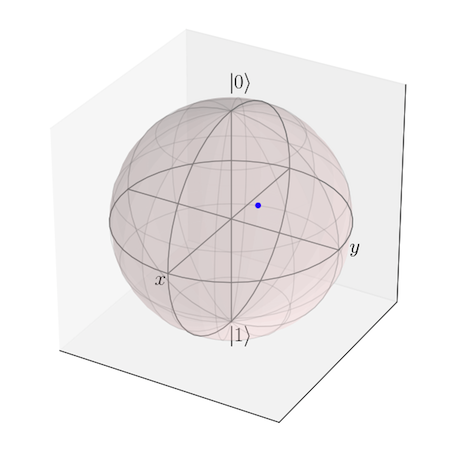
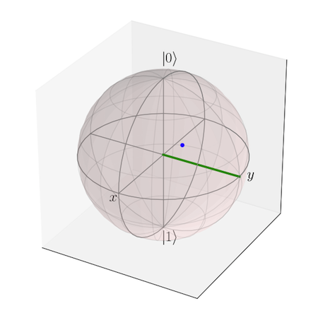
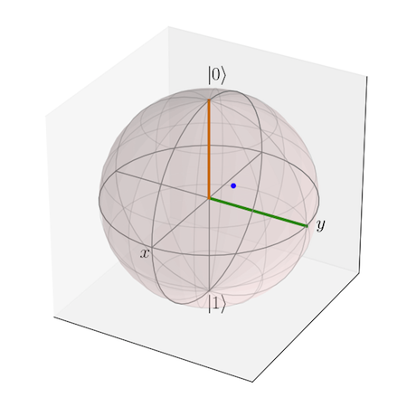
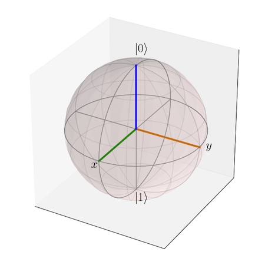
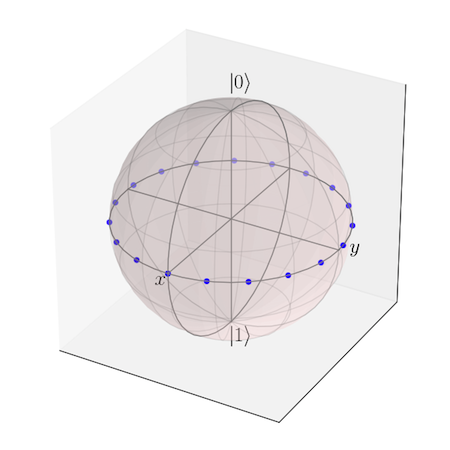
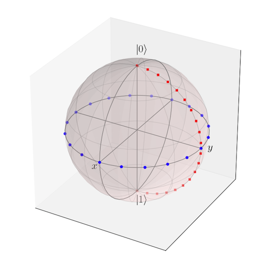
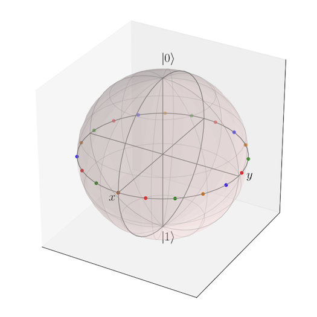
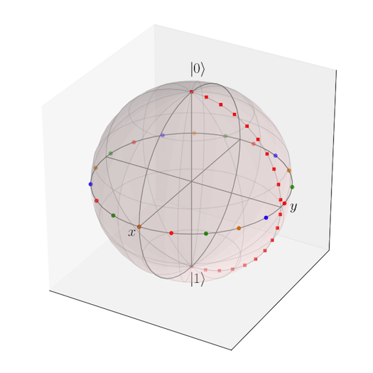
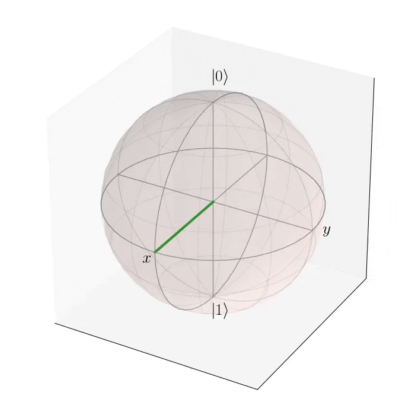

.. QuTiP 
   Copyright (C) 2011, Paul D. Nation & Robert J. Johansson

.. _guide-bloch:

Plotting on the Bloch Sphere
******************************
.. toctree::
   :maxdepth: 2

Introduction
============

When studying the dynamics of a two-level system, it is often convent to visualize the state of the system by plotting the state-vector or density matrix on the Bloch sphere.  In QuTiP, we have created the Bloch class to allow for easy creation and manipulation of data sets, both vectors and data points, on the Bloch sphere.

The Bloch class
+++++++++++++++

In QuTiP, creating a Bloch sphere is accomplished by calling:

>>> b=Bloch()

which will load an instance of the Bloch class.  Before getting into the details of this object, we can simply plot the blank Bloch sphere associated with this instance via:

>>> b.show()

In addition to the show() command, the Bloch class has the following functions:

+--------------------------+--------------------------------------+------------------------------------------+
| Name                     | Input Parameters (#=optional)        | Description                              |
+==========================+======================================+==========================================+
| add_points(puts,#meth)   | *pnts* list/array of (x,y,z) points, | Adds a single or set of data points      |  
|                          | *meth*='m' (default meth='s') will   | to be plotted on the sphere.             |
|                          | plot a collection of points as       |                                          |
|                          | multi-colored data points.           |                                          |
+--------------------------+--------------------------------------+------------------------------------------+
|add_states(state,#kind)   | *state* Qobj or list/array of Qobj's | Input multiple states as a list or array |
|                          | representing state or density matrix |                                          |
|                          | of a two-level system,               |                                          |
|                          | *kind* (optional) string specifying  |                                          |
|                          | if state should be plotted as point  |                                          |
|                          | (`'point'`) or vector (default).     |                                          |
+--------------------------+--------------------------------------+------------------------------------------+
| add_vectors(vec)         | *vec* list/array of (x,y,z) points   | adds single or multiple vectors to plot. |
|                          | giving direction and length of       |                                          |
|                          | state vectors.                       |                                          | 
+--------------------------+--------------------------------------+------------------------------------------+
| clear()                  |                                      | Removes all data from Bloch sphere.      |
|                          |                                      | Keeps customized figure properties.      |
+--------------------------+--------------------------------------+------------------------------------------+
| save(#format,#dirc)      | *format* format (default='png') of   | Saves Bloch sphere to a file.            |
|                          | output file, *dirc* (default=cwd)    |                                          |
|                          | output directory                     |                                          |
|                          |                                      |                                          |
+--------------------------+--------------------------------------+------------------------------------------+
| show()                   |                                      | Generates Bloch sphere with given data.  |
+--------------------------+--------------------------------------+------------------------------------------+

As an example, we can add a single data point:

>>> pnt=[1/sqrt(3),1/sqrt(3),1/sqrt(3)]
>>> b.add_points(pnt)
>>> b.show()

and then a single vector:

>>> vec=[0,1,0]
>>> b.add_vectors(vec)
>>> b.show()

and then add another vector corresponding to the |up> state:

>>> up=basis(2,0)
>>> b.add_states(up)
>>> b.show()

   

Notice that when we add more than a single vector (or data point), a different color will automatically be applied to the later data set (mod 4).  In total, the code for constructing our Bloch sphere with one vector, one state, and a single data point is:

>>> b=Bloch()
>>> pnt=[1/sqrt(3),1/sqrt(3),1/sqrt(3)]
>>> b.add_points(pnt)
>>> #b.show()
>>> vec=[0,1,0]
>>> b.add_vectors(vec)
>>> #b.show()
>>> up=basis(2,0)
>>> b.add_states(up)
>>> b.show()

where we have commented out the extra `show()` commands.  We can also plot multiple points, vectors, and states at the same time by passing list or arrays instead of individual elements.  Before giving an example, we can use the `clear()` command to remove the current data from our Bloch sphere instead of creating a new instance:

>>> b.clear()
>>> b.show()

   

Now on the same Bloch sphere, we can plot the three states associated with the x, y, and z directions:

>>> x=(basis(2,0)+(1+0j)*basis(2,1)).unit()
>>> y=(basis(2,0)+(0+1j)*basis(2,1)).unit()
>>> z=(basis(2,0)+(0+0j)*basis(2,1)).unit()
>>> b.add_states([x,y,z])
>>> b.show()

   

a similar method works for adding vectors:

>>> vec=[[1,0,0],[0,1,0],[0,0,1]]
>>> b.add_vectors(vec)

Adding multiple points to the Bloch sphere works slightly differently than adding multiple states or vectors.  For example, lets add a set of 20 points around the equator (after calling `clear()`):

>>> xp=[cos(th) for th in linspace(0,2*pi,20)]
>>> yp=[sin(th) for th in linspace(0,2*pi,20)]
>>> zp=zeros(20)
>>> pnts=[xp,yp,zp]
>>> b.add_points(pnts)
>>> b.show()

   

Notice that, in contrast to states or vectors, each point remains the same color as the initial point.  This is because adding multiple data points using the add_points function is interpreted, by default, to correspond to a single data point (single qubit state) plotted at different times.  This is very useful when visualizing the dynamics of a qubit.  An example of this is given in the *[ExamplesBlochQubitDecay Qubit Decay on the Bloch Sphere]* example.  If we want to plot additional qubit states we can call additional `add_points` functions:

>>> xz=zeros(20)
>>> yz=[sin(th) for th in linspace(0,pi,20)]
>>> zz=[cos(th) for th in linspace(0,pi,20)]
>>> b.add_points([xz,yz,zz])
>>> b.show()

   

Notice how the color and point markers change for each set of data.

The entire code for this final sphere is thus:

>>> b=Bloch()
>>> xp=[cos(th) for th in linspace(0,2*pi,20)]
>>> yp=[sin(th) for th in linspace(0,2*pi,20)]
>>> zp=zeros(20)
>>> xz=zeros(20)
>>> yz=[sin(th) for th in linspace(0,pi,20)]
>>> zz=[cos(th) for th in linspace(0,pi,20)]
>>> b.add_points([xp,yp,zp])
>>> b.add_points([xz,yz,zz])
>>> b.show()

Again, we have had to call `add_points` twice because adding more than one set of multiple data points is *not* supported by the `add_points` function.

What if we want to vary the color of our points.  We can tell the `Bloch class` to vary the color of each point according to the colors listed in the b.point_color list (see *[GuideBloch#Configuring_the_Bloch_sphere Configuring the Bloch sphere]* below).  Again after `clear()`:

>>> xp=[cos(th) for th in linspace(0,2*pi,20)]
>>> yp=[sin(th) for th in linspace(0,2*pi,20)]
>>> zp=zeros(20)
>>> pnts=[xp,yp,zp]
>>> b.add_points(pnts,'m') # <-- add a 'm' string to signify 'multi' colored points
>>> b.show()

   

Now, the data points cycle through a variety of predefined colors.  Now lets add another set of points, but this time we want the set to be a single color, representing say a qubit going from the |up> state to the |down> state in the y-z plane:

>>> xz=zeros(20)
>>> yz=[sin(th) for th in linspace(0,pi,20)]
>>> zz=[cos(th) for th in linspace(0,pi,20)]
>>> b.add_points([xz,yz,zz]) # no 'm'
>>> b.show()

   

A more slick way of using this 'multi' color feature is also given in the *[ExamplesBlochQubitDecay Qubit Decay on the Bloch Sphere]* example, where we set the color of the markers as a function of time.

Configuring the Bloch sphere
===============================

At the end of the last section we saw that the colors and marker shapes of the data plotted on the Bloch sphere are automatically varied according to the number of points and vectors added.  But what if you want a different choice of color, or you want your sphere to be purple with different axes labels? Well then you are in luck as the Bloch class has 20 attributes which one can control.  Assuming ``b=Bloch()``:   

+---------------+---------------------------------------------------------+---------------------------------------------+
| Attribute     | Function                                                | Default Setting                             | 
+===============+=========================================================+=============================================+
| b.font_color  | Color of fonts                                          | `'black'`                                   | 
+---------------+---------------------------------------------------------+---------------------------------------------+
| b.font_size   | Size of fonts                                           | 20                                          | 
+---------------+---------------------------------------------------------+---------------------------------------------+
| b.frame_alpha | Transparency of wireframe                               | 0.1                                         | 
+---------------+---------------------------------------------------------+---------------------------------------------+
| b.frame_color | Color of wireframe                                      | `'gray'`                                    | 
+---------------+---------------------------------------------------------+---------------------------------------------+
| b.frame_width | Width of wireframe                                      | 1                                           | 
+---------------+---------------------------------------------------------+---------------------------------------------+
| b.point_color | List of colors for Bloch point markers to cycle through | `['b','r','g','#CC6600']`                   | 
+---------------+---------------------------------------------------------+---------------------------------------------+
| b.point_marker| List of point marker shapes to cycle through            | `['o','s','d','^']`                         | 
+---------------+---------------------------------------------------------+---------------------------------------------+
| b.point_size  | List of point marker sizes (not all markers look the    | `[25,32,35,45]`                             | 
|               | same size when plotted)                                 |                                             | 
+---------------+---------------------------------------------------------+---------------------------------------------+
| b.sphere_alpha| Transparency of Bloch sphere                            |  0.2                                        | 
+---------------+---------------------------------------------------------+---------------------------------------------+
| b.sphere_color| Color of Bloch sphere                                   |  `'#FFDDDD'`                                | 
+---------------+---------------------------------------------------------+---------------------------------------------+
| b.size        | Sets size of figure window                              | `[7,7]` (700x700 pixels)                    | 
+---------------+---------------------------------------------------------+---------------------------------------------+
| b.vector_color| List of colors for Bloch vectors to cycle through       |  `['g','#CC6600','b','r']`                  | 
+---------------+---------------------------------------------------------+---------------------------------------------+
| b.vector_width| Width of Bloch vectors                                  | 3                                           | 
+---------------+---------------------------------------------------------+---------------------------------------------+
| b.view        | Azimuthal and Elvation viewing angles                   |  `[-60,30]`                                 | 
+---------------+---------------------------------------------------------+---------------------------------------------+
| b.xlabel      | Labels for x-axis                                       | `['$x$','']` +x and -x (labels use LaTeX)   | 
+---------------+---------------------------------------------------------+---------------------------------------------+
| b.xlpos       | Position of x-axis labels                               | `[1.1,-1.1]`                                | 
+---------------+---------------------------------------------------------+---------------------------------------------+
| b.ylabel      | Labels for y-axis                                       | `['$y$','']` +y and -y (labels use LaTeX)   | 
+---------------+---------------------------------------------------------+---------------------------------------------+
| b.ylpos       | Position of y-axis labels                               | `[1.2,-1.2]`                                | 
+---------------+---------------------------------------------------------+---------------------------------------------+
| b.zlabel      | Labels for z-axis                                       | `['$\left|0\\right>$','$\left|1\\right>$']` | 
|               |                                                         | +z and -z (labels use LaTeX)                | 
+---------------+---------------------------------------------------------+---------------------------------------------+
| b.zlpos       | Position of z-axis labels                               | `[1.2,-1.2]`                                | 
+---------------+---------------------------------------------------------+---------------------------------------------+

These properties can also be accessed via the print command:

>>> b=Bloch()
>>> print b
Bloch sphere properties:
------------------------
font_color:    black
font_size:     20
frame_alpha:   0.2
frame_color:   gray
frame_width:   1
point_color:   ['b', 'r', 'g', '#CC6600']
point_marker:  ['o', 's', 'd', '^']
point_size:    [25, 32, 35, 45]
sphere_alpha:  0.2
sphere_color:  #FFDDDD
size:          [7, 7]
vector_color:  ['g', '#CC6600', 'b', 'r']
vector_width:  3
view:          [-60, 30]
xlabel:        ['$x$', '']
xlpos:         [1.2, -1.2]
ylabel:        ['$y$', '']
ylpos:         [1.1, -1.1]
zlabel:        ['$\\left|0\\right>$', '$\\left|1\\right>$']
zlpos:         [1.2, -1.2]

Animating with the Bloch sphere
===============================

The Bloch class was designed from the outset to generate animations.  To animate a set of vectors or data points the basic idea is: plot the data at time t1, save the sphere, clear the sphere, plot data at t2,... The Bloch sphere will automatically number the output file based on how many times the object has been saved (this is stored in b.savenum).  An example of generating images for animation is given below::

    from qutip import *
    b=Bloch()
    vec=array([[cos(th),sin(th),0.5*sin(4*th)] for th in linspace(0,2*pi,120)])
    vec=array([k/norm(k) for k in vec]) #normalize
    for k in range(120):
        b.add_vectors(vec[k])
        b.save(dirc=os.getcwd()+'/temp') #saving images to temp directory in current working directory
        b.clear()

