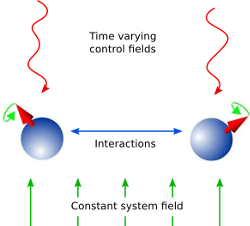

.. _control:

*********************************************
Quantum Optimal Control
*********************************************

Introduction
=============

In quantum control we look to prepare some specific state, effect some state-to-state transfer, or effect some transformation (or gate) on a quantum system. For a given quantum system there will always be factors that effect the dynamics that are outside of our control. As examples, the interactions between elements of the system or a magnetic field required to trap the system. However, there may be methods of affecting the dynamics in a controlled way, such as the time varying amplitude of the electric component of an interacting laser field. And so this leads to some questions; given a specific quantum system with known time-independent dynamics generator (referred to as the *drift* dynamics generators) and set of externally controllable fields for which the interaction can be described by *control* dynamics generators:

1. What states or transformations can we achieve (if any)?

2. What is the shape of the control pulse required to achieve this?

These questions are addressed as *controllability* and *quantum optimal control* [dAless08]_. The answer to question of *controllability* is determined by the commutability of the dynamics generators and is formalised as the *Lie Algebra Rank Criterion* and is discussed in detail in [dAless08]_. The solutions to the second question can be determined through optimal control algorithms, or control pulse optimisation.

   Schematic showing the principle of quantum control.

Quantum Control has many applications including NMR, *quantum metrology*, *control of chemical reactions*, and *quantum information processing*.

To explain the physics behind these algorithms we will first consider only finite-dimensional, closed quantum systems.

Closed Quantum Systems
======================
In closed quantum systems the states can be represented by kets, and the transformations on these states are unitary operators. The dynamics generators are Hamiltonians. The combined Hamiltonian for the system is given by

.. math::

    H(t) = H_0 + \sum_{j=1} u_j(t) H_j

where :math:`H_0` is the drift Hamiltonian and the :math:`H_j` are the control Hamiltonians. The :math:`u_j` are time varying amplitude functions for the specific control.

The dynamics of the system are governed by *Schrödingers equation*.

.. math::

    \tfrac{d}{dt} \ket{\psi} = -i H(t)\ket{\psi}

Note we use units where :math:`\hbar=1` throughout. The solutions to Schrödinger's equation are of the form:

.. math::

    \ket{\psi(t)} = U(t)\ket{\psi_0}

where :math:`\psi_0` is the state of the system at :math:`t=0` and :math:`U(t)` is a unitary operator on the Hilbert space containing the states. :math:`U(t)` is a solution to the *Schrödinger operator equation*

.. math::

    \tfrac{d}{dt}U = -i H(t)U ,\quad U(0) = \mathbb{1}

We can use optimal control algorithms to determine a set of :math:`u_j` that will drive our system from :math:`\ket{\psi_0}` to :math:`\ket{\psi_1}`, this is state-to-state transfer, or drive the system from some arbitary state to a given state :math:`\ket{\psi_1}`, which is state preparation, or effect some unitary transformation :math:`U_{target}`, called gate synthesis. The latter of these is most important in quantum computation.

The GRAPE algorithm
===================
The **GR**\ adient **A**\ scent **P**\ ulse **E**\ ngineering was first proposed in [NKanej]_. Solutions to Schrödinger's equation for a time-dependent Hamiltonian are not generally possible to obtain analytically. Therefore, a piecewise constant approximation to the pulse amplitudes is made. Time allowed for the system to evolve :math:`T` is split into :math:`M` timeslots (typically these are of equal duration), during which the control amplitude is assumed to remain constant. The combined Hamiltonian can then be approximated as:

.. math::

    H(t) \approx H(t_k) = H_0 + \sum_{j=1}^N u_{jk} H_j\quad

where :math:`k` is a timeslot index, :math:`j` is the control index, and :math:`N` is the number of controls. Hence :math:`t_k` is the evolution time at the start of the timeslot, and :math:`u_{jk}` is the amplitude of control :math:`j` throughout timeslot :math:`k`. The time evolution operator, or propagator, within the timeslot can then be calculated as:

.. math::

    X_k:=e^{-iH(t_k)\Delta t_k}

where :math:`\Delta t_k` is the duration of the timeslot. The evolution up to (and including) any timeslot :math:`k` (including the full evolution :math:`k=M`) can the be calculated as

.. math::

    X(t_k):=X_k X_{k-1}\cdots X_1 X_0

If the objective is state-to-state transfer then :math:`X_0=\ket{\psi_0}` and the target :math:`X_{targ}=\ket{\psi_1}`, for gate synthesis :math:`X_0 = U(0) = \mathbb{1}` and the target :math:`X_{targ}=U_{targ}`.

A *figure of merit* or *fidelity* is some measure of how close the evolution is to the target, based on the  control amplitudes in the timeslots. The typical figure of merit for unitary systems is the normalised overlap of the evolution and the target.

.. math::

    f_{PSU} = \tfrac{1}{d} \big| \tr \{X_{targ}^{\dagger} X(T)\} \big|

where :math:`d` is the system dimension. In this figure of merit the absolute value is taken to ignore any differences in global phase, and :math:`0 \le f \le 1`. Typically the fidelity error (or *infidelity*) is more useful, in this case defined as :math:`\varepsilon = 1 - f_{PSU}`.  There are many other possible objectives, and hence figures of merit.

As there are now :math:`N \times M` variables (the :math:`u_{jk}`) and one
parameter to minimise :math:`\varepsilon`, then the problem becomes a finite
multi-variable optimisation problem, for which there are many established
methods, often referred to as 'hill-climbing' methods. The simplest of these to
understand is that of steepest ascent (or descent). The gradient of the
fidelity with respect to all the variables is calculated (or approximated) and
a step is made in the variable space in the direction of steepest ascent (or
descent). This method is a first order gradient method. In two dimensions this
describes a method of climbing a hill by heading in the direction where the
ground rises fastest. This analogy also clearly illustrates one of the main
challenges in multi-variable optimisation, which is that all methods have a
tendency to get stuck in local maxima. It is hard to determine whether one has
found a global maximum or not - a local peak is likely not to be the highest
mountain in the region. In quantum optimal control we can typically define an
infidelity that has a lower bound of zero. We can then look to minimise the
infidelity (from here on we will only consider optimising for infidelity
minima). This means that we can terminate any pulse optimisation when the
infidelity reaches zero (to a sufficient precision). This is however only
possible for fully controllable systems; otherwise it is hard (if not
impossible) to know that the minimum possible infidelity has been achieved. In
the hill walking analogy the step size is roughly fixed to a stride, however,
in computations the step size must be chosen. Clearly there is a trade-off here
between the number of steps (or iterations) required to reach the minima and
the possibility that we might step over a minima. In practice it is difficult
to determine an efficient and effective step size.

The second order differentials of the infidelity with respect to the variables
can be used to approximate the local landscape to a parabola. This way a step
(or jump) can be made to where the minima would be if it were parabolic. This
typically vastly reduces the number of iterations, and removes the need to
guess a step size. The method where all the second differentials are calculated
explicitly is called the *Newton-Raphson* method. However, calculating the
second-order differentials (the Hessian matrix) can be computationally
expensive, and so there are a class of methods known as *quasi-Newton* that
approximate the Hessian based on successive iterations. The most popular of
these (in quantum optimal control) is the Broyden–Fletcher–Goldfarb–Shanno
algorithm (BFGS). The default method in the QuTiP Qtrl GRAPE implementation is
the L-BFGS-B method in Scipy, which is a wrapper to the implementation
described in [Byrd95]_. This limited memory and bounded method does not need to
store the entire Hessian, which reduces the computer memory required, and
allows bounds to be set for variable values, which considering these are field
amplitudes is often physical.

The pulse optimisation is typically far more efficient if the gradients can be
calculated exactly, rather than approximated. For simple fidelity measures such
as :math:`f_{PSU}` this is possible. Firstly the propagator gradient for each
timeslot with respect to the control amplitudes is calculated. For closed
systems, with unitary dynamics, a method using the eigendecomposition is used,
which is efficient as it is also used in the propagator calculation (to
exponentiate the combined Hamiltonian). More generally (for example open
systems and symplectic dynamics) the Frechet derivative (or augmented matrix)
method is used, which is described in [Flo12]_. For other optimisation goals it
may not be possible to calculate analytic gradients. In these cases it is
necessary to approximate the gradients, but this can be very expensive, and can
lead to other algorithms out-performing GRAPE.

The CRAB Algorithm
===================
It has been shown [Lloyd14]_, the dimension of a quantum optimal control
problem is a polynomial function of the dimension of the manifold of the
time-polynomial reachable states, when allowing for a finite control precision
and evolution time. You can think of this as the information content of the
pulse (as being the only effective input) being very limited e.g. the pulse is
compressible to a few bytes without loosing the target.

This is where the **C**\ hopped **RA**\ ndom **B**\ asis (CRAB) algorithm
[Doria11]_, [Caneva11]_ comes into play: Since the pulse complexity is usually
very low, it is sufficient to transform the optimal control problem to a few
parameter search by introducing a physically motivated function basis that
builds up the pulse. Compared to the number of time slices needed to accurately
simulate quantum dynamics (often equals basis dimension for Gradient based
algorithms), this number is lower by orders of magnitude, allowing CRAB to
efficiently optimize smooth pulses with realistic experimental constraints. It
is important to point out, that CRAB does not make any suggestion on the basis
function to be used. The basis must be chosen carefully considered, taking into
account a priori knowledge of the system (such as symmetries, magnitudes of
scales,...) and solution (e.g. sign, smoothness, bang-bang behavior,
singularities, maximum excursion or rate of change,....). By doing so, this
algorithm allows for native integration of experimental constraints such as
maximum frequencies allowed, maximum amplitude, smooth ramping up and down of
the pulse and many more. Moreover initial guesses, if they are available, can
(however not have to) be included to speed up convergence.

As mentioned in the GRAPE paragraph, for CRAB local minima arising from
algorithmic design can occur, too. However, for CRAB a 'dressed' version has
recently been introduced [Rach15]_ that allows to escape local minima.

For some control objectives and/or dynamical quantum descriptions, it is either
not possible to derive the gradient for the cost functional with respect to
each time slice or it is computationally expensive to do so. The same can apply
for the necessary (reverse) propagation of the co-state. All this trouble does
not occur within CRAB as those elements are not in use here. CRAB, instead,
takes the time evolution as a black-box where the pulse goes as an input and
the cost (e.g. infidelity) value will be returned as an output. This concept,
on top, allows for direct integration in a closed loop experimental environment
where both the preliminarily open loop optimization, as well as the final
adoption, and integration to the lab (to account for modeling errors,
experimental systematic noise, ...) can be done all in one, using this
algorithm.

Optimal Quantum Control in QuTiP
================================

The Quantum Control part of qutip has been moved to its own project.

The previously available implementation is now located in the `qutip-qtrl <https://qutip-qtrl.readthedocs.io/en/stable/>`_ module. If the ``qutip-qtrl`` package is installed, it can also be imported under the name ``qutip.control`` to ease porting code developed for QuTiP 4 to QuTiP 5.

A newer interface with upgraded capacities is being developped in `qutip-qoc <https://qutip-qoc.readthedocs.io/latest/guide/guide-control.html>`_.

Please give these modules a try.
