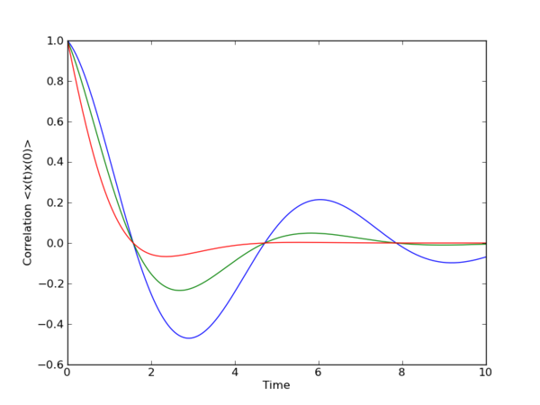
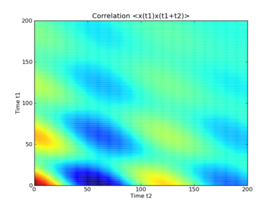
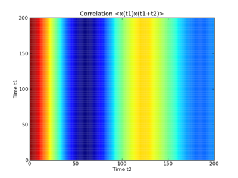

.. QuTiP 
   Copyright (C) 2011-2012, Paul D. Nation & Robert J. Johansson

.. _guide-correlation:

Solving Two-Time Correlation Functions
**************************************

Here we demonstrate how to calculate two-time correlation functions in QuTiP. Using the quantum regression theorem, we can apply the equation of motion for the system itself also to calculate two-time correlation functions. In QuTiP, there are family functions that assists in this process: :func:`qutip.correlation.correlation_ode`, :func:`qutip.correlation.correlation_es`, :func:`qutip.correlation.correlation_mc`, and :func:`qutip.correlation.correlation_ss_ode`, :func:`qutip.correlation.correlation_ss_es`, :func:`qutip.correlation.correlation_ss_mc`. As the names suggest, these functions use the ODE, the exponential series, and the Monte-Carlo solvers, respectively, to evolve the correlation functions in time. The following table describes in detail the usage of each function:

.. tabularcolumns:: | p{8cm} | L |

+----------------------------------------------+-----------------------------------------+
| Function                                     | Usage                                   |
+==============================================+=========================================+
| :func:`qutip.correlation.correlation_ss_es`  | Calculates the steady state correlation |
|                                              | :math:`\left<a(0)b(\tau)\right>`,       |
|                                              | using the Exponential series solver.    |
|                                              |                                         |
|                                              |                                         |
+----------------------------------------------+-----------------------------------------+
| :func:`qutip.correlation.correlation_ss_ode` | Calculates the steady state correlation |
|                                              | :math:`\left<a(0)b(\tau)\right>`,       |
|                                              | using the ODE solver.                   |
+----------------------------------------------+-----------------------------------------+
| :func:`qutip.correlation.correlation_ss_mc`  | Calculates the steady state correlation |
|                                              | :math:`\left<a(0)b(\tau)\right>`,       |
|                                              | using the Monte-Carlo evolution.        |
+----------------------------------------------+-----------------------------------------+
| :func:`qutip.correlation.correlation_es`     | Calculates the correlation function     |
|                                              | :math:`\left<a(t_1)b(t_1+t_2)\right>`,  |
|                                              | using the Exponential series solver.    |
+----------------------------------------------+-----------------------------------------+
| :func:`qutip.correlation.correlation_ode`    | Calculates the correlation function     |
|                                              | :math:`\left<a(t_1)b(t_1+t_2)\right>`,  |
|                                              | using the ODE solver.                   |
+----------------------------------------------+-----------------------------------------+
| :func:`qutip.correlation.correlation_mc`     | Calculates the correlation function     |
|                                              | :math:`\left<a(t_1)b(t_1+t_2)\right>`,  |
|                                              | using Monte-Carlo evolution.            |
+----------------------------------------------+-----------------------------------------+

The most common use-case is to calculate correlation functions of the kind :math:`\left<a(0)b(t)\right>`, in which case we use the correlation function solvers that start from the steady state, e.g., the :func:`qutip.correlation.correlation_ss_ode` function. These functions return a vector (in general complex) with the correlations between the operators as a function of the difference time. 

Steadystate correlation function
================================

The following code demonstrates how to calculate the :math:`\left<x(0)x(t)\right>` correlation for a leaky cavity with three different relaxation rates::

    >>> tlist = linspace(0,10.0,200);
    >>> a  = destroy(10)
    >>> x  = a.dag() + a
    >>> H  = a.dag()*a
    >>>  
    >>> corr1 = correlation_ss_ode(H, tlist, [sqrt(0.5)*a], x, x)
    >>> corr2 = correlation_ss_ode(H, tlist, [sqrt(1.0)*a], x, x)
    >>> corr3 = correlation_ss_ode(H, tlist, [sqrt(2.0)*a], x, x)
    >>>  
    >>> from pylab import *
    >>> plot(tlist, real(corr1), tlist, real(corr2), tlist, real(corr3))
    >>> xlabel('Time')
    >>> ylabel('Correlation <x(0)x(t)>')

	
Non-steadystate correlation function
====================================
    
More generally, we can also calculate correlation functions of the kind :math:`\left<a(t_1)b(t_1+t_2)\right>`, i.e., the correlation function of a system that is not in its steadystate. In QuTiP, we can evoluate such correlation functions using, e.g., the function :func:`qutip.correlation.correlation_ode`. This function returns a matrix with the correlations as a function of the two time coordinates::

    >>> tlist = linspace(0,10.0,200);
    >>> a  = destroy(10)
    >>> x  = a.dag() + a
    >>> H  = a.dag()*a
    >>> alpha = 2.5
    >>> corr = correlation_ode(H, coherent_dm(10, alpha), tlist, tlist, [sqrt(0.25)*a], x, x)
    >>> 
    >>> from pylab import *
    >>> pcolor(corr)
    >>> xlabel('Time t2')
    >>> ylabel('Time t1')
    >>> title('Correlation <x(t1)x(t1+t2)>')
    >>> show()

   
   :math:`\alpha = 2.5`

   
   :math:`\alpha = 0`

Notice that in the figure above to the right, where :math:`\alpha = 0.0` and the system therefore initially is in its steadystate, that the correlations does not depend on the :math:`t_1` coordinate, and we could in this case have used the steadystate solver to only calculate the :math:`t_2` dependence. 

