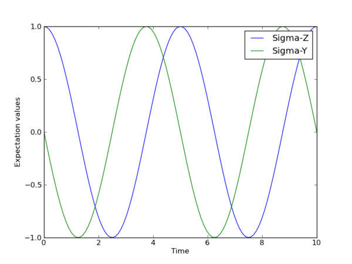
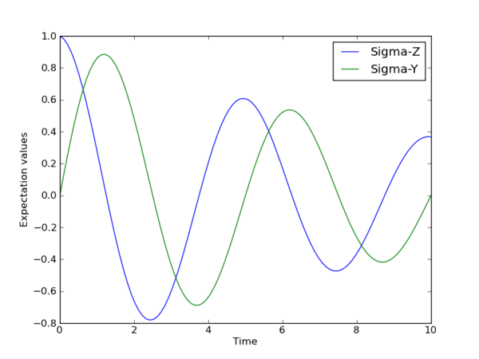
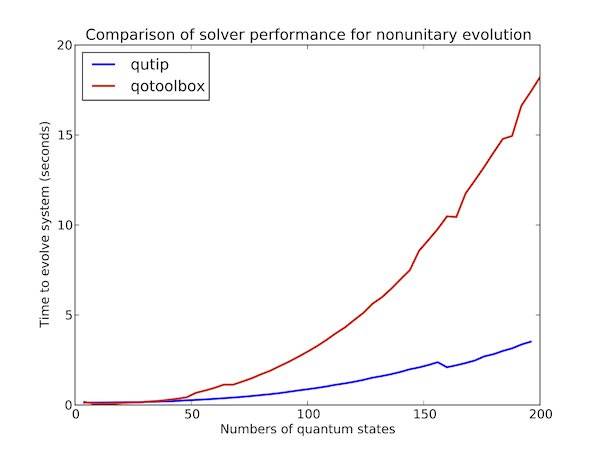

.. QuTiP 
   Copyright (C) 2011-2012, Paul D. Nation & Robert J. Johansson

.. _dynamics:

*******************************************************
An Overview of the Quantum Dynamics Solvers in QuTiP
*******************************************************

.. _dynamics-unitary:

Unitary evolution
====================
The dynamics of a closed (pure) quantum system is governed by the Schrödinger equation

.. math::
   :label: schrodinger

	i\hbar\frac{\partial}{\partial t}\Psi = \hat H \Psi,

where :math:`\Psi` is the wave function, :math:`\hat H` the Hamiltonian, and :math:`hbar` is Planck's constant. In general, the Schrödinger equation is a partial differential equation (PDE) where both :math`\Psi` and :math:`\hat H` are functions of space and time. For computational purposes it is useful to expand the PDE in a set of basis functions that span the Hilbert space of the Hamiltonian, and to write the equation in matrix and vector form

.. math::
   
   i\hbar\frac{d}{dt}\left|\psi\right> = H \left|\psi\right>

where :math:`\left|\psi\right>` is the state vector and :math:`H` is the matrix representation of the Hamiltonian. This matrix equation can, in principle, be solved by diagonalizing the Hamiltonian matrix :math:`H`. In practice, however, it is difficult to perform this diagonalization unless the size of the Hilbert space (dimension of the matrix :math:`H`) is small. Analytically, it is a formidable task to calculate the dynamics for systems with more than two states. If, in addition, we consider dissipation due to the inevitable interaction with a surrounding environment, the computational complexity grows even larger, and we have to resort to numerical calculations in all realistic situations. This illustrates the importance of numerical calculations in describing the dynamics of open quantum systems, and the need for efficient and accessible tools for this task.

The Schrödinger equation, which governs the time-evolution of closed quantum systems, is defined by its Hamiltonian and state vector. In the previous section, [GuideComposite Creating and manipulating composite objects with tensor and ptrace], we showed how Hamiltonians and state vectors are constructed in QuTiP. Given a Hamiltonian, we can calculate the unitary (non-dissipative) time-evolution of an arbitrary state vector :math:`\psi_0` (``psi0``) using the QuTiP function :func:`qutip.odesolve`. It evolves the state vector and evaluates the expectation values for a set of operators ``expt_op_list`` at the points in time in the list ``tlist``, using an ordinary differential equation solver. Alternatively, we can use the function :func:`qutip.essolve`, which uses the exponential-series technique to calculate the time evolution of a system. The :func:`qutip.odesolve` and :func:`qutip.essolve` functions take the same arguments and it is therefore easy switch between the two solvers. 

For example, the time evolution of a quantum spin-1/2 system with tunneling rate 0.1 that initially is in the up state is calculated, and the  expectation values of the :math:`\sigma_z` operator evaluated, with the following code::

    >>> H = 2 * pi * 0.1 * sigmax()
    >>> psi0 = basis(2, 0)
    >>> tlist = linspace(0.0, 10.0, 20.0)
    >>> odesolve(H, psi0, tlist, [], [sigmaz()])
    array([[ 1.00000000+0.j,  0.78914229+0.j,  0.24548596+0.j, -0.40169696+0.j,
            -0.87947669+0.j, -0.98636356+0.j, -0.67728166+0.j, -0.08257676+0.j,
             0.54695235+0.j,  0.94582040+0.j,  0.94581706+0.j,  0.54694422+0.j,
            -0.08258520+0.j, -0.67728673+0.j, -0.98636329+0.j, -0.87947111+0.j,
            -0.40168898+0.j,  0.24549302+0.j,  0.78914528+0.j,  0.99999927+0.j]])

The brackets in the fourth argument is an empty list of collapse operators,  since we consider unitary evolution in this example. See the next section for examples on how dissipation is included by defining a list of collapse operators.

The function returns an array of expectation values for the operators that are included in the list in the fifth argument. Adding operators to this list results in a larger output array returned by the function (one list of numbers, corresponding to the times in tlist, for each operator)::

    >>> odesolve(H, psi0, tlist, [], [sigmaz(), sigmay()])
    array([[  1.00000000e+00+0.j,   7.89142292e-01+0.j,   2.45485961e-01+0.j,
             -4.01696962e-01+0.j,  -8.79476686e-01+0.j,  -9.86363558e-01+0.j,
             -6.77281655e-01+0.j,  -8.25767574e-02+0.j,   5.46952346e-01+0.j,
              9.45820404e-01+0.j,   9.45817056e-01+0.j,   5.46944216e-01+0.j,
             -8.25852032e-02+0.j,  -6.77286734e-01+0.j,  -9.86363287e-01+0.j,
             -8.79471112e-01+0.j,  -4.01688979e-01+0.j,   2.45493023e-01+0.j,
              7.89145284e-01+0.j,   9.99999271e-01+0.j],
           [  0.00000000e+00+0.j,  -6.14214010e-01+0.j,  -9.69403055e-01+0.j,
             -9.15775807e-01+0.j,  -4.75947716e-01+0.j,   1.64596791e-01+0.j,
              7.35726839e-01+0.j,   9.96586861e-01+0.j,   8.37166184e-01+0.j,
              3.24695883e-01+0.j,  -3.24704840e-01+0.j,  -8.37170685e-01+0.j,
             -9.96585195e-01+0.j,  -7.35720619e-01+0.j,  -1.64588257e-01+0.j,
              4.75953748e-01+0.j,   9.15776736e-01+0.j,   9.69398541e-01+0.j,
              6.14206262e-01+0.j,  -8.13905967e-06+0.j]])
  
The resulting list of expectation values can easily be visualized using matplotlib's plotting functions::

    >>> tlist = linspace(0.0, 10.0, 100)
    >>> expt_list = odesolve(H, psi0, tlist, [], [sigmaz(), sigmay()])
    >>> 
    >>> from pylab import *
    >>> plot(tlist, real(expt_list[0]))
    >>> plot(tlist, real(expt_list[1]))
    >>> xlabel('Time')
    >>> ylabel('Expectation values')
    >>> legend(("Simga-Z", "Sigma-Y"))
    >>> show()

If an empty list of operators is passed as fifth parameter, the :func:`qutip.odesolve` function returns a list of state vectors for the times specified in ``tlist``::

    >>> tlist = [0.0, 1.0]
    >>> odesolve(H, psi0, tlist, [], [])
    [
    Quantum object: dims = [[2], [1]], shape = [2, 1], type = ket
    Qobj data = 
    [[ 1.+0.j]
     [ 0.+0.j]]
    , Quantum object: dims = [[2], [1]], shape = [2, 1], type = ket
    Qobj data = 
    [[ 0.80901765+0.j        ]
     [ 0.00000000-0.58778584j]]
    , Quantum object: dims = [[2], [1]], shape = [2, 1], type = ket
    Qobj data = 
    [[ 0.3090168+0.j        ]
     [ 0.0000000-0.95105751j]]
    , Quantum object: dims = [[2], [1]], shape = [2, 1], type = ket
    Qobj data = 
    [[-0.30901806+0.j        ]
     [ 0.00000000-0.95105684j]]
    ]

.. _dynamics-nonunitary:

Non-unitary evolution
=======================

While the evolution of the state vector in a closed quantum system is deterministic, open quantum systems are stochastic in nature. The effect of an environment on the system of interest is to induce stochastic transitions between energy levels, and to introduce uncertainty in the phase difference between states of the system. The state of an open quantum system is therefore described in terms of ensemble averaged states using the density matrix formalism. A density matrix :math:`\rho` describes a probability distribution of quantum states :math:`\left|\psi_n\right>`, in a matrix representation :math:`\rho = \sum_n p_n \left|\psi_n\right>\left<\psi_n\right|`, where :math:`p_n` is the classical probability that the system is in the quantum state :math:`\left|\psi_n\right>`. The time evolution of a density matrix :math:`\rho` is the topic of the remaining portions of this section.

.. _dynamics-nonunitary-master:

Master equation
------------------

The standard approach for deriving the equations of motion for a system interacting with its environment is to expand the scope of the system to include the environment. The combined quantum system is then closed, and its evolution is governed by the von Neumann equation

.. math::
   :label: neumann_total
   
   \dot \rho_{\rm tot}(t) = -\frac{i}{\hbar}[H_{\rm tot}, \rho_{\rm tot}(t)],

the equivalent of the Schrödinger equation (:eq:`schrodinger`) in the density matrix formalism. Here, the total Hamiltonian 

.. math::

 	H_{\rm tot} = H_{\rm sys} + H_{\rm env} + H_{\rm int},

includes the original system Hamiltonian :math:`H_{\rm sys}`, the Hamiltonian for the environment :math:`H_{\rm env}`, and a term representing the interaction between the system and its environment :math:`H_{\rm int}`. Since we are only interested in the dynamics of the system, we can at this point perform a partial trace over the environmental degrees of freedom in Eq.~(:eq:`neumann_total`), and thereby obtain a master equation for the motion of the original system density matrix. The most general trace-preserving and completely positive form of this evolution is the Lindblad master equation for the reduced density matrix :math:`\rho = {\rm Tr}_{\rm env}[\rho_{\rm tot}]` 

.. math::
	:label: master_equation

	\dot\rho(t)=-\frac{i}{\hbar}[H(t),\rho(t)]+\sum_n \frac{1}{2} \left[2 C_n \rho(t) C_n^{+} - \rho(t) C_n^{+} C_n - C_n^{+} C_n \rho(t)\right]

where the :math:`C_n = \sqrt{\gamma_n} A_n` are collapse operators, and :math:`A_n` are the operators through which the environment couples to the system in :math:`H_{\rm int}`, and :math:`\gamma_n` are the corresponding rates.  The derivation of Eq.~(:eq:`master_equation`) may be found in several sources, and will not be reproduced here.  Instead, we emphasize the approximations that are required to arrive at the master equation in the form of Eq.~(:eq:`master_equation`), and hence perform a calculation in QuTiP:

- **Separability:** At :math:`t=0` there are no correlations between the system and its environment such that the total density matrix can be written as a tensor product :math:`\rho^I_{\rm tot}(0) = \rho^I(0) \otimes \rho^I_{\rm env}(0)`.

- **Born approximation:** Requires: (1) that the state of the environment does not significantly change as a result of the interaction with the system;  (2) The system and the environment remain separable throughout the evolution. These assumptions are justified if the interaction is weak, and if the environment is much larger than the system. In summary, :math:`\rho_{\rm tot}(t) \approx \rho(t)\otimes\rho_{\rm env}`.

- **Markov approximation** The time-scale of decay for the environment :math:`\tau_{\rm env}` is much shorter than the smallest time-scale of the system dynamics :math:`\tau_{\rm sys} \gg \tau_{\rm env}`. This approximation is often deemed a "short-memory environment" as it requires that environmental correlation functions decay on a time-scale fast compared to those of the system.

- **Secular approximation** Stipulates that elements in the master equation corresponding to transition frequencies satisfy :math:`|\omega_{ab}-\omega_{cd}| \ll 1/\tau_{\rm sys}`, i.e., all fast rotating terms in the interaction picture can be neglected. It also ignores terms that lead to a small renormalization of the system energy levels. This approximation is not strictly necessary for all master-equation formalisms (e.g., the Block-Redfield master equation), but it is required for arriving at the Lindblad form (:eq:`master_equation`) which is used in QuTiP.

For systems with environments satisfying the conditions outlined above, the Lindblad master equation (:eq:`master_equation`) governs the time-evolution of the system density matrix, giving an ensemble average of the system dynamics. In order to ensure that these approximations are not violated, it is important that the decay rates :math:`\gamma_n` be smaller than the minimum energy splitting in the system Hamiltonian. Situations that demand special attention therefore include, for example, systems strongly coupled to their environment, and systems with degenerate or nearly degenerate energy levels. 

For non-unitary evolution of a quantum systems, i.e., evolution that includes
incoherent processes such as relaxation and dephasing, it is common to use
master equations. In QuTiP, the same function (:func:`qutip.odesolve`) is used for 
evolution both according to the Schrödinger equation and to the master equation,
even though these two equations of motion are very different. The :func:`qutip.odesolve`
function automatically determines if it is sufficient to use the Schrödinger 
equation (if no collapse operators were given) or if it has to use the
master equation (if collapse operators were given). Note that to calculate
the time evolution according to the Schrödinger equation is easier and much
faster (for large systems) than using the master equation, so if possible the
solver will fall back on using the Schrödinger equation.

What is new in the master equation compared to the Schrödinger equation are
processes that describe dissipation in the quantum system due to its interaction
with an environment. These environmental interactions are defined by the
operators through which the system couples to the environment, and rates that
describe the strength of the processes.

In QuTiP, the product of the square root of the rate and the operator that 
describe the dissipation process is called a collapse operator. A list of 
collapse operators (``c_op_list``) is passed as the fourth argument to the 
:func:`qutip.odesolve` function in order to define the dissipation processes in the master
eqaution. When the ``c_op_list`` isn't empty, the :func:`qutip.odesolve` function will use
the master equation instead of the unitary Schröderinger equation.

Using the example with the spin dynamics from the previous section, we can
easily add a relaxation process (describing the dissipation of energy from the
spin to its environment), by adding ``sqrt(0.05) * sigmax()`` to
the previously empty list in the fourth parameter to the :func:`qutip.odesolve` function::

    >>> tlist = linspace(0.0, 10.0, 100)
    >>> expt_list = odesolve(H, psi0, tlist, [sqrt(0.05) * sigmax()], [sigmaz(), sigmay()])
    >>> 
    >>> from pylab import *
    >>> plot(tlist, real(expt_list[0]))
    >>> plot(tlist, real(expt_list[1]))
    >>> xlabel('Time')
    >>> ylabel('Expectation values')
    >>> legend(("Sigma-Z", "Sigma-Y"))
    >>> show()

Here, 0.05 is the rate and the operator :math:`\sigma_x` (:func:`qutip.operators.sigmax`) describes the dissipation 
process.

Now a slightly more complex example: Consider a two-level atom coupled to a leaky single-mode cavity through a dipole-type interaction, which supports a coherent exchange of quanta between the two systems. If the atom initially is in its groundstate and the cavity in a 5-photon fock state, the dynamics is calculated with the lines following code::

    >>> tlist = linspace(0.0, 10.0, 200)
    >>> psi0 = tensor(fock(2,0), fock(10, 5))
    >>> a  = tensor(qeye(2), destroy(10))
    >>> sm = tensor(destroy(2), qeye(10))
    >>> H = 2*pi * a.dag() * a + 2 * pi * sm.dag() * sm + 2*pi * 0.25 * (sm*a.dag() + sm.dag() * a)
    >>> expt_list = odesolve(H, psi0, tlist, ntraj, [sqrt(0.1)*a], [a.dag()*a, sm.dag()*sm])
    >>> 
    >>> from pylab import *
    >>> plot(tlist, real(expt_list[0]))
    >>> plot(tlist, real(expt_list[1]))
    >>> xlabel('Time')
    >>> ylabel('Expectation values')
    >>> legend(("cavity photon number", "atom excitation probability"))
    >>> show()

.. figure:: guide-dynamics-jc.png
   :align: center
   :width: 4in

.. _dynamics-nonunitary-monte:

Monte-Carlo evolution
------------------------

Where as the density matrix formalism describes the ensemble average over many identical realizations of a quantum system, the Monte-Carlo (MC), or quantum-jump approach to wave function evolution, allows for simulating an individual realization of the system dynamics.  Here, the environment is continuously monitored, resulting in a series of quantum jumps in the system wave function, conditioned on the increase in information gained about the state of the system via the environmental measurements.  In general, this evolution is governed by the Schrödinger equation (:eq:`schrodinger`) with a **non-Hermitian** effective Hamiltonian  

.. math::
	:label: heff
	
	H_{\rm eff}=H_{\rm sys}-\frac{i\hbar}{2}\sum_{i}C^{+}_{n}C_{n},

where again, the :math:`C_{n}` are collapse operators, each corresponding to a separate irreversible process with rate :math:`\gamma_{n}`.  Here, the strictly negative non-Hermitian portion of Eq.~(:eq:`heff`) gives rise to a reduction in the norm of the wave function, that to first-order in a small time :math:`\delta t`, is given by :math:`\left<\psi(t+\delta t)|\psi(t+\delta t)\right>=1-\delta p` where

.. math::
	:label: jump

	\delta p =\delta t \sum_{n}\left<\psi(t)|C^{+}_{n}C_{n}|\psi(t)\right>,

and :math:`\delta t` is such that :math:`\delta p \ll 1`.  With a probability of remaining in the state :math:`\left|\psi(t+\delta t)\right>` given by :math:`1-\delta p`, the corresponding quantum jump probability is thus Eq.~(:eq:`jump`).  If the environmental measurements register a quantum jump, say via the emission of a photon into the environment, or a change in the spin of a quantum dot, the wave function undergoes a jump into a state defined by projecting :math:`\left|\psi(t)\right>` using the collapse operator :math:`C_{n}` corresponding to the measurement

.. math::
	:label: project

	\left|\psi(t+\delta t)\right>=C_{n}\left|\psi(t)\right>/\left<\psi(t)|C_{n}^{\dag}C_{n}|\psi(t)\right>^{1/2}.

If more than a single collapse operator is present in Eq~(:eq:`heff`), the probability of collapse due to the :math:`i\mathrm{th}$-operator $C_{i}` is given by 

.. math::
	:label: pcn

	P_{i}(t)=\left<\psi(t)|C_{i}^{+}C_{i}|\psi(t)\right>/\delta p.

Evaluating the MC evolution to first-order in time is quite tedious.  Instead, QuTiP uses the following algorithm to simulate a single realization of a quantum system.  Starting from a pure state :math:`\left|\psi(0)\right>`:

- **I:** Choose a random number :math:`r` between zero and one, representing the probability that a quantum jump occurs.  

- **II:** Integrate the Schrödinger equation (:eq:`schrodinger`), using the effective Hamiltonian (:eq:`heff`) until a time :math:`\tau` such that the norm of the wave function satisfies :math:`\left<\psi(\tau)\right.\left|\psi(\tau)\right>=r`, at which point a jump occurs.

- **III:** The resultant jump projects the system at time :math:`\tau` into one of the renormalized states given by Eq.~(:eq:`project`).  The corresponding collapse operator :math:`C_{n}` is chosen such that :math:`n` is the smallest integer satisfying:

.. math::
	:label: mc3

	\sum_{i=1}^{n} P_{n}(\tau) \ge r

where the individual :math:`P_{n}` are given by Eq.~(:eq:`pcn`).  Note that the left hand side of Eq.~(:eq:`mc3`) is, by definition, normalized to unity.

- **IV:** Using the renormalized state from step III as the new initial condition at time :math:`\tau`, draw a new random number, and repeat the above procedure until the final simulation time is reached.

In QuTiP, Monto-Carlo evolution is implemented with the
:func:`qutip.mcsolve` function. It takes nearly the same arguments as the :func:`qutip.odesolve`
function for master-equation evolution, expect for one additional parameter
``ntraj`` (fourth parameter), which define the number of stochastic trajectories
that should be averaged. This number should usually be in the range 100 - 500 to
give a smooth results (although the optimal number for ``ntraj`` can vary from
case to case).

To illustrate the use of the Monte-Carlo evolution of quantum systems in QuTiP,
let's again consider the case of a two-level atom coupled to a leaky cavity. The 
only differences to the master-equation treatment is that in this case we 
invoke the :func:`qutip.mcsolve` function instead of :func:`qutip.odesolve`, and a new parameter 
``ntraj = 250`` has been defined::

    >>> tlist = linspace(0.0, 10.0, 200)
    >>> psi0 = tensor(fock(2,0), fock(10, 5))
    >>> a  = tensor(qeye(2), destroy(10))
    >>> sm = tensor(destroy(2), qeye(10))
    >>> H = 2*pi * a.dag() * a + 2 * pi * sm.dag() * sm + 2*pi * 0.25 * (sm*a.dag() + sm.dag() * a)
    >>> ntraj = 250
    >>> expt_list = mcsolve(H, psi0, tlist, ntraj, [sqrt(0.1)*a], [a.dag()*a, sm.dag()*sm])
    >>> 
    >>> from pylab import *
    >>> plot(tlist, real(expt_list[0]))
    >>> plot(tlist, real(expt_list[1]))
    >>> title('Monte-Carlo time evolution')
    >>> xlabel('Time')
    >>> ylabel('Expectation values')
    >>> legend(("cavity photon number", "atom excitation probability"))
    >>> show()

.. figure:: guide-dynamics-mc.png
   :align: center
   :width: 4in

The advantage of the Monte-Carlo method over the master equation approach is that only the state vector is required to be kept in the computer memory (as opposed to the entire density matrix). For large quantum system this becomes a significant advantage and the Monte-Carlo is therefore generally recommended for such systems. But for small systems, on the other hand, the added overhead of averaging a large number of stochastic trajectories to obtain the open system dynamics outweigh the benefits of the (small) memory saving, and master equations are therefore generally more efficient.

The return value(s) from the Monte-Carlo solver depend on the presence of collapse and expectation operators in the :func:`qutip.mcsolve` function, as well as how many outputs are requested by the user.  The last example had both collapse and expectation value operators::

    >>> out=mcsolve(H, psi0, tlist, ntraj, [sqrt(0.1)*a], [a.dag()*a, sm.dag()*sm])

and the user requested a single output ``out``.  In this case, the monte-carlo solver returns the average over all trajectories for the expectation values generated by the requested operators.  If we remove the collapse operators::

    >>> out=mcsolve(H, psi0, tlist, ntraj, [], [a.dag()*a, sm.dag()*sm])

then we will also get expectation values for the output.  Now, if we add back in the collapse operators, but remove the expectation value operators::

    >>> out=mcsolve(H, psi0, tlist, ntraj, [sqrt(0.1)*a], [])

then the output of :func:`qutip.mcsolve` *is not* a list of expectation values but rather a list of state vector Qobjs calculated for each time, and trajectory.  This a huge output and should be avoided unless you want to see the jumps associated with the collapse operators for individual trajectories.  For example::
    
    >>> out[0]
    
will be a list of state vector Qobjs evaluated at the times in ``tlist``.

In addition, when collapse operators are specified, the monte-carlo solver will also keep track of when a collapse occurs, and which operator did the collapse.  To obtain this information, the user must specify multiple return values from the :func:`qutip.mcsolve` function.  For example, to get the times at which collapses occurred for the trajectories we can do::

    >>> expt,times=mcsolve(H, psi0, tlist, ntraj, [sqrt(0.1)*a], [a.dag()*a, sm.dag()*sm])
    
where we have requested a second output `times`.  Again the first operator corresponds to the expectation values.  To get the information on which operator did the collapse we add a third return value::

    >>> expt,times,which=mcsolve(H, psi0, tlist, ntraj, [sqrt(0.1)*a], [a.dag()*a, sm.dag()*sm])

If no expectation values are specified then the first output will be a list of state vectors.  A example demonstrating the use of multiple return values may be found at :ref:`examples_collapsetimesmonte`.  To summarize, the table below gives the output of the monte-carlo solver for a given set of input and output conditions:

+--------------------+-----------------------+-----------------------------+------------------------------------+
| Collapse operators | Expectation operators | Number of requested outputs | Return value(s)                    |
+====================+=======================+=============================+====================================+
| NO                 | NO                    | 1                           | List of state vectors              |
+--------------------+-----------------------+-----------------------------+------------------------------------+
| NO                 | YES                   | 1                           | List of expectation values         |
+--------------------+-----------------------+-----------------------------+------------------------------------+
| YES                | NO                    | 1                           | List of state vectors for each     |
|                    |                       |                             | trajectory.                        |
+--------------------+-----------------------+-----------------------------+------------------------------------+
| YES                | NO                    | 2                           | List of state vectors for each     |
|                    |                       |                             | trajectory + List of collapse times|
|                    |                       |                             | for each trajectory.               |
+--------------------+-----------------------+-----------------------------+------------------------------------+
| YES                | NO                    | 3                           | List of state vectors for each     |
|                    |                       |                             | trajectory + List of collapse times|
|                    |                       |                             | for each trajectory + List of which|
|                    |                       |                             | operator did collapse for each     |
|                    |                       |                             | trajectory.                        |
+--------------------+-----------------------+-----------------------------+------------------------------------+
| YES                | YES                   | 1                           | List of expectation values for each|
|                    |                       |                             | trajectory.                        |
+--------------------+-----------------------+-----------------------------+------------------------------------+
| YES                | YES                   | 2                           | List of expectation values for each|
|                    |                       |                             | trajectory + List of collapse times|
|                    |                       |                             | for each trajectory.               |
+--------------------+-----------------------+-----------------------------+------------------------------------+
| YES                | YES                   | 3                           | List of expectation values for each|
|                    |                       |                             | trajectory + List of collapse times|
|                    |                       |                             | for each trajectory + List of which|
|                    |                       |                             | operator did collapse for each     |
|                    |                       |                             | trajectory.                        |
+--------------------+-----------------------+-----------------------------+------------------------------------+

.. _dynamics-redfield:

Bloch-Redfield
================

.. note:: 

	Bloch-Redfield stuff goes here.

.. _dynamics-which:

Which solver should I use?
=============================

In general, the choice of solver is determined by the size of your system, as well as your desired output.  The computational resources required by the master equation solver scales as :math:`N^2`, where :math:`N` is the dimensionality of the Hilbert space.  For small systems, the master equation method is very efficient. In contrast, the monte-carlo solver scales as :math:`N`, but requires running multiple trajectories to average over to get the desired expectation values.  Therefore, if your system is too large, and you run out of memory using :func:`qutip.odesolve`, then the only option available will be :func:`qutip.mcsolve`.  On the other hand, the monte-carlo method cannot return the full density matrix as a function of time and you need to use :func:`qutip.odesolve` if this is required.

If your system is intermediate in size (you are not bound by memory) then it is interesting to calculate the crossover point where the monte-carlo solver begins to perform better than the master equation method.  The exact point at which one solver is better than the other will depend on the system of interest and number of processors. However as a guideline, below we have plotted the time required to solve for the evolution of coupled dissipative harmonic oscillators as a function of Hilbert space size.

.. figure:: guide-dynamics-solver-performance.png
   :align: center
   :width: 4in

Here, the number of trajectories used in :func:`qutip.mcsolve` is ``250`` and the number of processors (which determines the slope of the monte-carlo line) is ``4``.  Here we see that the monte-carlo solver begins to be more efficient than the corresponding master-equation method at a Hilbert space size of :math:`N\sim40`.  Therefore, if your system size is greater than :math:`N\sim40` and you do not need the full density matrix, then it is recommended to try the :func:`qutip.mcsolve` function. 

.. _dynamics-time:

Time-dependent Hamiltonians (unitary and non-unitary)
========================================================

In the previous examples of quantum system evolution, we assumed that the systems under consideration were described by a time-independent Hamiltonian. The two main evolution solvers in QuTiP, :func:`qutip.odesolve` and :func:`qutip.mcsolve`, can also handle time-dependent Hamiltonians. If a callback function is passed as first parameter to the solver function (instead of :class:`qutip.Qobj` Hamiltonian), then this function is called at each time step and is expected to return the :class:`qutip.Qobj` Hamiltonian for that point in time. The callback function takes two arguments: the time `t` and list additional Hamiltonian arguments ``H_args``. This list of additional arguments is the same object as is passed as the sixth parameter to the solver function (only used for time-dependent Hamiltonians).

For example, let's consider a two-level system with energy splitting 1.0, and subject to a time-dependent field that couples to the :math:`\sigma_x` operator with amplitude 0.1. Furthermore, to make the example a little bit more interesting, let's also assume that the two-level system is subject to relaxation, with relaxation rate 0.01. The following code calculates the dynamics of the system in the absence and in the presence of the time-dependent driving signal::

    >>> def hamiltonian_t(t, args):
    >>>     H0 = args[0]
    >>>     H1 = args[1]
    >>>     w  = args[2]
    >>>     return H0 + H1 * sin(w * t)
    >>> 
    >>> H0 = - 2*pi * 0.5  * sigmaz()
    >>> H1 = - 2*pi * 0.05 * sigmax() 
    >>> H_args = (H0, H1, 2*pi*1.0)
    >>> psi0 = fock(2, 0)                   # intial state |0>
    >>> c_op_list = [sqrt(0.01) * sigmam()] # relaxation
    >>> tlist = arange(0.0, 50.0, 0.01)
    >>>
    >>> expt_sz    = odesolve(H0, psi0, tlist, c_op_list, [sigmaz()])
    >>> expt_sz_td = odesolve(hamiltonian_t, psi0, tlist, c_op_list, [sigmaz()], H_args)
    >>>
    >>> #expt_sz_td = mcsolve(hamiltonian_t, psi0, tlist,250, c_op_list, [sigmaz()], H_args) #monte-carlo
    >>>
    >>> from pylab import *
    >>> plot(tlist, expt_sz[0],    'r')
    >>> plot(tlist, expt_sz_td[0], 'b')
    >>> ylabel("Expectation value of Sigma-Z")
    >>> xlabel("time")
    >>> legend(("H = H0", "H = H0 + H1 * sin(w*t)"), loc=4)
    >>> show()

.. figure:: guide-dynamics-td.png
   :align: center
   :width: 4in

.. _dynamics-options:

Setting ODE solver options
============================

Occasionally it is necessary to change the built in parameters of the ODE solvers used by both the odesolve and mcsolve functions.  The ODE options for either of these functions may be changed by calling the Odeoptions class :class:`qutip.Odeoptions`

>>> opts=Odeoptions()

the properties and default values of this class can be view via the `print` command::

    >>> print opts
	Odeoptions properties:
	----------------------
	atol:          1e-08
	rtol:          1e-06
	method:        adams
	order:         12
	nsteps:        1000
	first_step:    0
	min_step:      0
	max_step:      0
	tidy:          True
	num_cpus:      8
	rhs_filename:  None
	rhs_reuse:     False
	gui:           True
	expect_avg:    True

These properties are detailed in the following table.  Assuming ``opts=Odeoptions()``:

+-------------------+-----------------+----------------------------------------------------------------+
| Property          | Default setting | Description                                                    |
+===================+=================+================================================================+
| opts.atol         | 1e-8            | Absolute tolerance                                             |
+-------------------+-----------------+----------------------------------------------------------------+
| opts.rtol         | 1e-6            | Relative tolerance                                             |
+-------------------+-----------------+----------------------------------------------------------------+
| opts.method       | 'adams'         | Solver method.  Can be 'adams' (non-stiff) or 'bdf' (stiff)    |
+-------------------+-----------------+----------------------------------------------------------------+
| opts.order        | 12              | Order of solver.  Must be <=12 for 'adams' and <=5 for 'bdf'   |
+-------------------+-----------------+----------------------------------------------------------------+
| opts.nsteps       | 1000            | Max. number of steps to take for each interval                 |
+-------------------+-----------------+----------------------------------------------------------------+
| opts.first_step   | 0               | Size of initial step.  0 = determined automatically by solver. |
+-------------------+-----------------+----------------------------------------------------------------+
| opts.min_step     | 0               | Minimum step size.  0 = determined automatically by solver.    |
+-------------------+-----------------+----------------------------------------------------------------+
| opts.max_step     | 0               | Maximum step size.  0 = determined automatically by solver.    |
+-------------------+-----------------+----------------------------------------------------------------+
| opts.tidy         | True            | Whether to run tidyup function on time-independent Hamiltonian.| 
+-------------------+-----------------+----------------------------------------------------------------+
| opts.num_cpus     | installed num   |  Integer number of cpu's used by mcsolve.                      |
|                   | of processors   |                                                                |
+-------------------+-----------------+----------------------------------------------------------------+
| opts.rhs_filename | None            | RHS filename when using compiled time-dependent Hamiltonians.  |
+-------------------+-----------------+----------------------------------------------------------------+
| opts.rhs_reuse    | False           | Reuse compiled RHS function.  Useful for repeatative tasks.    |
+-------------------+-----------------+----------------------------------------------------------------+
| opts.gui          | True (if GUI)   | Use the mcsolve progessbar. Defaults to False on Windows.      |
+-------------------+-----------------+----------------------------------------------------------------+
| opts.expect_avg   | True            | Average over trajectories for expectation values from mcsolve. |
+-------------------+-----------------+----------------------------------------------------------------+

As an example, let us consider changing the number of processors used, turn the GUI off, and strengthen the absolute tolerance.  There are two equivalent ways to do this using the Odeoptions class.  First way,

    >>> opts=Odeoptions()
    >>> opts.num_cpus=3
    >>> opts.gui=False
    >>> opts.atol=1e-10

or one can use an inline method,

	>>> opts=Odeoptions(num_cpus=3,gui=False,atol=1e-10)

Note that the order in which you input the options does not matter.  Using either method, the resulting `opts` variable is now::

	>>> print opts
	Odeoptions properties:
	----------------------
	atol:          1e-10
	rtol:          1e-06
	method:        adams
	order:         12
	nsteps:        1000
	first_step:    0
	min_step:      0
	max_step:      0
	tidy:          True
	num_cpus:      3
	rhs_filename:  None
	rhs_reuse:     False
	gui:           False
	expect_avg:    True

To use these new settings we can use the keyword argument `options` in either the `odesolve` or `mcsolve` function.  We can modify the last example as::

    >>> odesolve(H0, psi0, tlist, c_op_list, [sigmaz()],options=opts)
    >>> odesolve(hamiltonian_t, psi0, tlist, c_op_list, [sigmaz()], H_args,options=opts)

or::
    
    >>> mcsolve(H0, psi0, tlist, ntraj,c_op_list, [sigmaz()],options=opts)
    >>> mcsolve(hamiltonian_t, psi0, tlist, ntraj, c_op_list, [sigmaz()], H_args,options=opts)

.. _dynamics-performance:

Performance (QuTiP vs. qotoolbox)
=====================================

Here we compare the performance of the master-equation and monte-Carlo solvers to their quantum optics toolbox counterparts.

In this example, we calculate the time-evolution of the density matrix for a coupled oscillator system using the odesolve function, and compare it to the quantum optics toolbox (qotoolbox).  Here, we see that the QuTiP solver out performs it's qotoolbox counterpart by a substantial margin as the system size increases.

To test the Monte-Carlo solvers, here we simulate a trilinear Hamiltonian over a range of Hilbert space sizes.  Since QuTiP uses multiprocessing, we can measure the performance gain when using several CPU's.  In contrast, the qotoolbox is limited to a single-processor only.  In the legend, we show the speed-up factor in the parenthesis, which should ideally be equal to the number of processors.  Finally, we have included the results using hyperthreading, written here as 4+(x) where x is the number of hyperthreads, found in some newer Intel processors.  We see however that the performance benefits from hyperthreading are marginal at best.

.. figure:: guide-dynamics-mcsolve-performance.png
   :align: center
   :width: 4in

