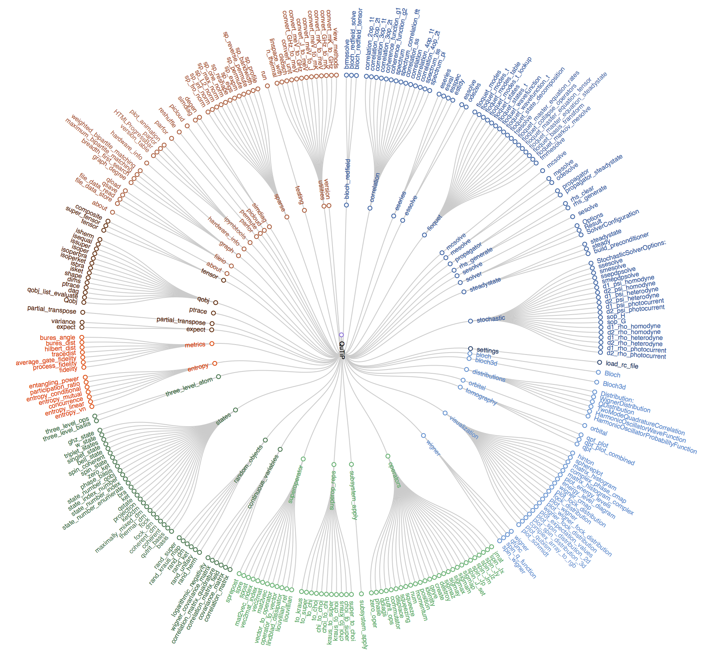

.. QuTiP 
   Copyright (C) 2011-2012, Paul D. Nation & Robert J. Johansson

.. _overview:

******************
Guide Overview
******************

The goal of this guide is to introduce you to the basic structures and functions that make up QuTiP. If you are familiar with the Quantum Optics Toolbox, then you should have no problem getting used to QuTiP. The guide is broken up into several sections, each highlighting a specific set of functionalities. In combination with the examples, this guide should provide a more or less complete overview.

.. _overview-org:

Organization
=============

QuTiP is designed to be a general toolbox for solving quantum optics like problems.  As such, the QuTiP framework is built from a large (and ever growing) library of functions; from :func:`qutip.states.basis` to :func:`qutip.wigner`.  The general organization of QuTiP, highlighting the important functions avalaible to the user is shown below.

   
   QuTiP tree-diagram of user accessible functions and classes.
