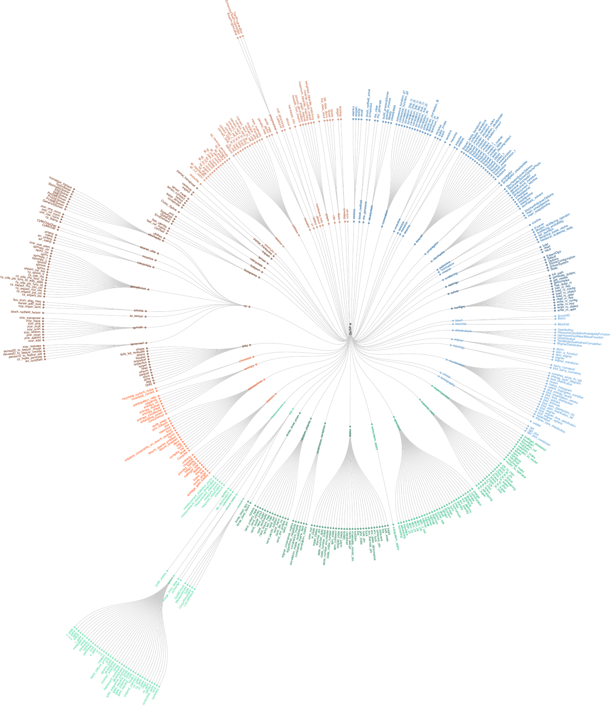

.. _overview:

******************
Guide Overview
******************

The goal of this guide is to introduce you to the basic structures and functions that make up QuTiP. This guide is divided up into several 
sections, each highlighting a specific set of functionalities. In combination with the examples that can be found on the project 
web page `https://qutip.org/tutorials.html <https://qutip.org/tutorials.html>`_, this guide should provide a more or less complete overview 
of QuTip. We also provide the API documentation in :ref:`apidoc`.

.. _overview-org:

Organization
=============

QuTiP is designed to be a general framework for solving quantum mechanics problems such as systems composed of few-level quantum systems and harmonic oscillators. To this end, QuTiP is built from a large (and ever growing) library of functions and classes; from :func:`qutip.states.basis` to :func:`qutip.wigner`.  The general organization of QuTiP, highlighting the important API available to the user, is shown in the figure below.

.. _figure-qutip-org:

   Tree-diagram of the 468 user accessible functions and classes in QuTiP 4.6. A vector image of the code tree is in :download:`qutip_tree.pdf <doc/qutip_tree.pdf>`.

