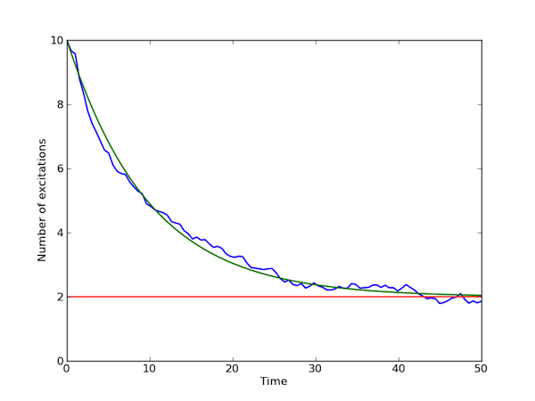

.. QuTiP 
   Copyright (C) 2011-2012, Paul D. Nation & Robert J. Johansson

.. _guide-steady:

Solving for Steady-State Solutions
**********************************

For open quantum systems with decay rates larger than the corresponding excitation rate, the system will tend toward a steady-state as :math:`t\rightarrow\infty`.  For many these systems, solving for the asymptotic state vector can be achieved using an iterative method faster than master equation or monte-carlo methods.  In QuTiP, the steady-state solution for a given Hamiltonian or Louivillian is given by :func:`qutip.steady.steadystate` or :func:`qutip.steady.steady`, respectively.  Both of these functions use an inverse power method with a random initial state.  (Details of these methods may be found in any iterative linear algebra text.)  In general, it is best to use the :func:`qutip.steady.steadystate` function with a given Hamiltonian and list of collapse operators.  This function will automatically build the Louivillian for you and then call the :func:`qutip.steady.steady` function. 

A simple example of a system that reaches a steady-state is a harmonic oscillator coupled to a thermal environment.  Below is an example of a harmonic oscillator, initially in a :math:`\left|10\right>` number state, and weakly coupled to a thermal environment characterized by an average particle expectation value of :math:`n=2`.  We also calculate the evolution via master equation and monte-carlo methods, and see that they converge to the steady-state solution::
    
    from qutip import *
    from pylab import *
    
    N=20 #number of basis states to consider
    a=destroy(N)
    H=a.dag()*a 
    psi0=basis(N,10) #initial state
    kappa=0.1 #coupling to oscillator
    
    # collapse operators
    c_op_list = []
    n_th_a = 2 # temperature with average of 2 excitations
    rate = kappa * (1 + n_th_a)
    if rate > 0.0:
        c_op_list.append(sqrt(rate) * a) #excitation operators
    rate = kappa * n_th_a
    if rate > 0.0:
        c_op_list.append(sqrt(rate) * a.dag()) #decay operators
    
    final_state=steadystate(H,c_op_list) #find steady-state
    fexpt=expect(a.dag()*a,final_state) #find expectation value for particle number

    ntraj=100
    tlist=linspace(0,50,100)
    mcexpt = mcsolve(H,psi0,tlist,ntraj,c_op_list, [a.dag()*a]) #monte-carlo
    meexpt = odesolve(H,psi0,tlist,c_op_list, [a.dag()*a])      #master eq.

    plot(tlist,mcexpt[0],tlist,meexpt[0],lw=1.5)
    axhline(y=fexpt,color='r',lw=1.5) #plot steady-state expt. value as horizontal line (should be 2)
    ylim([0,10])
    xlabel('Time')
    ylabel('Number of excitations')
    show()

.. _steady: 

