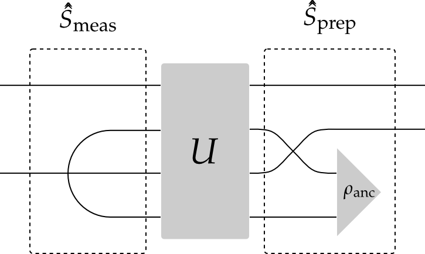

.. _steady:

*****************************************************
Superoperators, Pauli Basis and Channel Contraction
*****************************************************

[Christopher Granade](http://www.cgranade.com/)  
Institute for Quantum Computing

$\newcommand{\ket}[1]{\left|#1\right\rangle}$
$\newcommand{\bra}[1]{\left\langle#1\right|}$
$\newcommand{\cnot}{{\scriptstyle \rm CNOT}}$
$\newcommand{\Tr}{\operatorname{Tr}}$

In this guide, we will demonstrate the ``tensor_contract`` function, which contracts one or more pairs of indices of a Qobj. This functionality can be used to find rectangular superoperators that implement the partial trace channel $S(\rho) = \Tr_2(\rho)$, for instance. Using this functionality, we can quickly turn a system-environment representation of an open quantum process into a superoperator representation.

.. _steady-representation-plotting:

Superoperator Representations and Plotting
==========================================

We start off by first demonstrating plotting of superoperators, as this will be useful to us in visualizing the results of a contracted channel.

In particular, we will use Hinton diagrams as implemented by [``qutip.visualization.hinton``](https://qutip.org/docs/latest/apidoc/functions.html#qutip.visualization.hinton), which
show the real parts of matrix elements as squares whose size and color both correspond to the magnitude of each element. To illustrate, we first plot a few density operators.

>>> visualization.hinton(identity([2, 3]).unit()); # doctest: +SKIP

>>> visualization.hinton(Qobj([[1, 0.5], [0.5, 1]]).unit()); # doctest: +SKIP

We show superoperators as matrices in the *Pauli basis*, such that any Hermicity-preserving map is represented by a real-valued matrix. This is especially convienent for use with Hinton diagrams, as the plot thus carries complete information about the channel.

As an example, conjugation by $\sigma_z$ leaves $\mathbb{1}$ and $\sigma_z$ invariant, but flips the sign of $\sigma_x$ and $\sigma_y$. This is indicated in Hinton diagrams by a negative-valued square for the sign change and a positive-valued square for a +1 sign.

>>> visualization.hinton(to_super(sigmaz())); # doctest: +SKIP

As a couple more examples, we also consider the supermatrix for a Hadamard transform and for $\sigma_z \otimes H$.

>>> visualization.hinton(to_super(hadamard_transform())); # doctest: +SKIP

>>> visualization.hinton(to_super(tensor(sigmaz(), hadamard_transform()))); # doctest: +SKIP

.. _steady-reduced-channels:

Reduced Channels
================

As an example of tensor contraction, we now consider the map $S(\rho) = \Tr_2[\cnot (\rho \otimes \ket{0}\bra{0}) \cnot^\dagger]$.
We can think of the $\cnot$ here as a system-environment representation of an open quantum process, in which an environment register is prepared in a state $\rho_{\text{anc}}$, then a unitary acts jointly on the system of interest and environment. Finally, the environment is traced out, leaving a *channel* on the system alone. In terms of [Wood diagrams](http://arxiv.org/abs/1111.6950), this can be represented as the composition of a preparation map, evolution under the system-environment unitary, and then a measurement map.

The two tensor wires on the left indicate where we must take a tensor contraction to obtain the measurement map. Numbering the tensor wires from 0 to 3, this corresponds to a ``tensor_contract`` argument of ``(1, 3)``.

>>> tensor_contract(to_super(identity([2, 2])), (1, 3)) # doctest: +SKIP

Meanwhile, the ``super_tensor`` function implements the swap on the right, such that we can quickly find the preparation map.

>>> q = tensor(identity(2), basis(2)) # doctest: +SKIP
>>> s_prep = sprepost(q, q.dag()) # doctest: +SKIP

For a $\cnot$ system-environment model, the composition of these maps should give us a completely dephasing channel. The channel on both qubits is just the superunitary $\cnot$ channel:

>>> visualization.hinton(to_super(cnot())); # doctest: +SKIP

We now complete by multiplying the superunitary $\cnot$ by the preparation channel above, then applying the partial trace channel by contracting the second and fourth index indices. As expected, this gives us a dephasing map.

>>> tensor_contract(to_super(cnot()), (1, 3)) * s_prep # doctest: +SKIP
>>> visualization.hinton(tensor_contract(to_super(cnot()), (1, 3)) * s_prep); # doctest: +SKIP

