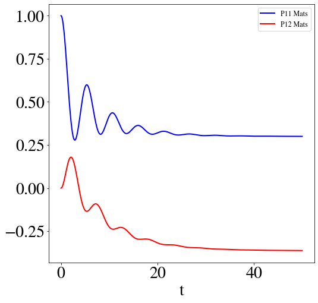

####################
Bosonic Environments
####################

In this section we consider a simple two-level system coupled to a
Drude-Lorentz bosonic bath. The system Hamiltonian, $H_{sys}$, and the bath
spectral density, $J_D$, are

.. math::

    H_{sys} = \frac{\epsilon \sigma_z}{2} + \frac{\Delta \sigma_x}{2}

    J_D = \frac{2\lambda \gamma \omega}{(\gamma^2 + \omega^2)},

We will demonstrate how to describe the bath using two different expansions
of the spectral density correlation function (Matsubara's expansion and
a Padé expansion), how to evolve the system in time and how to calculate
the steady state.

First we will do this in the simplest way, using the built-in implementations of
the two bath expansions, :class:`DrudeLorentzBath` and
:class:`DrudeLorentzPadeBath`.

Afterwards, we will show how to calculate the bath expansion coefficients and to
use those coefficients to construct your own bath description so that you can
implement your own bosonic baths.

A notebook containing a complete example similar to this one can be found in
`example notebook 1a <FIXME>`__).

.. todo::

    Fix notebook link above.

Describing the system and bath
------------------------------

First, let us construct the system Hamiltonian, $H_{sys}$, and the initial
system state, $rho0$:

.. code-block:: python

    from qutip import basis, sigmax, sigmaz

    # The system Hamiltonian:
    eps = 0.5  # energy of the 2-level system
    Del = 1.0  # tunnelling term
    H_sys = 0.5 * eps * sigmaz() + 0.5 * Del* sigmax()

    # Initial state of the system:
    rho0 = basis(2,0) * basis(2,0).dag()

Now let us describe the bath properties:

.. code-block:: python

    # Bath properties:
    gamma = 0.5  # cut off frequency
    lam = 0.1  # coupling strength
    T = 0.5  # temperature

    # System-bath coupling operator:
    Q = sigmaz()

where $\gamma$ (``gamma``), $\lambda$ (``lam``) and $T$ are the parameters
of a Drude-Lorentz bath, and ``Q`` is the coupling operator between the system
and the bath.

We may the pass these parameters to either ``DrudeLorentzBath`` or
``DrudeLorentzPadeBath`` to construct an expansion of the bath correlations:

.. code-block:: python

    from qutip.nonmarkov.heom import DrudeLorentzBath
    from qutip.nonmarkov.heom import DrudeLorentzPadeBath

    # Number of expansion terms to retain:
    Nk = 2

    # Matsubara expansion:
    bath = DrudeLorentzBath(Q, lam, T, Nk, gamma)

    # Padé expansion:
    bath = DrudeLorentzPadeBath(Q, lam, T, Nk, gamma)

Where ``Nk`` is the number of terms to retain within the expansion of the
bath.

System and bath dynamics
------------------------

Now we are ready to construct a solver:

.. code-block:: python

    from qutip.nonmarkov.heom import HEOMSolver
    from qutip import Options

    max_depth = 5  # maximum hierarchy depth to retain
    options = Options(nsteps=15_000)

    solver = HEOMSolver(H_sys, bath, max_depth=max_depth, options=options)

and to calculate the system evolution as a function of time:

.. code-block:: python

    tlist = [0, 10, 20]  # times to evaluate the system state at
    result = solver.run(rho0, tlist)

The ``max_depth`` parameter determines how many levels of the hierarchy to
retain. As a first approximation hierarchy depth may be thought of as similar
to the order of Feynman Diagrams (both classify terms by increasing number
of interactions).

The ``result`` is a standard QuTiP results object with the attributes:

- ``times``: the times at which the state was evaluated (i.e. ``tlist``)
- ``states``: the system states at each time
- ``expect``: the values of each ``e_ops`` at each time
- ``ado_states``: see below

If ``ado_return=True`` is passed to ``.run(...)`` the full set of auxilliary
density operators (ADOs) that make up the hierarchy at each time will be
returned as ``.ado_states``. We will describe how to use these to determine
other properties, such as system-bath currents, later in the guide.

If one has a full set of ADOs from a previous call of ``.run(...)`` you may
supply it as the initial state of the solver by calling
``.run(result.ado_states[-1], tlist, ado_init=True)``.

As with other QuTiP solvers, if expectation operators or functions are supplied
using ``.run(..., e_ops=[...])`` the expectation values are available in
``result.expect``.

.. todo::

    # Add some e_ops and display some results:

    # Define some operators with which we will measure the system
    # Populations
    P11p=basis(2,0) * basis(2,0).dag()
    P22p=basis(2,1) * basis(2,1).dag()
    # 1,2 element of density matrix  - corresonding to coherence
    P12p=basis(2,0) * basis(2,1).dag()
    # Calculate expectation values in the bases
    P11exp = expect(resultMats.states, P11p)
    P22exp = expect(resultMats.states, P22p)
    P12exp = expect(resultMats.states, P12p)

    # Plot the results
    fig, axes = plt.subplots(1, 1, sharex=True, figsize=(8,8))
    axes.plot(tlist, np.real(P11exp), 'b', linewidth=2, label="P11 Mats")
    axes.plot(tlist, np.real(P12exp), 'r', linewidth=2, label="P12 Mats")
    axes.set_xlabel(r't', fontsize=28)
    axes.legend(loc=0, fontsize=12)

Steady-state
------------

Using the same solver, we can also determine the steady state of the
combined system and bath using:

.. code-block:: python

   steady_state, steady_ados = solver.steady_state()

where ``steady_state`` is the steady state of the system and ``steady_ados``
if the steady state of the full hierarchy, which will examine shortly.

Calculating system-bath currents
--------------------------------

.. todo::

   Show how to calculate currents from the ADOs.

Matsubara expansion coefficients
--------------------------------

.. todo::

   Clean up this section.

.. code-block:: python

   def cot(x):
       return 1./np.tan(x)

   beta = 1./T

   # HEOM parameters
   Nk = 2 # number of Matsubara terms
   ckAR = [ lam * gamma * (cot(gamma / (2 * T)))]
   ckAR.extend([(4 * lam * gamma * T *  2 * np.pi * k * T / (( 2 * np.pi * k * T)**2 - gamma**2)) for k in range(1,Nk+1)])
   vkAR = [gamma]
   vkAR.extend([2 * np.pi * k * T for k in range(1,Nk+1)])
   ckAI = [lam * gamma * (-1.0)]
   vkAI = [gamma]

Multiple baths
--------------

.. todo::

    Clean up this section to use the new multiple baths feature.

The above example describes a single environment parameterized by the lists of
coefficients and frequencies in the correlation functions.

For multiple environments, the list of coupling operators and bath properties
must all be extended in a particular way.  Note this functionality differs in
the case of the Fermionic solver.

For the Bosonic solver, for ``N`` baths, each ``ckAR``, ``vkAR``, ``ckAI``, and
``vkAI`` are extended ``N`` times with the appropriate number of terms of that
bath.

On the other hand, the list of coupling operators is defined in such a way that
the terms corresponding to the real cooefficients are **given first**, and the
imaginary terms after. Thus if each bath has :math:`N_k` coefficients, the list
of coupling operators is of length :math:`N_k \times (N_R + N_I)`.

This is best illustrated by the example in `example notebook 2
<https://github.com/tehruhn/bofin/blob/main/examples/example-2-FMO-example.ipynb>`_.
In that case each bath is identical, and there are seven baths, each with a
unique coupling operator defined by a projector onto a single state:

.. code-block:: python

    ckAR = [pref * lam * gamma * (cot(gamma / (2 * T))) + 0.j]
    ckAR.extend([(pref * 4 * lam * gamma * T *  2 * np.pi * k * T / (( 2 * np.pi * k * T)**2 - gamma**2))+0.j for k in range(1,Nk+1)])
    vkAR = [gamma+0.j]
    vkAR.extend([2 * np.pi * k * T + 0.j for k in range(1,Nk+1)])
    ckAI = [pref * lam * gamma * (-1.0) + 0.j]
    vkAI = [gamma+0.j]

    NR = len(ckAR)
    NI = len(ckAI)
    Q2 = []
    ckAR2 = []
    ckAI2 = []
    vkAR2 = []
    vkAI2 = []
    for m in range(7):
        Q2.extend([ basis(7,m)*basis(7,m).dag() for kk in range(NR)])
        ckAR2.extend(ckAR)
        vkAR2.extend(vkAR)

    for m in range(7):
        Q2.extend([ basis(7,m)*basis(7,m).dag() for kk in range(NI)])
        ckAI2.extend(ckAI)
        vkAI2.extend(vkAI)
